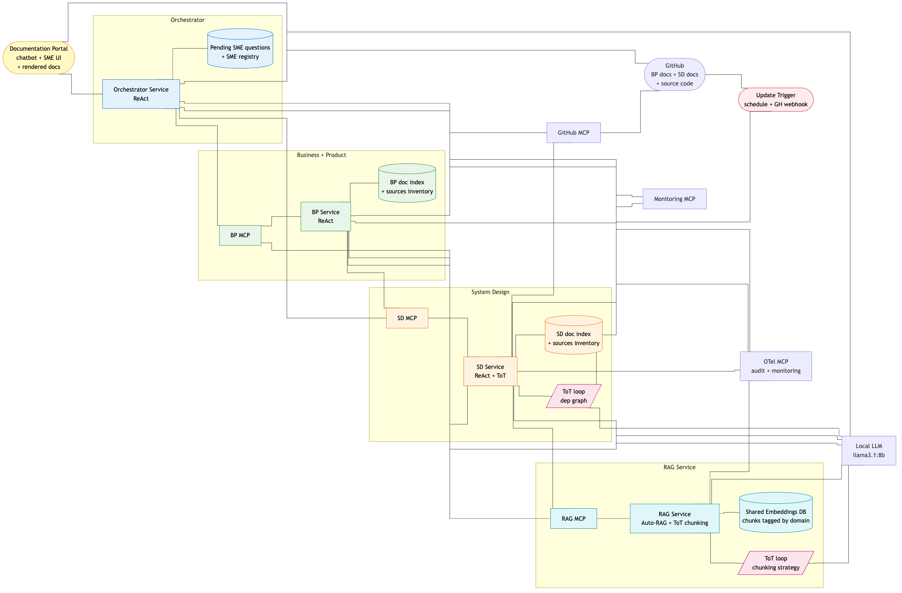
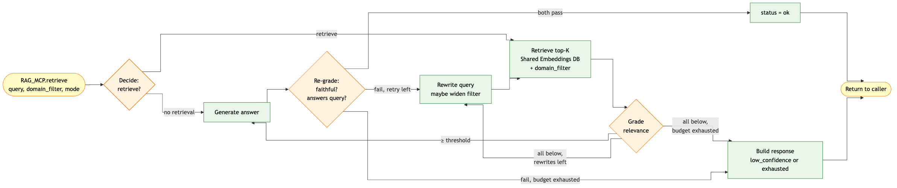
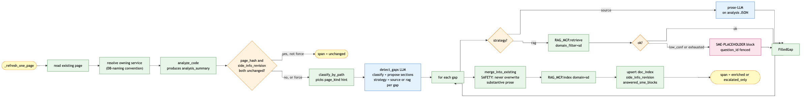
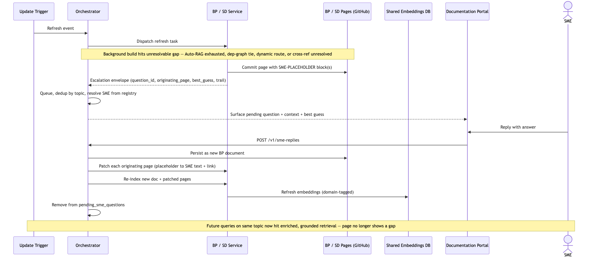

# Multi-Agent Knowledge Base System

**Final Capstone Report — Agentic AI Program · Carnegie Mellon University**

Enrique R. Corona Dominguez · June 2026

**Tech stack:** LangGraph · ChromaDB · Ollama (llama3.1:8b) · FastAPI · Vue.js + Quasar · OpenTelemetry · MCP Protocol

---

## Table of Contents

1. [Project Title](#1-project-title)
2. [Problem and User](#2-problem-and-user)
3. [System Goal and Scope](#3-system-goal-and-scope)
4. [Final System Architecture](#4-final-system-architecture)
5. [Design Evolution Across the Program](#5-design-evolution-across-the-program)
6. [Implementation Overview](#6-implementation-overview)
7. [Evaluation and Results](#7-evaluation-and-results)
8. [Safety and Reliability Considerations](#8-safety-and-reliability-considerations)
9. [Limitations and Next Steps](#9-limitations-and-next-steps)
10. [Public GitHub Repository](#10-public-github-repository)

---

## 1. Project Title

**Research Agent for Org Knowledge**

An Autonomous Multi-Agent Documentation System for Large-Scale Engineering Organizations — a continuously-updated knowledge base that gives engineers, product managers, and leadership an accurate, current map of system architecture, dependencies, and ownership without manual maintenance.

---

## 2. Problem and User

I work in a tech-org with systems that are 20+ years old and have evolved organically at different paces and with different technologies. Modernization is a top priority to improve efficiency, quality, and scale.

The core problem is that nobody has an accurate, current map of the system. We have 20+ years of technical debt and documentation spread across thousands of developers. Product Managers have documentation based on features and user requirements, while developers have documentation based on high-level designs — and if we are lucky — some low-level design and implementation decisions, which is uncommon. Finding all required dependencies for a new project becomes weeks of manual archaeology.

### Pain Points in a 20+ Year Org

- **Stale documentation** — written once, never updated; decisions get made on outdated assumptions
- **Knowledge silos** — tribal knowledge spread across Quip, Confluence, wikis, email threads, and people who have since left
- **Late dependency discovery** — integration failures surface at release time, not during design
- **No architecture map** — nobody can confidently answer "what services implement this product?" or "who calls this endpoint?"
- **Cross-org black boxes** — upstream and downstream dependencies poorly documented

### Why a Standalone LLM Falls Short

- **Multiple data sources** — source code, telemetry, Quip, Confluence, wikis; no single LLM context holds all of it
- **Incomplete and inaccurate input** — documents are stale, conflicting, or missing; raw retrieval amplifies the problem
- **No verification layer** — a single model can't distinguish a correct claim from a plausible-sounding stale one without grounding
- **No human escape hatch** — when confidence is low, there's no mechanism to escalate to an expert and close the gap

> Modernization efforts in a 20+ year old org stall on one recurring problem: **nobody has an accurate, current map of the system.** A Research Agent that **continuously updates and enriches** documentation collapses that lead time from weeks of manual archaeology to on-demand answers.

### Intended Users

- **Engineering leadership** — needs an accurate, current system map to make modernization decisions without manual archaeology
- **Developers** — need upstream/downstream dependencies, endpoint contracts, and data models when starting new projects
- **Product managers** — need to trace features back to the services that implement them
- **New-hire onboarding** — needs a reliable first map of the system without relying entirely on tribal knowledge

---

## 3. System Goal and Scope

The system acts as a **continuously-updating research agent** that ingests existing documentation and source code, reconciles gaps between what's documented and what's built, generates structured documentation per project and service, surfaces unresolvable gaps to subject matter experts (SMEs), integrates their answers back into the knowledge base, and answers queries through a Documentation Portal.

### Successful Performance Criteria

- Every service has an up-to-date SD page with endpoints, downstream dependencies, and data models
- Every product has a BP page with use cases, capabilities, and links to the services that implement it
- Queries return grounded, cited answers — not hallucinations
- SME questions are deduplicated and surfaced asynchronously, not as blockers to users
- The knowledge base improves with every refresh cycle

### Constraints and Boundaries

- **Read-only on external systems** — writes only to the BP/SD pages it owns and its own embedding store
- **No PII** — no PII data ingested, no access to undisclosed projects
- **Grounded answers only** — high-similarity retrieval configured; no speculation without evidence
- **POC scope** — Monitoring MCP excluded; input sources limited to GitHub; Slack, Confluence, email deferred

---

## 4. Final System Architecture

The system is a **multi-agent architecture** organized around a supervisor pattern with four specialized components, each communicating exclusively through **MCP-shaped contracts** — never direct function calls — so each agent can evolve or be replaced independently.

### High-Level Architecture

*All agent-to-agent communication goes through typed MCP contracts. Specialists never read from peer embeddings or write to peer pages. Cross-references are relative Markdown links in Git, not runtime calls.*

### The Four Agents

**Orchestrator (Supervisor)**
- **Owns** — pending SME questions queue, SME/specialist registry. No content state.
- **Does** — routes Portal queries, forwards refresh events, ingests SME replies, deduplicates SME questions by topic
- **Action space** — `dispatch_to_bp`, `dispatch_to_sd`, `dispatch_to_both`, `ingest_sme_reply`, `ack_completion`, `done`

**B&P Agent (Business & Product Specialist)**
- **Owns** — BP pages in GitHub, BP doc index (content hash, SD-side revision snapshot, open placeholder IDs), BP sources inventory
- **Does** — detects gaps, fills them via SD cross-references (`sd-mcp`) or RAG retrieval (`rag`), escalates unresolvable gaps as inline SME placeholder blocks
- **Does not** — embed or chunk anything itself; all retrieval and indexing delegate to the RAG Service

**SD Agent (System Design Specialist)**
- **Owns** — SD pages in GitHub, SD doc index, SD sources inventory (last-known commit SHAs per service)
- **Does** — analyzes source code via `analyze_code` (Python AST: endpoints, data structures, data stores, downstream calls), infers dependency graphs via ToT loop, generates service/endpoint/dependency pages
- **Does not** — embed or chunk anything itself, write into BP pages

**RAG Service (Shared Retrieval Infrastructure)**
- **Owns** — shared Embeddings Database, embedding model, Autonomous RAG loop, ToT chunking-strategy sub-graph
- **Does** — accepts docs via `RAG_MCP.index()`, picks chunking strategy via ToT, computes embeddings, persists chunks tagged with caller's `domain`; accepts queries via `RAG_MCP.retrieve()` and runs the Autonomous RAG loop
- **Does not** — read source code, write to GitHub, talk to SMEs, own any per-page state

### Autonomous RAG Loop

*Four-node LangGraph StateGraph: decide → retrieve → grade → rewrite. Bounded to R=2 rewrites. Returns `ok | low_confidence | exhausted`. Repeated grade failures emit an index-quality flag so the calling specialist can re-index the source on the next refresh.*

### SD Service — Per-Page Enrichment Flow

*Gap criteria: missing heading · empty body · boilerplate marker (TBD/TODO/WIP/N/A) · SME-PLACEHOLDER fence. Subjective judgments are NOT gap criteria. `merge_into_existing` never overwrites substantive prose even if the detector mis-flags it.*

### SME Interaction and Re-Integration

*SME escalation is background-only — user queries never page an SME. Two-write re-integration: new BP doc (future RAG retrieval finds the answer) + patch every originating page. Closed `question_id`s are never reused — the Git audit trail stays linear.*

### Key Design Patterns

**ReAct Loops** — All four agents run as LangGraph `StateGraph` instances with `reason → act → observe` cycles. The Orchestrator's loop is compact; B&P and SD run deterministic background-mode paths and reactive query-mode paths on the same graph.

**Tree of Thoughts (Selective)** — Applied only where it helps, not globally. Chunking strategy selection (RAG Service, K=4, similarity-over-M ≥0.7, beam search B=2–3, D=2–3) and dependency graph inference (SD, K=3 candidates, telemetry-agreement ≥0.8).

**Continuous Refresh** — Update Trigger fans out refresh events to affected specialists in parallel. Refresh time ∝ slowest page, not total page count. Per-page skip-unchanged logic means re-runs over unchanged content are free.

---

## 5. Design Evolution Across the Program

The system design evolved substantially from the initial concept in Module 1 through the final design in Module 6. Each module added a concrete layer.

| Module | Key Addition | Why It Mattered |
|--------|-------------|-----------------|
| **1 — Problem framing** | Problem statement, two specialist POVs (B&P and SA), core principles (read-only, extensible, secure, up-to-date) | The constraints that held through every subsequent refinement. SME feedback was established as a first-class feature from the start. |
| **2 — Reasoning loops** | Formal ReAct loops for both specialists and an Orchestration layer on top | Defined the retrieve → analyze → reconcile → generate → escalate pattern per specialist. The Orchestrator's job is routing — not content analysis. |
| **3 — RAG** | Indexing methodology, chunking strategies, summary embeddings, quality heuristic | Critical insight: distinguishing two RAG modes — classic Q&A and document *selection* during background knowledge-building. This asymmetry shaped the RAG Service's API in Module 5. |
| **4 — Tree of Thoughts** | Selective ToT for chunking strategy and dep-graph inference; beam search; per-use-case scoring rubrics; LangGraph replacing LangChain | ToT is used only where it helps — not globally. LangGraph was chosen because stateful cyclic graphs with conditional early-exit edges don't fit LCEL chains. |
| **5 — High-level architecture** | RAG consolidated into a fourth standalone agent; MCP contracts between all components; Documentation Portal design; B&P↔SD cross-reference mechanism | The biggest structural change. Co-locating the embedding model, vector store, Auto-RAG loop, and ToT chunking in one service gives both specialists consistent retrieval behavior and a free upgrade path for future specialists. |
| **6 — Safety, evaluation, human oversight** | Full guardrails catalogue, two-layer evaluation strategy (online OTel metrics + offline golden set), SME placeholder format and re-integration flow, per-service LLD, Portal surfaces | Framed safety as three reinforcing layers: preventive guardrails, detective evaluation, and corrective human oversight. |

One notable removal: the code/design gap-reconciliation ToT use case was dropped from the POC after Module 5. It adds meaningful complexity with lower ROI than the RAG and dep-graph ToT uses for a first working version.

---

## 6. Implementation Overview

The POC is a working implementation of the full architecture, tested against **Pear Store** — a synthetic Apple App Store–style e-commerce system built deliberately with uneven implementation and documentation gaps, giving the agent realistic material to discover and remediate.

### Pear Store — Synthetic Test Corpus

- **10 microservices** — 8 storefront (catalog, account, cart, order, payment, fulfillment, review, search) + 2 PearCare (pearcare-plan, pearcare-claim)
- **1 frontend** — Flask + Jinja storefront
- **9 SQLite databases** — one per service, seeded on boot
- **Selective OTel instrumentation** — 5 of 10 services emit spans/metrics; rest are dark

**Documentation quality tiers (intentional gaps):**

| Tier | Examples |
|------|---------|
| HIGH | `catalog-db.md`, order telemetry — complete, exemplary |
| MEDIUM | Fulfillment telemetry — mostly complete, named gaps |
| LOW | `account.md`, `payment-db.md` — terse, missing fields |
| VERY LOW | `review.md` — fragments, typos, wrong claims |
| MISSING | `order-db`, `fulfillment-db`, 4 telemetry docs — entirely absent |

### Frameworks and Libraries

| Framework / Tool | Role in the System |
|-----------------|-------------------|
| **LangGraph** | Drives all four agent reasoning loops as typed `StateGraph` instances. Chosen over LangChain (deprecation path) because it supports stateful, cyclic graphs with conditional edges — required for the Auto-RAG rewrite loop and the beam-search ToT loops. |
| **ChromaDB** | Local vector store for the shared Embeddings Database. Runs in-process for the POC; splitting behind `RAG_MCP`-over-HTTP is a later optimization without changing the specialist-facing contract. |
| **Ollama + llama3.1:8b** | All LLM calls across the system run against a single local instance. One model, one set of prompts, no token cost. Latency is the primary cost proxy monitored via the OTel trace stream. |
| **FastAPI** | Orchestrator REST API — `/v1/queries`, `/v1/refresh`, `/v1/sme-replies`, `/v1/streams/events` (SSE X-Ray feed), `/v1/metrics`, `/v1/docs/*`. |
| **Vue.js + Quasar** | Documentation Portal — single-page app with Documentation, SME Answers, and Dashboard tabs, a Multi-Agents X-Ray collapsible drawer (SSE stream of service logs + LLM audit records), and a floating chatbot bubble. |
| **SQLite + OpenTelemetry** | In-service audit log backed by SQLite for the POC. OTel spans emitted via `OTEL_MCP` for every inbound/outbound MCP call. Production swaps both for Splunk and a real OTel backend without changing the per-call API. |
| **Python ast module** | `analyze_code` uses Python's built-in AST to extract endpoints, data structures, data stores, and downstream calls from service source code — no LLM required for structural analysis. |
| **CrewAI** | Used for the critic role in the evaluation pipeline. |

---

## 7. Evaluation and Results

The POC was run against the full Pear Store corpus — 10 services, 9 databases, and a mix of BP and SD documentation across all quality tiers. Evaluation has two layers: **online metrics** computed live from the OTel trace stream and doc indexes, and **offline metrics** requiring labeling or human sampling.

### Key Results

| Metric | Result |
|--------|--------|
| Auto-RAG re-grade pass rate | **88.4%** |
| ToT chunking strategy success rate | **82.5%** |
| Cross-reference health (SD↔BP links) | **100%** (22 links, 0 broken) |
| Pages enriched + stub pages created | **44 enriched + 3 stubs** |
| LLM calls / errors | **1,500 / 0** |
| Index-quality hit rate | **18.8%** |
| SME questions generated | **11** (4 answered, 7 pending) |

### SD Gap → Impact

| Gap Area | Before | After |
|----------|--------|-------|
| account, review, payment | LOW | HIGH — auth flow, session lifecycle, correct endpoints, PSP retry policy added |
| order-db, fulfillment-db, pearcare-plan-db | MISSING | MEDIUM — 3 pages created from scratch via `analyze_code` AST analysis |
| 4 telemetry docs (catalog, search, account, fulfillment) | MISSING | Created — `catalog.md` expanded from 3-line stub; `search.md` created from scratch |
| Runbooks (incident-response) | Empty | On-call rotation, escalation tree, rollback steps added; 4 SME answers merged back |

### BP Gap → Impact

| Business Case | Before | After |
|--------------|--------|-------|
| catalog-discovery, purchase-flow | HIGH (anchor) | Levers and success metrics propagated to 9 lower-quality BP pages |
| refunds, pearcare-cancellations | LOW | MEDIUM — refund ceiling, 72h SLA windows, churn baseline added |
| ratings-trust, piracy-and-licensing | VERY LOW | LOW — abuse scoring criteria and enforcement thresholds filled |
| developer-payouts, pearcare-claim-economics | MEDIUM | HIGH — monthly payout cycle, 5-day claim approval SLA documented |

### Online Metrics (Live from Day One)

- **Answer re-grade pass rate** — per axis: faithfulness (hallucination check) and answerability (faithful refusal check)
- **RAG status distribution** — breakdown of `ok / low_confidence / exhausted`; a rise in `exhausted` signals a coverage or indexing problem
- **Escalation rate** — fraction of background builds surfacing at least one SME placeholder
- **Coverage** — `% products with a BP page` and `% services with an SD page`
- **Page freshness** — median page age since last refresh; `% pages whose content hash diverges from current source`
- **Cross-reference health** — `% relative Markdown links that resolve` on a scheduled validator pass
- **SME resolution time** — median / p95 from question creation to `ingest_sme_reply`

### Offline Metrics (Periodic)

- **Correctness via golden set** — ~30–50 curated Q&A pairs scored by LLM-as-judge with periodic human recalibration
- **Calibration** — of answers stamped `ok`, what fraction a human reviewer also marks correct
- **Hallucination rate** — "is every factual claim supported by at least one cited source?" run periodically with a stricter rubric

---

## 8. Safety and Reliability Considerations

The safety posture is built from three reinforcing layers: **preventive guardrails** keep individual loops bounded and isolated. **Detective evaluation** turns runtime behavior into measurable signals. **Corrective human oversight** closes the loop when the agent genuinely can't resolve something — without blocking users.

### Preventive Guardrails

- **Tool access boundaries** — MCPs are the only inter-agent interface
- **Cross-domain isolation** — every chunk carries a `domain` tag; B&P cannot write `domain=sd`; SD cannot write `domain=bp`
- **Loop bounds** — Auto-RAG capped at R=2 rewrites; ToT capped at B=2–3, D=2–3; after cap: `low_confidence` or `exhausted`, never infinite recursion
- **Output validation** — every answer goes through a grader and faithfulness re-grade; failed grades trigger a rewrite or fall back to low-confidence
- **Read-only on external systems** — writes only to the BP/SD pages it owns and its own embedding store
- **SME escalation is background-only** — user queries never page an SME; escalations are deduped by topic
- **Dual audit trail** — OTel spans for every MCP call + Git history for every page write

### Known Gaps (Deferred)

- **Prompt injection** — no sanitization pass yet; POC input set is hand-checked
- **PII / sensitive content** — policy-only today; a redaction pass on ingest is a candidate for the next phase
- **Global LLM budget cap** — per-loop bounds exist, but no per-request or per-refresh ceiling on total LLM calls
- **Output schema validation** — structured outputs follow documented shapes but aren't JSON-schema-validated at the boundary
- **SME identity** — how an SME authenticates when replying is left to the Portal implementation

---

## 9. Limitations and Next Steps

### Current Limitations

**Model & Quality**
- All nodes share `llama3.1:8b` — no per-node specialization yet
- No adversarial testing — prompt injection and PII leakage rates unmeasured
- No regression suite — quality over time not tracked systematically

**Infrastructure**
- Single-host — no horizontal scaling
- SQLite everywhere — not production-grade at volume
- In-process ChromaDB — no dedicated vector store
- Stub OTel collector — SQLite-backed, not a real backend

**Triggers & Sources**
- Schedule-based or manual only — no GH webhook default
- Git only — Slack, Confluence, email out of scope
- Python only — SD source analysis doesn't support other languages

**Corpus & Telemetry**
- Synthetic test data — real legacy codebases will surface edge cases
- Partial OTel coverage — only 5 of 10 services emit spans
- Monitoring MCP absent — ToT dep-graph falls back to code-only analysis

### Realistic Next Steps

1. **Wire the Monitoring MCP** — unlocks telemetry-agreement scoring for SD's dep-graph ToT
2. **Add additional input sources** — Quip and Confluence enter through the same ingest contract used by GitHub today
3. **Build the eval harness** — automate the golden-set evaluation on a weekly cadence; this is what's still most missing
4. **Upgrade LLM for accuracy-critical nodes** — swapping the Auto-RAG grader and faithfulness re-grade to `llama3.1:70b` or `mixtral:8x7b` for those nodes specifically
5. **Implement PII redaction and prompt-injection sanitization** — pre-ingest pass before documents enter the indexing pipeline
6. **Add auth** — SSO middleware on the Portal and authenticated GitHub proxying on the Orchestrator; designed as a middleware change, not a contract change
7. **Real org deployment** — run against actual org documentation and source code to validate at scale

### Key Learnings

> **Good system design + small local LLMs** can deliver production-quality results — llama3.1:8b achieved 88.4% re-grade pass rate and 82.5% ToT success with 0 errors across 1,500 calls.

> Using LLMs as **processing primitives** — judges, classifiers, Q&A generators — unlocks structured knowledge from raw unstructured docs at scale.

> **LLM latency is a first-class design constraint** in multi-agent systems. Loop bounds and beam width aren't just safety rails — they're performance decisions.

> **Observability was the key feedback loop** — moving from TOP_K=4 to TOP_K=25 was only visible because the metrics were there.

> **Software engineering best practices** — typed contracts, OTel tracing, domain isolation — are directly transferable to agentic systems and make them debuggable.

> **AI-assisted coding made this scale possible** — a project of this scope wouldn't be achievable in the available timeframe without it.

---

## 10. Public GitHub Repository

| Repository | URL |
|------------|-----|
| Project repository | [github.com/kikecorona/agentic-ai-capstone-project](https://github.com/kikecorona/agentic-ai-capstone-project) |
| Pear Store (synthetic corpus) | [github.com/kikecorona/pear-store](https://github.com/kikecorona/pear-store) |

The repository includes:

1. **Project documentation** — [`PROJECT.md`](https://github.com/kikecorona/agentic-ai-capstone-project/blob/main/PROJECT.md) (problem, reasoning loops, RAG design, ToT), [`PROJECT_ARCHITECTURE.md`](https://github.com/kikecorona/agentic-ai-capstone-project/blob/main/PROJECT_ARCHITECTURE.md) (high-level architecture, guardrails, trade-offs), [`PROJECT_LOW_LEVEL_DESIGN.md`](https://github.com/kikecorona/agentic-ai-capstone-project/blob/main/PROJECT_LOW_LEVEL_DESIGN.md) (per-service designs, SME interaction, evaluation strategy, portal design)
2. **Implementation** — full working POC under [`implementation/`](https://github.com/kikecorona/agentic-ai-capstone-project/tree/main/implementation) including the Orchestrator (FastAPI), B&P Service, SD Service, RAG Service (LangGraph + ChromaDB), and Documentation Portal (Vue.js + Quasar)
3. **Synthetic data** — [Pear Store](https://github.com/kikecorona/pear-store) with 10 services, endpoints, and product documentation at varying quality tiers used to exercise the full pipeline
4. **Playground** — [`playground/`](https://github.com/kikecorona/agentic-ai-capstone-project/tree/main/playground) contains standalone experiments with LangGraph, ReAct, and GitHub MCP that informed the final design
5. **Setup and usage instructions** — [`implementation/README.md`](https://github.com/kikecorona/agentic-ai-capstone-project/blob/main/implementation/README.md) covers prerequisites, environment setup, and how to boot the full stack locally

---

*Agentic AI Program: Building Autonomous Systems for Real-World Applications · Carnegie Mellon University, School of Computer Science, Executive Education · Enrique R. Corona Dominguez · June 2026*
