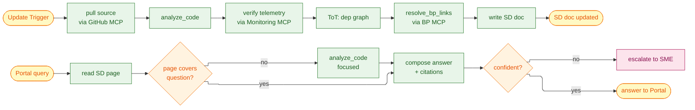
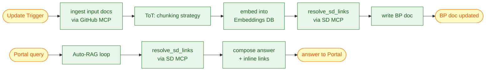
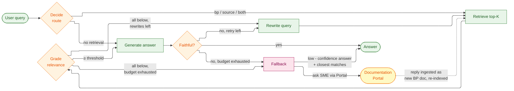
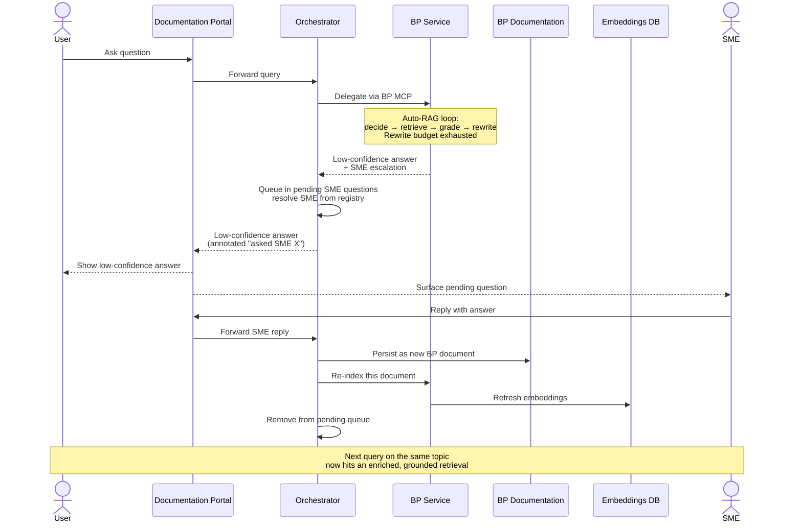

# Capstone Project — Architecture

Enrique R. Corona Dominguez

> Disclaimer: I wrote this with help from Claude Code, I provided a lot of guidance, suggestions, corrections and for the most part defined the high level architecture and
> implementation details based on the course lectures.

This document continues from [PROJECT.md](PROJECT.md) (Sections 1–7) and covers the
high-level ([Section 8](#8-high-level-architecture-module-5))
and low-level ([Section 9](#9-low-level-design)) design of the Research Agent. References to earlier sections link back
to the
main document.

## 8. High-Level Architecture (Module 5)

> As stated in [Section 1.3](PROJECT.md#13-proposed-solution), we're implementing a **Research Agent** that
helps our leadership, developers, and product managers have a complete view of the architecture,
dependencies, progress, and known gaps of our systems. Modernization efforts in a 20+ year old org stall
on a single recurring problem: nobody has an accurate, current map of the system. Decisions get made on
stale or incomplete documentation, dependencies get discovered late, and gap analysis becomes weeks of
manual archaeology. A Research Agent that **continuously updates and enriches** the org's documentation
collapses that lead time and gives every team — engineering, product, leadership — a single source of
truth they can trust.

### 8.1 Roles and responsibilities

The system is a **multi-agent** architecture organized around a supervisor pattern: the **Orchestrator** is
the supervisor that routes work and tracks state, while **B&P** and **SD** are specialist agents that each
own a documentation domain and run their own LangGraph reasoning loop. Collaboration happens through
**MCP-shaped contracts** — never direct function calls — so each agent can evolve or be replaced
independently.

**Per-agent role:**

- **Orchestrator agent** *(supervisor)*
    - **Owns** — the datasources inventory, the doc index, and the pending SME questions queue.
    - **Does** — routes Portal queries to the right specialist, dispatches refresh tasks fired by the
      Update Trigger, ingests SME replies (received through the Portal) as new B&P documents,
      deduplicates pending SME questions per topic.
    - **Does not** — analyze content. No embedding pipeline, no code analysis, no ToT; all deep work is
      delegated to a specialist.
- **B&P agent** *(Business & Product specialist)*
    - **Owns** — the **BP pages in GitHub** and the **Embeddings Database**.
    - **Does** — runs the indexing pipeline ([Section 6](PROJECT.md#6-retrieval-design--rag-module-3)), generates
      product and feature pages with
      cross-references to SD pages, answers query-time questions through the Autonomous RAG loop
      ([Section 9.3.1](#931-autonomous-rag-architecture-query-time)), resolves SD links via the SD MCP.
    - **Does not** — write into the SD pages or read source code directly; the SD MCP is the only path
      to either.
- **SD agent** *(System Design specialist)*
    - **Owns** — the **SD pages in GitHub**.
    - **Does** — analyzes source code via the GitHub MCP, cross-checks telemetry via the Monitoring MCP,
      runs the ToT dep-graph loop ([Section 7.1](PROJECT.md#71-where-tot-helps-in-this-project), use case 3), generates
      service/endpoint/dependency pages
      with cross-references to B&P pages, resolves B&P links via the B&P MCP.
    - **Does not** — write into the B&P pages or maintain embeddings; the B&P MCP is the only path to
      either.

**Interaction patterns:**

- **Supervisor → specialist** (Orchestrator → B&P/SD) — task envelopes for refresh or query work; the
  specialist runs its loop and returns a structured response or an escalation.
- **Specialist ↔ specialist** (B&P ↔ SD) — read-only peer calls for cross-references. B&P calls SD MCP
  for "what services serve this product"; SD calls B&P MCP for the reverse. Neither agent ever writes
  into the other's store.
- **Specialist → supervisor** (escalation) — when a specialist can't resolve a question on its own
  (Auto-RAG exhausts its rewrites, the SD ToT can't pick a winner), it returns an SME-escalation
  envelope; the orchestrator queues it and surfaces it through the Portal ([Section 9.5](#95-sme-interaction)).
- **Trigger → supervisor → specialists** (refresh fan-out) — the orchestrator consults the doc index,
  identifies affected pages, and fans out one task per page to the right specialist. Specialists work in
  parallel and report completion back; the orchestrator updates the doc index.

Adding a new specialist later (e.g., a Security agent) is mostly an orchestrator change: register a new
MCP and add the routing rule. Existing specialists don't need to know about the new one until they need
to cross-reference it.

### 8.2 High-Level Architecture diagram

The following diagram shows the high-level architecture considering tooling, augmented retrieval components and
ToT.

> **Storage decision** — all generated documentation (B&P and SD) is persisted to **GitHub** as Markdown.
> Cross-references between B&P and SD pages are plain relative Markdown links, so they live in the same review/PR
> workflow as code.
>
> **Two operating modes** — both **B&P** and **SD** run in two distinct flows:
> - **Refresh path** — `Update Trigger → Orchestrator → BP/SD Service → updated docs + embeddings`. Driven by
    > schedule or by GitHub change events; this is the "continuous" half of the system.
> - **Query path** — `Portal → Orchestrator → BP/SD Service → answer back to Portal`. Driven by user chatbot
    > questions or SME interactions through the Portal.
>
> The two paths share the same agent services and MCPs; they differ only in entry point and depth of work.
> [Section 9](#9-low-level-design) walks through the LangGraph designs that support both modes.
>
> **POC scope** — both inputs and outputs live in Git. Slack, Confluence, email and Quip ingestion are deferred
> to later phases — they would be added as new MCPs next to the GitHub MCP without changing the rest of the
> topology.

```mermaid
%%{init: {'flowchart': {'defaultRenderer': 'elk', 'curve': 'step'}}}%%
flowchart LR
    Portal([Documentation Portal<br/>chatbot for users<br/>+ SME answer UI<br/>+ rendered docs])
    Trigger([Update Trigger<br/>schedule and/or<br/>GH change watcher])
    LLM[Local LLM<br/>e.g. Llama 3.1]
    GH([GitHub<br/>BP docs + SD docs<br/>+ source code])
    GH_MCP[GitHub MCP]

    subgraph OC [Orchestrator]
        OC_Service[Orchestrator Service<br/>ReAct]
        OC_DS[(Datasources<br/>inventory<br/>+ doc index<br/>+ pending SME questions)]
        OC_Service --- OC_DS
    end

subgraph BP [Business &amp; Product]
BP_MCP[B&amp;P MCP]
BP_Service[B&amp;P Service<br/>ReAct + ToT + Auto-RAG]
BP_ToT[/ToT loop<br/>chunking strategy/]
E_DS[(Embeddings<br/>Database)]
BP_MCP --- BP_Service
BP_Service --- BP_ToT
BP_Service --- E_DS
end

subgraph SD [System Design]
SD_MCP[SD MCP]
SD_Service[SD Service<br/>ReAct + ToT]
SD_ToT[/ToT loop<br/>dependency graph/]
MON_MCP[Monitoring MCP]
SD_MCP --- SD_Service
SD_Service --- SD_ToT
SD_ToT --- MON_MCP
SD_Service --- MON_MCP
end

Portal --- OC_Service
Portal --- GH
Trigger --- OC_Service
GH --- Trigger
OC_Service --- LLM
OC_Service --- BP_MCP
OC_Service --- SD_MCP
BP_Service --- LLM
BP_ToT --- LLM
BP_Service --- SD_MCP
BP_Service --- GH_MCP
SD_Service --- LLM
SD_ToT --- LLM
SD_Service --- BP_MCP
SD_Service --- GH_MCP
GH_MCP --- GH

classDef oc fill: #E3F2FD, stroke: #1565C0, color:#0D47A1
classDef bp fill: #E8F5E9, stroke:#2E7D32, color: #1B5E20
classDef sd fill:#FFF3E0, stroke: #EF6C00, color: #E65100
classDef tot fill: #FCE4EC, stroke: #AD1457,color: #880E4F
classDef docs fill: #F3E5F5,stroke: #6A1B9A, color: #4A148C
classDef portal fill: #FFF9C4, stroke: #F57F17, color:#E65100
classDef trigger fill: #FFEBEE, stroke:#C62828, color: #B71C1C
class OC oc
class BP bp
class SD sd
class BP_ToT,SD_ToT tot
class OC_DS docs
class Portal portal
class Trigger trigger
```



> **Diagram simplification** — the **BP↔SD cross-reference** is implemented as relative Markdown links inside
> the GitHub repo, so it lives in the `GH` node rather than as a runtime edge.

- The **"Service"** component of each agent contains the reasoning loop logic defined
  in [Section 3](PROJECT.md#3-proposed-reasoning-loop-module-2) (Module 2).
- The **Documentation Portal** is the only user-facing component. It (a) renders the BP and SD pages directly
  from GitHub, (b) hosts a **chatbot** for users to query the agent and propose improvements, routed to the
  **Orchestrator Service**, and (c) provides the **SME answer UI** described in [Section 9.5](#95-sme-interaction).
- The **Orchestrator** runs a plain **ReAct** loop and is reached only through the Portal and the
  Update Trigger. Its **datasources inventory** carries a **doc index** (every page produced by B&P and SD,
  with URI, owning agent, last update, source documents) and a **pending SME questions** queue used by the
  Portal's SME UI.
- The **B&P Service** runs a **ReAct + ToT + Auto-RAG** loop. The ToT sub-routine selects the best chunking
  strategy per document during indexing ([Section 7.1](PROJECT.md#71-where-tot-helps-in-this-project), use case 1); the
  Auto-RAG loop ([Section 9.3.1](#931-autonomous-rag-architecture-query-time)) handles
  query-time retrieval. It owns the **B&P pages** in GitHub and embeds cross-references to SD pages for every
  service mentioned in a feature description.
- The **SD Service** runs a **ReAct + ToT** loop. The ToT sub-routine infers dependency graphs at indexing time
  using the **Monitoring MCP** as part of the evaluator ([Section 7.1](PROJECT.md#71-where-tot-helps-in-this-project),
  use case 3). It owns the **SD pages** in
  GitHub and embeds cross-references to B&P pages for every product served by a given service or endpoint.
- **Single storage** — all generated documentation (BP and SD) lives in the same GitHub repo as the source
  code. They are different folders (`/bp/` and `/sd/` for the POC, see [Section 8.3](#83-considerations-for-the-poc));
  cross-references are
  plain relative Markdown links. The Portal reads these folders directly to render the docs; agents read and
  write through the **GitHub MCP**.
- **Continuously updated, not read-only** — on every refresh cycle the owning agent: (a) creates pages for newly
  discovered projects/services, (b) refreshes existing pages whose source code or input docs have drifted,
  (c) re-validates cross-references and downgrades broken links to "follow-up", (d) ingests new SME responses
  delivered via the Portal. Refreshes are kicked off by the **Update Trigger**; on each refresh the B&P agent
  re-runs its indexing pipeline ([Section 6](PROJECT.md#6-retrieval-design--rag-module-3)) so the **Embeddings Database
  ** stays in sync with the B&P pages.
  The "read-only" principle from [Section 1.4](PROJECT.md#14-principles-for-our-agent) applies only to the *external
  systems* the agent inspects — the
  agent's own documentation output is in constant flux, version-controlled by Git.
- **Update Trigger** — drives the continuous half of the system. It watches GitHub for changes and/or fires
  on a schedule, then emits refresh requests to the Orchestrator. The orchestrator dispatches per-affected-page
  work to B&P and SD, which re-run their pipelines. Implementation TBD — daily cron, GitHub webhook, or a
  hybrid. The contract: fire `(doc_id or commit_sha, change_kind)` events to the Orchestrator.
- **Cross-referencing flow** — when B&P generates a page about a product, it calls the **SD MCP** to resolve
  which services back that product and writes the resulting links into the page. Symmetrically, when SD
  generates a page about a service, it calls the **B&P MCP** to resolve which products consume that service.
  Both directions are re-validated on each refresh, so a stale link becomes a follow-up task instead of silent
  rot.
- For **B&P** the main deliverable is the set of BP pages in GitHub; for **SD**, the set of SD pages in
  GitHub. Both are Markdown.

### 8.3 Considerations for the POC

- For the POC we'll leave out the **Monitoring MCP** as input for the SD agent. Without it, the SD ToT loop will fall
  back to code references and existing documentation as the only evaluator signals.
- For the POC the ToT loops will run with **B=2–3** and **D=2–3** ([Section 7.4](PROJECT.md#74-search-strategy)) to
  bound the number of LLM calls per loop.
- For the POC the B&P and SD documentation can share **a single GitHub repo** with two top-level folders
  (`/bp/` and `/sd/`) — easier link resolution and a single PR review surface. Splitting into two repos is a later
  optimization if access control becomes an issue.
- For the POC the **Update Trigger** will run as a **daily scheduled job** plus a manual "refresh" action in the
  Documentation Portal. GitHub webhooks for per-commit triggers can be added later without changes to the rest
  of the topology — the Orchestrator's contract with the Trigger is the same regardless of source.
- For the POC the **LLM** is a small local model (e.g., **Llama 3.1 8B**) running on the same host as the
  agent services. This keeps the POC self-contained and removes external API dependencies; quality-sensitive
  nodes (the critic, the faithfulness re-grade) can switch to a larger model later if needed. Prompts are
  kept small and focused so they fit comfortably within the model's context window.

---

## 9. Low-Level Design

This section covers the per-service designs (B&P and SD) plus the patterns shared between them — Autonomous RAG
and SME interaction.

### 9.1 Two operating modes

Both the **B&P** and **SD** services run in two modes against the same LangGraph harness:

- **Background mode** — the agent picks up refresh requests from the **Update Trigger** and rebuilds or
  extends its documentation store. This is the continuous half of the system; source code or input docs
  change, the trigger fires, the orchestrator dispatches per-affected-page work, and the service re-runs its
  pipeline.
- **Query mode** — the agent answers an on-demand question coming through the **Documentation Portal** (a
  user via the chatbot, or an SME through the SME UI). For B&P this is the **Autonomous RAG** loop in
  [Section 9.3.1](#931-autonomous-rag-architecture-query-time); for SD it is a shorter graph that reads the pre-built
  doc and falls back to live code
  analysis when needed.

Both modes share the same MCPs, the same LLM, and the same doc stores. The difference is the entry point
and the depth of work performed.

### 9.2 SD Service design

The SD agent is one **LangGraph** state graph whose entry router dispatches to the right path based on the
operating mode ([Section 9.1](#91-two-operating-modes)).

**Background mode** — for each refresh task the graph walks the affected service end-to-end. It pulls source
code via the **GitHub MCP**, runs plain code analysis (AST + regex) augmented by an LLM pass for the prose
around each endpoint, optionally verifies inferred call patterns against telemetry through the **Monitoring
MCP** when wired in, runs the **ToT loop** ([Section 7.1](PROJECT.md#71-where-tot-helps-in-this-project), use case 3) to
pick the best dependency graph
among several candidates, calls the **B&P MCP** to resolve cross-references, and writes the resulting page
as Markdown into the **SD pages** in GitHub. The orchestrator's `doc index` records the new revision so
the next refresh knows what changed.

**Query mode** — a question routed to SD takes a much shorter path: read the relevant SD page from the doc
store, run a focused version of the same `analyze_code` node on a targeted subset of files when the page
doesn't fully cover the question, and compose the answer with citations. If the answer is still
low-confidence, escalate through the SME flow ([Section 9.5](#95-sme-interaction)).

Reusing the same code-analysis node across both modes keeps the live answers consistent with what we
documented during the last refresh — they come from the same logic.

**ReAct implementation.** The outer loop is a `reason → act → observe` cycle: `reason` picks the next
step from `{pull_source, analyze_code, verify_telemetry, run_tot_dep_graph, resolve_bp_links,
write_doc, focused_analyze, compose_answer, escalate, done}` based on the operating mode and the
partial result so far. `act` calls the chosen sub-step (e.g., `analyze_code` is itself a five-step
internal pipeline — see [Section 9.2.1](#921-analyze_code)). `observe` writes the result back into graph state and a conditional
edge loops back to `reason` until the action returns `done`. Background mode is mostly deterministic so
the local LLM rarely deviates from the planned order; query mode is more active — the reasoner decides
whether the existing page covers the question or focused code analysis is needed.



#### 9.2.1 analyze_code

This node is the workhorse of SD's design. It pulls source files via the **GitHub MCP** and produces a
structured representation of the service: **endpoints** (Flask `@app.route` decorators extracted with
Python's `ast` module), **data structures** (`@dataclass` definitions and type-hinted function
signatures), and **downstream calls** (`requests` HTTP calls and raw `sqlite3` queries). Each endpoint
also gets a one-paragraph plain-English description from an LLM pass over the function body and
surrounding comments, so the doc reads like prose rather than an auto-generated stub.

In query mode the same node runs on a focused subset of files identified by the router — typically the
file containing the endpoint the question is about — keeping the prompt small for the local LLM.

**Implementation pipeline.** The node decomposes into five internal sub-steps:

1. **`pull_source`** — pulls the target service's tree via the GitHub MCP. A full refresh pulls
   everything; an incremental refresh pulls only files changed since the doc index's last revision
   (commit-sha diff). Files are content-hashed and cached so re-runs over the same revision are free.
2. **`parse_ast`** — parses each `.py` file with the stdlib `ast` module, producing a uniform internal
   node representation `{kind, name, decorators, args, body_range, source_path}` that downstream
   sub-steps consume.
3. **`extract_endpoints`** — walks the AST for Flask `@app.route(path, methods=[...])` decorators and
   `Blueprint`-mounted routes. Each match produces an `Endpoint` record `{method, path, handler_fn,
   params, return_type, source_path, line_range}`. Data structures are extracted alongside from
   `@dataclass` definitions and type-hinted parameter/return annotations.
4. **`extract_calls`** — pattern-matches outbound calls: HTTP via
   `requests.{get,post,put,delete,...}(url, ...)` and DB via `sqlite3` — calls of the form
   `<conn>.execute(sql, ...)` where `<conn>` traces back to a `sqlite3.connect(...)` (directly or
   through the `shared.db.connect()` helper). Table names parsed from the SQL string and
   statically-resolvable URLs become the dependency target; the rest are tagged `dynamic` for SME
   review.
5. **`llm_augment`** — for each endpoint, sends a structured prompt to the LLM containing the function
   body, immediately surrounding comments, and the `Call` records that originate from that handler.
   The prompt asks for a one-paragraph prose description of what the endpoint does and any non-obvious
   behavior. Bounded to ~1k input tokens per call so prompts stay focused and fit comfortably in the
   local LLM's context window.

**Output shape.** The node writes a `ServiceAnalysis` blob to graph state, consumed by every downstream
node in the SD graph (`verify_telemetry`, `ToT dep graph`, `resolve_bp_links`, `write SD doc`):

```text
{
  "service": "billing-service",
  "source_revision": "<commit-sha>",
  "endpoints":         [{ method, path, handler, params, return_type, source_path, line_range }],
  "data_structures":   [{ name, fields, kind }],
  "downstream_calls":  [{ from, kind: http|db, target, dynamic? }],
  "prose":             { "<endpoint_key>": "<one-paragraph description>" }
}
```

**Edge cases — tagged, not guessed:**

- **Dynamic routes** — paths or URLs computed at runtime are tagged `dynamic` with the source
  expression captured; the doc page surfaces them for SME confirmation.
- **Blueprint registration** — multi-blueprint apps where the URL prefix comes from
  `register_blueprint(..., url_prefix=...)` are captured best-effort. The ToT dep-graph step uses
  telemetry to break ties when more than one wiring is plausible.
- **Partial parse failures** — file-level parse errors are recorded in the analysis metadata; the rest
  of the run proceeds and the SD page lists the failed files as follow-ups for the next refresh.

#### 9.2.2 verify_telemetry

When the **Monitoring MCP** is wired in (out of POC scope per [Section 8.3](#83-considerations-for-the-poc)), this node
cross-checks
`analyze_code`'s output against observed traffic. For each inferred endpoint, it queries the MCP for
spans and metrics matching the route — endpoints with no telemetry get flagged as candidates for
deprecation. For each inferred downstream call, it verifies that traces actually show calls to the named
target; calls that appear in code but not in telemetry are suspicious, and the reverse case (telemetry
shows something the code analysis missed) is also surfaced.

Each endpoint and dependency gets a confidence score based on telemetry agreement, which feeds into the
ToT evaluator below. The node is a no-op when the Monitoring MCP is unavailable — confidence collapses to
"code-only".

#### 9.2.3 ToT dep graph

Inferring the dependency graph is non-trivial — call patterns are often ambiguous when calls flow through
brokers, queues, or service meshes. The steps:

1. **Generate** — emit K=3 candidate dependency graphs per service: one taken straight from code
   analysis, one reweighted by telemetry agreement (so high-volume but lightly-coded paths get promoted),
   and one that prefers stable historical traffic over single-trace anomalies.
2. **Score** — for each candidate, compute the telemetry agreement: the fraction of edges that match
   observed traffic from the Monitoring MCP, weighted by call volume. Without telemetry, the score
   collapses to a rubric over code coverage and reference count.
3. **Prune** — drop candidates with agreement below 0.8.
4. **Iterate** — beam-search keeps the top B=2–3 surviving candidates and expands variants (swap inferred
   edges, merge near-duplicates) for the next level. Stops at depth D=2–3.
5. **Persist** — the winning graph becomes the dependency section in the generated SD page; runner-up
   edges that differ are recorded as follow-up tasks for the next refresh.

If no candidate clears the threshold, the highest-scoring graph is kept and flagged for SME review.

### 9.3 B&P Service design

The B&P agent is also one LangGraph state graph, with an extra responsibility on top of the indexing
pipeline from [Section 6](PROJECT.md#6-retrieval-design--rag-module-3): every page it produces or consumes needs to *
*resolve into the SD documentation**
so that a B&P page about a product links to the services that implement it.

**Background mode** — the agent ingests input documents (org docs from the Git repo for the POC), runs the
**ToT chunking-strategy loop** ([Section 7.1](PROJECT.md#71-where-tot-helps-in-this-project), use case 1) per document,
writes embeddings into the
**Embeddings Database**, and produces the corresponding B&P page. Right before writing, a `resolve_sd_links`
node calls the **SD MCP** to enumerate the services that back the product or feature described on the page;
the resulting links are inlined as relative Markdown links to the SD pages. Stale links surface as
follow-up tasks rather than silent rot — the next refresh re-validates them.

**Query mode** — incoming questions are answered by the **Autonomous RAG**
loop ([Section 9.3.1](#931-autonomous-rag-architecture-query-time)). When the
loop references a service in its answer, the same `resolve_sd_links` node runs to resolve the reference at
answer time, so the user sees an up-to-date link even if the persisted page is briefly stale. If the loop
exhausts its rewrite budget, it escalates through the SME flow ([Section 9.5](#95-sme-interaction)).

The cross-referencing direction is symmetric with SD: B&P calls **SD MCP** to resolve "what services serve
this product"; SD calls **B&P MCP** to resolve "what products depend on this service". The two services do
not write into each other's stores — they just link.

**ReAct implementation.** The outer loop is a `reason → act → observe` cycle: `reason` picks the next
step from `{ingest_input_docs, run_tot_chunking, embed, resolve_sd_links, write_bp_doc, run_auto_rag,
compose_answer, escalate, done}` based on the operating mode and partial result. `act` calls the chosen
sub-step; `observe` writes the result back into graph state and a conditional edge loops back to
`reason`. Background mode is mostly deterministic sequencing through the indexing pipeline; query mode
hands off to the **Auto-RAG** sub-graph ([Section 9.3.1](#931-autonomous-rag-architecture-query-time)), which is its own ReAct-style loop with a `decide →
retrieve → grade → rewrite` cycle.



#### 9.3.1 Autonomous RAG architecture (query time)

[Sections 6.1–6.4](PROJECT.md#6-retrieval-design--rag-module-3) describe the **indexing-time** pipeline. At **query time
** we wrap retrieval in an **Autonomous
RAG** loop so the B&P agent can self-correct when retrieval is weak instead of returning a low-confidence answer
silently. The loop has four nodes — **decide → retrieve → grade → rewrite** — wired as a LangGraph `StateGraph`,
same harness style as the ToT loops ([Section 7.5](PROJECT.md#75-mapping-tot-roles-to-tools)).

The nodes:

1. **Decision (router)** — classifies the query into `{no_retrieval, b&p_docs, source_docs, both}`. Some questions
   are answered from static context or by deferring to SD via the SD MCP, and skip retrieval.
2. **Retrieval** — similarity search against the chosen embedding
   view ([Section 6.3](PROJECT.md#63-for-indexing-each-document)). K is small (2–5) since we
   pull the **whole document** into context once it has been selected.
3. **Grader** — an LLM scores each retrieved document 0–3. If all are below threshold, the loop goes to the
   rewriter; otherwise the survivors go to answer generation, and we run a second grading pass for **faithfulness**
   to catch hallucinations.
4. **Query rewriter** — invoked when the grader produces nothing usable. Rewrites the query (acronyms, synonyms,
   scope, sub-queries) and loops back to retrieval. Bounded to **R=2** rewrites per question.

Loop control and failure modes:

- After R rewrites, fall back to (a) escalate to an SME ([Section 9.5](#95-sme-interaction)) or (b) return a
  low-confidence answer with
  the closest matches. Which fallback applies is the open question in [Section 6.5](PROJECT.md#65-open-questions).
- If the post-generation faithfulness check fails, trigger one rewrite cycle on the unsupported claims, then fall
  back if it still fails.
- If the same document repeatedly survives retrieval but fails the grader, the orchestrator flags it for re-indexing
  with a different chunking strategy (the ToT use case 1
  from [Section 7.1](PROJECT.md#71-where-tot-helps-in-this-project)) — closing the loop between query-time
  and indexing-time decisions.
- Cache `(query → graded retrieval)` for the lifetime of a single agent run.

The loop lives inside the **B&P Service** ([Section 8](#8-high-level-architecture-module-5)), reading from the *
*Embeddings Database** and writing back the
index-quality signals above. The router and rewriter can become ToT decision points later if their single-pass calls
underperform; for the POC we keep them single-pass.



#### 9.3.2 ingest input docs

This node pulls input documents from the Git repo via the **GitHub MCP**, normalizes them (strips
formatting metadata, collapses whitespace, resolves embedded references), and computes a content hash
that the orchestrator's `doc index` uses to skip unchanged files on the next refresh. The node hands the
normalized document and its metadata (source path, format, hash) to the chunking step ([Section 9.3.3](#933-tot-chunking-strategy)). For the
POC the input set is just hand-checked org docs in the same Git repo; later phases plug in additional
MCPs (Confluence, Slack, etc.) without changing this node's contract.

#### 9.3.3 ToT: chunking strategy

For each new or changed document, the agent picks a chunking strategy from the candidates
in [Section 6.2](PROJECT.md#62-chunking-strategies)
(per-paragraph, per-section, per-N-chars, summary-only, hybrid) using the ToT loop. The steps:

1. **Generate** — emit K=4 candidate strategies for the document (e.g. per-paragraph at 800 chars,
   per-section, per-N at 1200 chars, summary-only).
2. **Embed** — for each candidate, run the chunker, compute embeddings for every chunk, and stage them in
   a temporary index.
3. **Probe** — ask an LLM to read the document and produce N student-style Q&A pairs.
4. **Score** — for each candidate, run the questions against its temporary index and compute the
   similarity-over-M score: the fraction of questions whose top-K hit lands in the right chunk.
5. **Prune** — drop candidates with score below 0.7.
6. **Iterate** — beam-search keeps the top B=2–3 surviving candidates and expands variants (different
   chunk sizes, hybrid combinations) for the next level. Stops at depth D=2–3 or when one candidate
   clearly beats the others.
7. **Persist** — the winning candidate's chunks and embeddings are written to the **Embeddings
   Database**; the strategy itself is persisted as metadata so query-time retrieval can reuse it.

If no candidate clears the threshold at depth D, the document is tagged low-confidence and indexed with
the highest-scoring strategy anyway.

### 9.4 Orchestrator Service design

The Orchestrator is one **LangGraph** state graph that runs a plain **ReAct** loop. It does no content
analysis itself — its job is to receive work from the Portal or the Update Trigger, route it to the
right specialist, and persist the resulting state. Same harness style as B&P and SD, with fewer nodes
since there is no domain-specific reasoning.

**Inputs.** Three event types feed the orchestrator:

- **Portal query** — a user (or SME) question or improvement proposal. The orchestrator picks B&P, SD,
  or both based on the query.
- **Trigger refresh** — `(doc_id or commit_sha, change_kind)` events from the Update Trigger. The
  orchestrator looks up affected pages in the doc index and dispatches per-affected-page work to the
  right specialist.
- **SME reply** — answers received via the Portal that need to land as new B&P documents.

**State.** Three persisted blobs (the **datasources inventory**) survive between runs:

- **`doc_index`** — every page produced by B&P or SD, keyed by URI, with `{owning_agent, last_updated,
  source_documents, content_hash}`.
- **`pending_sme_questions`** — escalated questions waiting for an SME, keyed by topic, with
  `{question, originating_query, assigned_sme, posted_at}`.
- **`sources_inventory`** — input documents and their last-known hashes; used by B&P's `ingest input
  docs` step and the Trigger's diff calculation.

**ReAct implementation.** The outer loop is a 3-node ReAct cycle: `reason` (the local LLM picks the next
action from `{dispatch_to_bp, dispatch_to_sd, dispatch_to_both, ingest_sme_reply, update_index, done}`
based on the inbound event and current state) → `act` (calls the chosen MCP or internal node) →
`observe` (writes the response back into graph state). A conditional edge loops back to `reason` until
the action returns `done`. The system prompt is kept tight (~300 tokens) and the action space small so
the loop runs reliably on the local LLM.

**Pipeline nodes wrapped by the ReAct loop:**

1. **`route`** — classifies the inbound event into `{portal_query, trigger_refresh, sme_reply}`. Used
   by the `reason` step as the first decision point.
2. **`dispatch`** — for refresh tasks, fans out one task per affected page to BP_MCP or SD_MCP. For
   Portal queries, picks a single specialist (or both, if the query spans both domains) and forwards.
3. **`ingest_sme_reply`** — persists the SME's answer as a new B&P document via the BP_MCP, removes
   the corresponding entry from `pending_sme_questions`, and tells B&P to re-index.
4. **`update_index`** — every time a specialist returns a completed page, this node updates the
   `doc_index` and `sources_inventory`.

**Resumability.** Every node persists its state before transitioning; if the orchestrator crashes
mid-refresh it picks up where it left off on next start. Refresh fan-outs run specialists in parallel
but preserve ordering per page so cross-references stay consistent within a single cycle.

### 9.5 SME interaction

When the loop in [Section 9.3.1](#931-autonomous-rag-architecture-query-time) exhausts its rewrite budget — or the faithfulness check fails repeatedly — it escalates to a
**subject matter expert** through the **Documentation Portal** ([Section 8](#8-high-level-architecture-module-5)). The
goal is to enrich the knowledge
base, not to block the user.

The flow is async:

1. The fallback emits the question to the orchestrator. The question carries the original user query, the rewrite
   trail, the closest retrieved documents with grader scores, and the agent's best low-confidence guess so the SME
   can confirm or correct rather than draft from scratch.
2. The user gets the low-confidence answer immediately, annotated with "asked SME X — will refresh once they reply".
3. The orchestrator queues the question (`pending SME questions` in its inventory) and the Portal surfaces it to
   the right SME. When the SME replies in the Portal, the orchestrator stores the reply as a new B&P document and
   triggers re-indexing.



The orchestrator deduplicates pending questions per topic so two users hitting the same gap don't both page the
SME. The Portal looks up the right SME from a registry keyed by project/domain (the "initial list of SMEs" from
[Section 3.1](PROJECT.md#31-business--product-bp-pov)), with fallback to the next candidate after a timeout (e.g., 24h).
The same flow is used by **SD**
when its ToT gap-reconciliation evaluator can't pick a winner ([Section 7.7](PROJECT.md#77-risk-and-mitigation)'s
mitigation).

If the SME's reply disagrees with the retrieved documents, those documents are flagged for refresh — the SME-driven
counterpart of the index-quality feedback in [Section 9.3.1](#931-autonomous-rag-architecture-query-time). If no SME is available for a domain, the orchestrator records the
gap in its inventory; it is a knowledge-base coverage problem, not a runtime error.
