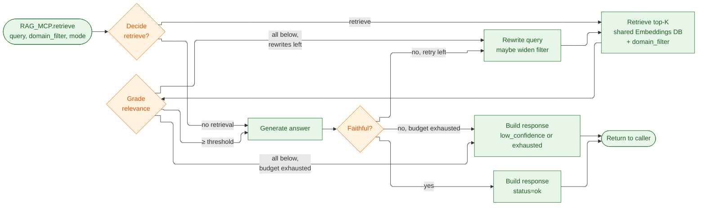
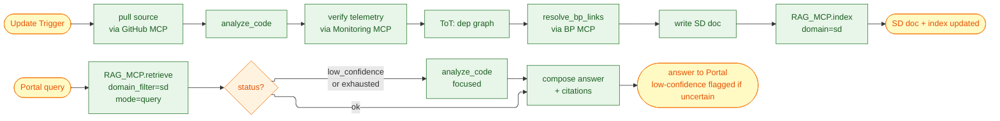
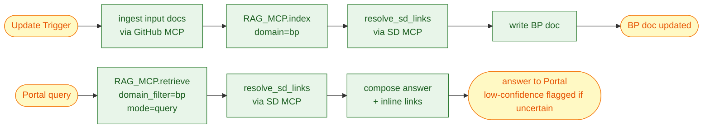
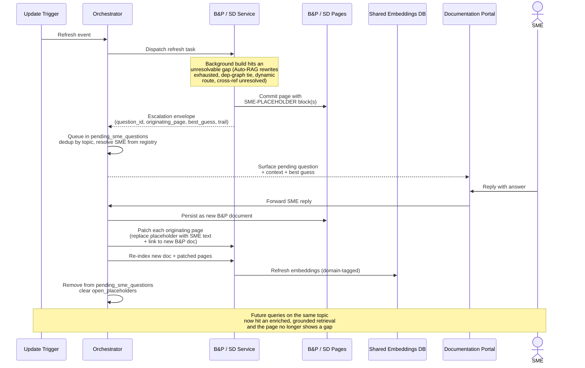

# Capstone Project — Architecture

Enrique R. Corona Dominguez

> Disclaimer: I wrote this with help from Claude Code, I provided a lot of guidance, suggestions, corrections and for
> the most part defined the high level architecture and
> implementation details based on the course lectures.

This document continues from [PROJECT.md](PROJECT.md) (Sections 1–7) and covers the
high-level ([Section 8](#8-high-level-architecture-module-5))
and low-level ([Section 9](#9-low-level-design)) design of the Research Agent. References to earlier sections link back
to the
main document.

## 8. High-Level Architecture (Module 5)

> As stated in [Section 1.3](PROJECT.md#13-proposed-solution), we're implementing a **Research Agent** that
> helps our leadership, developers, and product managers have a complete view of the architecture,
> dependencies, progress, and known gaps of our systems. Modernization efforts in a 20+ year old org stall
> on a single recurring problem: nobody has an accurate, current map of the system. Decisions get made on
> stale or incomplete documentation, dependencies get discovered late, and gap analysis becomes weeks of
> manual archaeology. A Research Agent that **continuously updates and enriches** the org's documentation
> collapses that lead time and gives every team — engineering, product, leadership — a single source of
> truth they can trust.

### 8.1 Roles and responsibilities

The system is a **multi-agent** architecture organized around a supervisor pattern: the **Orchestrator** is
the supervisor that routes work and tracks state, **B&P** and **SD** are specialist agents that each
own a documentation domain, and the **RAG Service** is a fourth component that owns the shared
embedding store and the retrieval / chunking sub-graphs both specialists rely on. Collaboration happens
through **MCP-shaped contracts** — never direct function calls — so each agent can evolve or be replaced
independently.

**Why four agents.** The work splits naturally into two domains — *business/product* and *system/code*
— and each one calls for a different kind of reasoning over a different kind of source material.
Asking one agent to do both blurs that focus. The Orchestrator is the third because someone has to
route work, track what's been documented, and hold the queue of open SME questions; that's not a fit
for either specialist. The RAG Service is the fourth because retrieval and indexing are concerns that
neither specialist owns by itself: the embedding model, the vector store, the Auto-RAG loop, and the
ToT chunking-strategy sub-graph are all infrastructure the two specialists share. Co-locating them in
a single component means the embedding model lives in one place, both specialists see consistent
retrieval behavior, and a future specialist (e.g., Security) gets retrieval and indexing for free by
calling the same RAG Service. A fifth agent would only be added when a new domain shows up; stretching
past four for general engineering reasons would just add coordination cost without new capability.

**Per-agent role:**

- **Orchestrator agent** *(supervisor)*
    - **Owns** — the **pending SME questions queue** and the SME / specialist registry. No content state.
    - **Does** — routes Portal queries to the right specialist, forwards refresh events from the
      Update Trigger to the affected specialist(s), ingests SME replies (received through the Portal)
      and routes them to the owning specialist for persistence and re-integration, deduplicates pending
      SME questions per topic.
    - **Does not** — analyze content, track which pages exist, or compute what changed. No embedding
      pipeline, no code analysis, no ToT, no doc index, no sources inventory; all deep work and all
      per-domain state are owned by a specialist.
- **B&P agent** *(Business & Product specialist)*
    - **Owns** — the **BP pages in GitHub**, the **BP doc index** (per-page metadata: `last_updated`,
      `source_documents`, `content_hash`, `open_placeholders`, embedding revision), and the **BP
      sources inventory** (input docs and their last-known hashes). No embedding store and no
      chunking pipeline of its own — those live in the RAG Service.
    - **Does** — runs the indexing pipeline ([Section 6](PROJECT.md#6-retrieval-design--rag-module-3))
      by ingesting input docs and handing the normalized document to the RAG Service via
      `RAG_MCP.index(domain=bp, ...)`, generates product and feature pages with cross-references to SD
      pages, answers query-time questions by delegating to the RAG Service via
      `RAG_MCP.retrieve(query, domain_filter=bp, mode=query)`, resolves SD links via the SD MCP,
      computes its own affected pages on a refresh event by diffing against its sources inventory.
    - **Does not** — embed or chunk anything itself, write into SD pages, or read source code
      directly; the RAG MCP owns retrieval and indexing, the SD MCP is the only path to SD pages and
      SD-side relational queries.
- **SD agent** *(System Design specialist)*
    - **Owns** — the **SD pages in GitHub**, the **SD doc index** (same shape as B&P's), and the **SD
      sources inventory** (last-known commit shas per service it documents). No embedding store of
      its own; no chunking pipeline of its own.
    - **Does** — analyzes source code via the GitHub MCP, cross-checks telemetry via the Monitoring
      MCP, runs the ToT dep-graph loop
      ([Section 7.1](PROJECT.md#71-where-tot-helps-in-this-project), use case 3), generates
      service/endpoint/dependency pages with cross-references to B&P pages, resolves B&P links via
      the B&P MCP, hands each generated SD page to the RAG Service via
      `RAG_MCP.index(domain=sd, ...)` for chunking + embedding + persistence, answers query-time
      questions by delegating to the RAG Service via
      `RAG_MCP.retrieve(query, domain_filter=sd, mode=query)`, computes its own affected pages on a
      refresh event by diffing against its sources inventory.
    - **Does not** — embed or chunk anything itself, write into B&P pages, or call into the
      embedding store directly; the RAG MCP is the only path to retrieval and indexing.
- **RAG agent** *(retrieval / indexing service)*
    - **Owns** — the **shared Embeddings Database**, the **embedding model**, the **Autonomous RAG
      loop** ([Section 9.2.1](#921-autonomous-rag-loop)), and the **ToT chunking-strategy sub-graph**
      ([Section 9.2.2](#922-tot-chunking-strategy)). Stateless across requests apart from the
      vector store itself; no per-page metadata, no SME state.
    - **Does** — accepts documents via `RAG_MCP.index(domain, source_uri, document)`, picks a
      chunking strategy via the ToT sub-graph, computes embeddings, persists chunks tagged with the
      caller's `domain` (`bp`|`sd`); accepts queries via
      `RAG_MCP.retrieve(query, domain_filter, mode)` and runs the Autonomous RAG loop, returning a
      response with status `ok | low_confidence | exhausted`, the answer, sources, retrieval trail,
      and grader scores; surfaces index-quality flags (chunks that survive retrieval but repeatedly
      fail the grader) so the calling specialist can trigger a re-index. The `mode` parameter is
      advisory — the loop is identical, only the calling specialist's reaction to `exhausted` differs
      (low-confidence answer in query mode, SME escalation in background mode).
    - **Does not** — read source code, write to GitHub, talk to SMEs, or own any per-page state. Both
      writes (`index`) and reads (`retrieve`) are scoped by the `domain` tag the specialist
      provides; the RAG Service trusts the specialist's claim of domain ownership and never
      cross-writes.

**Shared store, shared sub-graphs.** There is **one Embeddings Database**, owned by the RAG Service.
Chunks carry a `domain` tag (`bp`|`sd`) plus the source URI, content hash, and chunking-strategy
metadata. The two shared sub-graphs — Autonomous RAG ([Section 9.2.1](#921-autonomous-rag-loop)) and
ToT chunking strategy ([Section 9.2.2](#922-tot-chunking-strategy)) — live inside the RAG Service and
are not invoked by the specialists directly any more; they reach them via `RAG_MCP.retrieve` and
`RAG_MCP.index`. Cross-domain queries drop the domain filter and read the whole store — no peer-MCP
retrieval call, no merge step.

**Interaction patterns:**

- **Supervisor → specialist** (Orchestrator → B&P/SD) — task envelopes for refresh or query work; the
  specialist runs its loop and returns a structured response or an escalation.
- **Specialist → RAG Service** (B&P/SD → RAG_MCP) — both specialists call the same MCP for indexing
  (`index`) and retrieval (`retrieve`). Specialists pass their `domain` tag and the orchestrator's
  domain hint; the RAG Service does not authenticate domain ownership beyond what the specialist
  asserts (the boundary is enforced by which MCP each specialist is wired to).
- **Specialist ↔ specialist** (B&P ↔ SD) — read-only peer calls for **relational cross-references**
  only. B&P calls SD MCP for "what services serve this product"; SD calls B&P MCP for "what products
  depend on this service". Similarity retrieval is never a peer call — both specialists go through
  the RAG MCP. Neither agent writes into the other's pages.
- **Specialist → supervisor** (escalation) — when a specialist can't resolve a question during a
  background page build (RAG_MCP returns `exhausted`, SD code analysis or ToT can't resolve,
  cross-reference unresolvable), it returns an SME-escalation envelope; the orchestrator queues it
  and surfaces it through the Portal ([Section 9.6](#96-sme-interaction-module-6)).
- **Trigger → supervisor → specialists** (refresh fan-out) — the orchestrator forwards the change event
  to the specialist(s) it concerns (B&P for input-doc paths, SD for source-code paths; both for
  ambiguous events). Each specialist diffs the event against its own sources inventory and doc index,
  computes its affected pages, and works on them in parallel — calling `RAG_MCP.index` for each
  page that needs (re-)indexing.

Adding a new specialist later (e.g., a Security agent) is mostly an orchestrator change: register a new
MCP, add the routing rule, and have the new specialist call `RAG_MCP` with `domain=security`.
Existing specialists don't need to know about the new one until they need to cross-reference it, and
no embedding pipeline has to be set up for them.

### 8.2 High-Level Architecture diagram

The following diagram shows the high-level architecture considering tooling, augmented retrieval components and
ToT.


> **Diagram simplification** — the **BP↔SD cross-reference** is implemented as relative Markdown links inside
> the GitHub repo, so it lives in the `GH` node rather than as a runtime edge.

- The **"Service"** component of each agent contains the reasoning loop logic defined
  in [Section 3](PROJECT.md#3-proposed-reasoning-loop-module-2) (Module 2).
- The **Documentation Portal** is the only user-facing component. It renders BP/SD pages from
  GitHub, hosts the chatbot (routed to the Orchestrator), and provides the SME answer UI
  ([Section 9.6](#96-sme-interaction-module-6)).
- The **Monitoring MCP** is external, alongside the GitHub MCP. SD calls it during code analysis to
  verify inferred call patterns and score ToT dep-graph candidates; future agents can consume it
  without going through SD.
- **Page storage** — all generated docs live in the same GitHub repo as source code, in
  domain-scoped folders. Cross-references are relative Markdown links; agents read and write
  through the GitHub MCP. POC folder layout is in [Section 8.5](#85-considerations-for-the-poc).
- **Embedding storage** — one shared Embeddings Database, owned by the RAG Service and reached only
  via `RAG_MCP`. Chunks carry a `domain` tag plus source URI, content hash, and chunking-strategy
  metadata, so refresh and invalidation stay per-specialist even though the index is shared.
- **Continuous refresh** — the **Update Trigger** watches GitHub and/or fires on a schedule and
  emits `(doc_id or commit_sha, change_kind)` events to the Orchestrator. Each affected specialist
  diffs against its sources inventory and re-runs its pipeline. The "read-only" principle from
  [Section 1.4](PROJECT.md#14-principles-for-our-agent) applies only to *external* systems — the
  agent's own docs are in constant flux, version-controlled by Git.
- **Cross-references** — B&P calls `SD_MCP` to resolve "what services serve this product"; SD calls
  `BP_MCP` for the reverse. Both directions are re-validated on each refresh, so stale links become
  follow-up tasks instead of silent rot.
- **Runtime audit** — every service (Orchestrator, B&P, SD, RAG) emits OpenTelemetry spans for
  inbound and outbound MCP calls via `OTEL_MCP`. Spans carry the request envelope, response
  status, and latency. Per-node metrics (escalation rate, grader-fail rate, RAG `exhausted` rate,
  latency) are derived from the trace stream; see [Section 8.5](#85-considerations-for-the-poc) for
  the POC implementation.

### 8.3 Trade-offs and scalability

**Reliability vs. latency.** Every reliability mechanism in this design is also a latency cost: the
Auto-RAG rewrite loop, the ToT loops, and SME escalation each add wait time on top of a direct answer.
Each one carries an explicit cap so worst-case latency stays predictable. The trade is deliberate:
stale or hallucinated documentation is the failure mode we cannot afford, so we pay extra time on
uncertain answers rather than ship a fast wrong one.

**Coordination overhead vs. independence.** Routing every cross-agent call through MCPs and the
Orchestrator costs an extra hop, but it keeps each agent independently replaceable and puts shared
state in a single place. Direct calls would be faster but would entangle the agents and force
coordinated deployments — a worse trade for a system meant to evolve.

**Complexity vs. consistency.** B&P and SD each run in two modes (background and query) on the same
graph, so both modes reuse the same domain logic. That keeps the separation of concerns clean and
keeps fresh answers consistent with the last refresh.

**Autonomy vs. oversight (Module 6).** The agent runs autonomously most of the time — refreshes
fan out, queries answer back, and Auto-RAG self-corrects within bounds — but every loop in the
design ends in either a confident answer, a low-confidence answer with closest matches, or a
human-in-the-loop hand-off (SME escalation in background mode). We deliberately gate human
attention to the cases where it adds the most value: gaps in source material that the agent
genuinely cannot resolve from what it has, never user-facing latency. The tradeoff is that
low-confidence answers sometimes reach users without an SME having signed off; we accept that
because the alternative — making every uncertain query block on a human — would collapse the
system's throughput and defeat the "continuously updated" goal from
[§1.3](PROJECT.md#13-proposed-solution).

**Scalability.** Four properties let the design grow without rework:

- **Parallel refresh fan-out** — the Orchestrator hands out one job per affected page and the
  specialists work in parallel, so refresh time tracks the slowest page rather than the total number
  of pages.
- **New specialists plug in** — adding a new agent (e.g., Security) is a registration plus one
  routing rule. Existing agents only learn about it when they need to link to its domain.
- **New input sources plug in** — Confluence, Slack, Quip, and email enter through the same ingest
  contract used by the GitHub source today; no changes to the rest of the pipeline.
- **Resumable state** — the Orchestrator saves its progress as it goes. If a refresh crashes
  partway, it picks up where it left off instead of restarting from scratch.

### 8.4 Guardrails (Module 6)

The architecture has several guardrails baked into the structural choices above. This section
catalogues them explicitly so the safety posture is reviewable, and flags the known gaps that are
deferred to later phases.

**Built into the design:**

- **Tool access** — MCPs are the only inter-agent interface ([§8.1](#81-roles-and-responsibilities)).
  Each agent is wired to a fixed set: BP/SD reach the RAG Service, the GitHub MCP, the peer's MCP
  (relational queries only), and — for SD — the Monitoring MCP. The RAG Service has no GitHub
  access; the Orchestrator has no embedding-store or source-code access. Adding a tool means
  changing the wiring, not the prompts.
- **Cross-domain isolation** — every chunk in the shared Embeddings Database carries a `domain`
  tag, and the RAG Service trusts the caller's domain claim only on the wired MCP boundary. BP
  cannot write `domain=sd`; SD cannot write `domain=bp`. Page writes are similarly per-domain
  through the GitHub MCP.
- **Loop bounds** — Auto-RAG capped at **R=2** rewrites ([§9.2.1](#921-autonomous-rag-loop)); ToT
  loops capped at **B=2–3, D=2–3** ([§7.4](PROJECT.md#74-search-strategy)). After the cap, the
  loop returns `low_confidence` / `exhausted` rather than recursing further.
- **Output validation** — every Auto-RAG answer goes through a grader and a faithfulness re-grade
  ([§9.2.1](#921-autonomous-rag-loop)) before reaching the user; failed grades trigger a rewrite or
  fall back to low-confidence with closest matches.
- **Source verification** — answers carry retrieval trails and grader scores; cross-references are
  re-validated each refresh and degrade to follow-up tasks rather than silent rot
  ([§8.2](#82-high-level-architecture-diagram) cross-references bullet); SME re-integration grounds
  answers in human-verified content ([§9.6.1](#961-placeholders-and-re-integration)).
- **Escalation rules** — SME escalation is **background-only**: a user query can never page an SME
  ([§9.6](#96-sme-interaction-module-6)). Escalations are deduped by topic before reaching the SME registry.
- **Read-only on external systems** — the [§1.4](PROJECT.md#14-principles-for-our-agent)
  principle: the agent only writes to the BP/SD pages
  it owns and to its own embedding store. Source code, telemetry, and any future external sources
  (Slack, Confluence, Quip) are read-only.
- **Audit trail** — two complementary mechanisms: every page write goes through the GitHub MCP,
  so Git history is the durable per-page audit log; every inbound and outbound MCP call is an
  OpenTelemetry span via `OTEL_MCP` ([§8.2](#82-high-level-architecture-diagram)), so the runtime
  call graph is independently observable. Placeholder blocks include the `question_id` so
  SME-driven changes are traceable across both.
- **Runtime monitoring** — `OTEL_MCP` collects spans for every service-to-service call; per-node
  metrics (escalation rate, grader-fail rate, latency per node, RAG `exhausted` rate) and the
  index-quality flags from RAG retrieval are derived from the trace stream. POC implementation is
  in [Section 8.5](#85-considerations-for-the-poc).

**Known gaps (deferred or flagged for later phases):**

- **Prompt injection** — input docs from Git could embed adversarial instructions. No sanitization
  pass on ingest yet; for the POC the input set is hand-checked org docs, so the risk is low.
- **PII / sensitive content** — [§1.4](PROJECT.md#14-principles-for-our-agent) forbids PII but
  enforcement today is policy, not technical. A redaction pass on ingest is a candidate for the
  next phase.
- **Global LLM / cost budget** — per-loop bounds exist, but no per-request or per-refresh ceiling
  on total LLM calls. A runaway loop is bounded by the `done` action and resumability, not by an
  explicit budget.
- **Output schema validation** — structured outputs (escalation envelope, RAG response, ToT branch
  scores) follow documented shapes but aren't JSON-schema-validated at the boundary.
- **SME identity** — the Portal looks up SMEs from a registry; how an SME authenticates when
  replying is left to the Portal implementation.

**Safety strategy — how the pieces compose.** Guardrails (§8.4), evaluation
([§9.8](#98-evaluation-strategy-module-6)), and human intervention ([§9.6](#96-sme-interaction-module-6))
are three layers of one strategy, not three independent features. Guardrails are **preventive** —
they keep individual loops bounded and isolated, so a single bad call can't cascade across the
system. Evaluation is **detective** — the OTel trace stream and the offline golden set turn
runtime behavior into measurable signals (escalation rate, faithfulness pass rate, calibration),
so regressions surface early instead of silently degrading the docs. Human intervention is
**corrective** — when the agent genuinely can't resolve something during a background build, it
hands off to an SME and re-integrates the answer back into the index, closing the loop instead of
leaving a gap. The three reinforce each other: guardrails make detection meaningful (a faithful
answer that's also low-confidence is genuinely uncertain, not just sloppy), detection routes the
right gaps to SMEs, and SME answers feed back into the index so the next round of preventive
guardrails has better material to work with.

### 8.5 Considerations for the POC

- **Monitoring MCP** is left out — SD's ToT falls back to code references and existing docs as
  evaluator signals.
- **ToT loops** run with **B=2–3, D=2–3**
  ([Section 7.4](PROJECT.md#74-search-strategy)) — applies to both SD's dep-graph ToT and the RAG
  Service's chunking ToT.
- **RAG Service** runs in-process with a local ChromaDB instance. Splitting it behind
  `RAG_MCP`-over-HTTP is a later optimization; the contract with B&P/SD doesn't change.
- **OpenTelemetry MCP** is built for the POC as a thin OTel collector fronted by an MCP. Each
  service emits spans for inbound and outbound calls (request envelope, response status, latency);
  the collector persists them locally (file-based or SQLite). Production deployments would swap
  the collector for a real OTel backend (Tempo, Honeycomb, etc.) without changing the service-side
  wiring.
- **Indexed content** is BP input docs and generated SD pages only, not source code. Source-code
  indexing slots in later as another input to `RAG_MCP.index` without changing the topology.
- **Page storage** — BP and SD share a single GitHub repo with
  [/bp/](https://github.com/kikecorona/pear-store/tree/main/documentation/bp) and
  [/sd/](https://github.com/kikecorona/pear-store/tree/main/documentation/sd) folders. Splitting
  into two repos is a later option if access control requires it.
- **Update Trigger** runs as a daily scheduled job plus a manual "refresh" in the Portal. GitHub
  webhooks for per-commit triggers can be added later without changing the contract.
- **Input sources** — both inputs and outputs live in Git. Slack, Confluence, email and Quip
  ingestion are deferred to later phases; they would be added as new MCPs next to the GitHub MCP
  without changing the rest of the topology.
- **Evaluation (Module 6)**
  - **In scope for the POC** — Live signals are read off the trace stream and the doc indexes from
    day one with no extra code beyond a dashboard. Deeper evaluation runs against a small,
    manually-curated golden set on a weekly cadence; the LLM-as-judge uses the same `llama3.1:8b` as
    the agent itself, with the option to swap to a stronger judge (`llama3.1:70b` or `mixtral:8x7b`)
    for the periodic human-recalibration cycles. Calibration and hallucination checks start as manual
    spot-checks and become automated as the harness matures.
  - **Out of scope for the POC** — External adversarial inputs (prompt injection, crafted documents) and PII
    leakage rates are not measured — they are policy-deferred per the
    [§8.4 known gaps](#84-guardrails-module-6). Adding them later is a harness change, not a
    metric-strategy change.
- **Deploy safety (Module 6)** — The guardrails in [§8.4](#84-guardrails-module-6) (loop bounds,
  output validation, escalation rules, cross-domain isolation, OTel-based runtime monitoring) give
  us enough confidence to deploy and observe in real time rather than flying blind. And because
  every page write goes through Git via the GitHub MCP, every deploy comes with a free rollback
  story: a regression in BP/SD content reverts cleanly with `git revert` on the affected files,
  and re-indexing falls out of the next refresh against the rolled-back source. The combination —
  preventive guardrails + observable runtime + Git-backed rollback — is what makes the design
  deploy-ready beyond just functionally correct.

### 8.6 LLM strategy

For the POC, every LLM call across [§9](#9-low-level-design) — Auto-RAG router/grader/rewriter, orchestrator's `reason`
step, ToT probe-question generator, ToT critics, SD's `analyze_code` LLM augment, faithfulness
re-grade — runs against the same `llama3.1:8b` instance. One model, one set of prompts, one memory
profile.

If quality on a specific node lags during evaluation, the candidates for upgrade are:

- **SD `analyze_code` LLM augment** ([Section 9.3.1](#931-analyze_code)) — prose descriptions of
  endpoints. Code-specialized models do better on tricky code paths (transaction boundaries,
  non-obvious side effects). Candidates on Ollama: `codellama:7b-instruct`, `qwen2.5-coder:7b`,
  `deepseek-coder-v2`. The newer Qwen/DeepSeek tiers usually beat CodeLlama on current benchmarks.
- **Auto-RAG grader and faithfulness re-grade** ([Section 9.2.1](#921-autonomous-rag-loop)) and the
  **gap-reconciliation critic** ([Section 7.7](PROJECT.md#77-risk-and-mitigation)) — these are the
  accuracy-critical scoring nodes. A stronger general model (`llama3.1:70b`, `mixtral:8x7b`)
  improves discrimination on edge cases at the cost of memory and latency.
- **Cheap structured calls** — router, query rewriter, orchestrator `reason`, ToT probe
  Q&A — stay on `llama3.1:8b`. They're fast, structured, and bounded; a bigger model is overkill.

Trade-off: per-node specialization improves quality on the most accuracy-sensitive steps but adds
operational complexity (multiple models loaded or swapped, separate prompt tuning per family).
Ollama can hold multiple models on disk and swap on demand, so the cost on a workstation is mostly
memory. We don't commit to specialization in the POC — the design just leaves the seams obvious.

---

## 9. Low-Level Design

This section covers the per-service designs (B&P, SD, RAG) plus the patterns shared between them — the
Autonomous RAG loop, the ToT chunking strategy, and SME interaction.

### 9.1 Two operating modes

Both the **B&P** and **SD** services run in two modes against the same LangGraph harness:

- **Background mode** — the agent picks up refresh requests from the **Update Trigger** and rebuilds or
  extends its documentation store. This is the continuous half of the system; source code or input docs
  change, the trigger fires, the orchestrator dispatches per-affected-page work, and the service re-runs its
  pipeline — calling `RAG_MCP.index(...)` for every (re-)affected document.
- **Query mode** — the agent answers an on-demand question coming through the **Documentation Portal** (a
  user via the chatbot, or an SME through the SME UI). Both specialists delegate retrieval to the
  RAG Service via `RAG_MCP.retrieve(...)`; SD additionally falls back to live code analysis when
  retrieval comes back low-confidence on a service the SD page doesn't fully cover.

Both modes share the same MCPs and the same LLM. They differ in entry point and in how the
specialist composes its result around the RAG response.

### 9.2 RAG Service design

The RAG Service is the fourth component (alongside the Orchestrator, B&P, and SD). It owns the
**shared Embeddings Database**, the **embedding model**, and two LangGraph sub-graphs: the
**Autonomous RAG** loop ([Section 9.2.1](#921-autonomous-rag-loop)) used at retrieval time, and the
**ToT chunking strategy** loop ([Section 9.2.2](#922-tot-chunking-strategy)) used at indexing time.
Specialists never talk to the embedding store directly — every read and every write goes through
`RAG_MCP`.

**MCP shape.** Three methods exposed to B&P and SD:

- `retrieve(query, domain_filter, mode) -> { status, answer, sources, retrieval_trail, grader_scores }` —
  runs the Autonomous RAG loop. `domain_filter ∈ {bp, sd, both}` is pushed into the vector query;
  `mode ∈ {query, background}` is advisory metadata that lets the loop tune limits and lets the
  caller branch on the response. `status ∈ {ok, low_confidence, exhausted}` summarises the outcome:
  `ok` means the answer cleared the grader and the faithfulness check; `low_confidence` means the
  rewrite budget was exhausted but a best-effort answer is included with the closest matches;
  `exhausted` means no usable evidence was found and no answer is returned. The caller decides what
  to do — query mode returns the answer (or a low-confidence fallback) to the user; background mode
  may write an SME placeholder when `status` is `low_confidence` or `exhausted` on a sub-question
  necessary for the page being built.
- `index(domain, source_uri, document, content_hash) -> { chunks_indexed, chunking_strategy, embedding_revision }` —
  runs the ToT chunking-strategy loop on the document, computes embeddings with the RAG Service's
  embedding model, and persists chunks tagged with the caller's `domain`. The response gives the
  specialist enough metadata to update its own `doc_index`. Existing chunks for the same
  `(domain, source_uri)` are replaced atomically.
- `delete(domain, source_uri)` — invalidate all chunks for a removed source, used when a B&P input
  doc disappears or an SD page is retired.

`embed(chunks)` and `score_strategy(candidate_chunks, probe_questions)` are internal nodes of the
ToT chunking sub-graph; they are not exposed externally because the specialists don't run that loop
themselves.

**State and routing.** The RAG Service is one LangGraph state graph fronted by `RAG_MCP`; the entry
node routes by method (`retrieve`, `index`, `delete`) into the matching sub-graph. Apart from the
vector store itself, the service is stateless across requests — it does not track which page is
"in flight" for either specialist. Index-quality flags (chunks that survive retrieval but repeatedly
fail the grader) are emitted as part of the `retrieve` response so the calling specialist can
decide to re-index that source with a different chunking strategy on the next refresh. The flag is
naturally scoped by the `domain` tag the chunk carries, so re-indexing stays per-specialist.

**LLM use.** The RAG Service calls the same local LLM that B&P and SD use, for the grader, the
faithfulness re-grade, the query rewriter (in `retrieve`), and the probe-question generator + Q&A
scoring (in `index`). All these calls are bounded and cacheable; for the POC the service runs
in-process so there is no extra network hop.

**Boundary.** The RAG Service trusts the caller's claim of `domain` ownership — there is no
authentication beyond which MCP each specialist is wired to. B&P only writes `domain=bp`; SD only
writes `domain=sd`. Reads can request any domain or `both`. Adding a future specialist (e.g.,
Security) means giving it access to `RAG_MCP` and reserving a new `domain` tag — no schema change to
the store, no code change in B&P or SD.

#### 9.2.1 Autonomous RAG loop

[Sections 6.1–6.4](PROJECT.md#6-retrieval-design--rag-module-3) describe the **indexing-time** rationale.
At **retrieval time** the RAG Service wraps the vector lookup in an **Autonomous RAG** loop so the
caller can self-correct when retrieval is weak instead of returning a low-confidence answer silently.
The loop has four nodes — **decide → retrieve → grade → rewrite** — wired as a LangGraph
`StateGraph`, same harness style as the ToT loops
([Section 7.5](PROJECT.md#75-mapping-tot-roles-to-tools)). It runs entirely inside the RAG Service;
the caller (B&P or SD) sees only the response shape described in [Section 9.2](#92-rag-service-design).

The nodes:

1. **Decision (router)** — classifies the query into `{no_retrieval, retrieve}` and, when retrieving,
   honors the caller-supplied `domain_filter` ∈ `{bp, sd, both}`. Some questions are answered from
   static context and skip retrieval entirely. The Orchestrator's dispatch envelope
   ([Section 9.5](#95-orchestrator-service-design)) is what seeds the filter at the specialist; the
   specialist passes it through to `RAG_MCP.retrieve`. The router can drop the filter on its own if
   a single-domain hint produces nothing usable two rewrites in a row.
2. **Retrieval** — similarity search against the chosen embedding
   view ([Section 6.3](PROJECT.md#63-for-indexing-each-document)) on the shared Embeddings Database,
   constrained by the router's `domain_filter`. K is small (2–5) since we pull the **whole document**
   into context once it has been selected. There is no merge step — the filter (or its absence) is
   pushed into the vector query and the grader sees a single ranked list.
3. **Grader** — an LLM scores each retrieved document 0–3. If all are below threshold, the loop goes
   to the rewriter; otherwise the survivors go to answer generation, and we run a second grading
   pass for **faithfulness** to catch hallucinations.
4. **Query rewriter** — invoked when the grader produces nothing usable. Rewrites the query
   (acronyms, synonyms, scope, sub-queries) and loops back to retrieval. Bounded to **R=2** rewrites
   per question. May also widen `domain_filter` (e.g., from `bp` to `both`) when the failure pattern
   suggests cross-domain evidence is needed.

Loop control and failure modes:

- After R rewrites, the loop returns `status=low_confidence` with the closest matches, the rewrite
  trail, and grader scores. If even the closest matches are below a "no signal at all" floor the
  loop returns `status=exhausted` with no answer. The decision of what to do with each status is
  the caller's: B&P/SD in **query mode** turn `low_confidence`/`exhausted` into a low-confidence
  answer to the user; in **background mode** they turn it into an SME escalation
  ([Section 9.6](#96-sme-interaction-module-6)) and write a placeholder block
  ([Section 9.6.1](#961-placeholders-and-re-integration)).
- If the post-generation faithfulness check fails, trigger one rewrite cycle on the unsupported
  claims; if it still fails after the cycle, downgrade `status` to `low_confidence` and return.
- If the same document repeatedly survives retrieval but fails the grader, the loop emits an
  index-quality flag in the `retrieval_trail` so the calling specialist can re-index that source
  with a different chunking strategy on the next refresh — closing the loop between retrieval and
  indexing.
- Cache `(query → graded retrieval)` for the lifetime of a single request.

The router and rewriter can become ToT decision points later if their single-pass calls
underperform; for the POC we keep them single-pass.



#### 9.2.2 ToT: chunking strategy

For each new or changed document arriving via `RAG_MCP.index` — input docs from B&P, generated SD
pages from SD — the RAG Service picks a chunking strategy from the candidates in
[Section 6.2](PROJECT.md#62-chunking-strategies) (per-paragraph, per-section, per-N-chars,
summary-only, hybrid) using the ToT loop. The steps:

1. **Generate** — emit K=4 candidate strategies for the document (e.g. per-paragraph at 800 chars,
   per-section, per-N at 1200 chars, summary-only).
2. **Embed** — for each candidate, run the chunker, compute embeddings for every chunk, and stage
   them in a temporary index.
3. **Probe** — ask an LLM to read the document and produce N student-style Q&A pairs.
4. **Score** — for each candidate, run the questions against its temporary index and compute the
   similarity-over-M score: the fraction of questions whose top-K hit lands in the right chunk.
5. **Prune** — drop candidates with score below 0.7.
6. **Iterate** — beam-search keeps the top B=2–3 surviving candidates and expands variants
   (different chunk sizes, hybrid combinations) for the next level. Stops at depth D=2–3 or when
   one candidate clearly beats the others.
7. **Persist** — the winning candidate's chunks and embeddings are written to the **shared
   Embeddings Database** with the caller-supplied `domain` tag (`bp` or `sd`); the strategy itself
   is persisted as metadata so retrieval-time grading can reuse it. Existing chunks for the same
   `(domain, source_uri)` are replaced atomically.

If no candidate clears the threshold at depth D, the document is tagged low-confidence and indexed
with the highest-scoring strategy anyway; the response signals the low-confidence index so the
calling specialist can decide whether to surface a follow-up or accept the imperfect index.

This sub-graph is owned end-to-end by the RAG Service: B&P and SD do not run it themselves and do
not need to know which strategy won — they only see the response metadata
(`chunking_strategy`, `embedding_revision`) returned by `RAG_MCP.index`, which they record in their
own `doc_index`. The probe step's question generator is content-driven, so domain prose differences
(B&P narrative vs SD structured prose) flow through naturally — the winning strategy can differ per
page without any specialist-specific tuning.

### 9.3 SD Service design

The SD agent is one **LangGraph** state graph whose entry router dispatches to the right path based on the
operating mode ([Section 9.1](#91-two-operating-modes)).

**Background mode** — for each refresh task the graph walks the affected service end-to-end. It pulls
source code via the **GitHub MCP**, runs plain code analysis (AST + regex) augmented by an LLM pass
for the prose around each endpoint, optionally verifies inferred call patterns against telemetry
through the **Monitoring MCP** when wired in, runs the **ToT loop**
([Section 7.1](PROJECT.md#71-where-tot-helps-in-this-project), use case 3) to pick the best
dependency graph among several candidates, calls the **B&P MCP** to resolve cross-references, writes
the resulting page as Markdown into the **SD pages** in GitHub, then hands the new page to the RAG
Service via `RAG_MCP.index(domain=sd, source_uri, document)` for chunking + embedding +
persistence. SD's own `doc_index` records the new revision (and the `chunking_strategy` /
`embedding_revision` returned by the RAG Service) so the next refresh knows what changed.

**Query mode** — a question routed to SD delegates retrieval to the RAG Service via
`RAG_MCP.retrieve(query, domain_filter=sd, mode=query)` ([Section 9.2.1](#921-autonomous-rag-loop)).
The orchestrator's dispatch envelope seeds the SD-domain hint that SD passes through; cross-domain
queries pass `domain_filter=both`. If the response comes back with `status=ok` the answer is
composed from the returned chunks with citations. If the response is `low_confidence` or
`exhausted` — typically because the existing SD page genuinely doesn't cover the question — a
focused `analyze_code` pass runs on a targeted subset of files (the file backing the closest-matching
endpoint, taken from the response's `sources`) and feeds the composer. The user always gets an
answer back: if the RAG response and focused analysis both leave the response low-confidence, it is
returned as such with closest-match citations and the analyzer's notes. Query mode never escalates
to an SME — that flow is reserved for background builds (see [Section 9.6](#96-sme-interaction-module-6)).

Reusing the same code-analysis node across both modes keeps the live answers consistent with what we
documented during the last refresh — they come from the same logic. Delegating retrieval to the same
RAG Service across B&P and SD keeps query-time behavior consistent across domains.

**ReAct implementation.** The outer loop is a `reason → act → observe` cycle: `reason` picks the next
step from `{pull_source, analyze_code, verify_telemetry, run_tot_dep_graph, resolve_bp_links,
write_doc, rag_index, rag_retrieve, focused_analyze, compose_answer, escalate, done}` based on the
operating mode and the partial result so far. `act` calls the chosen sub-step (e.g., `analyze_code`
is itself a five-step internal pipeline — see [Section 9.3.1](#931-analyze_code); `rag_index` and
`rag_retrieve` are MCP calls into the RAG Service). `observe` writes the result back into graph
state and a conditional edge loops back to `reason` until the action returns `done`. Background mode
is mostly deterministic so the local LLM rarely deviates from the planned order; query mode is more
active — the reasoner decides whether the RAG response was sufficient or focused code analysis is
needed. `escalate` is reachable only from background mode.



#### 9.3.1 analyze_code

This node is the workhorse of SD's design. It pulls source files via the **GitHub MCP** and produces a
structured representation of the service: **endpoints** (Flask `@app.route` decorators extracted with
Python's `ast` module), **data structures** (`@dataclass` definitions and type-hinted function
signatures), and **downstream calls** (`requests` HTTP calls and raw `sqlite3` queries). Each endpoint
also gets a one-paragraph plain-English description from an LLM pass over the function body and
surrounding comments, so the doc reads like prose rather than an auto-generated stub.

In query mode the same node runs on a focused subset of files identified by the router — typically the
file containing the endpoint the question is about — keeping the prompt small for the local LLM.

**Implementation pipeline.** The node decomposes into five internal sub-steps:

1. **`pull_source`** — pulls the target service's tree via the GitHub MCP. A full refresh pulls
   everything; an incremental refresh pulls only files changed since the doc index's last revision
   (commit-sha diff). Files are content-hashed and cached so re-runs over the same revision are free.
2. **`parse_ast`** — parses each `.py` file with the stdlib `ast` module, producing a uniform internal
   node representation `{kind, name, decorators, args, body_range, source_path}` that downstream
   sub-steps consume.
3. **`extract_endpoints`** — walks the AST for Flask `@app.route(path, methods=[...])` decorators and
   `Blueprint`-mounted routes. Each match produces an `Endpoint` record `{method, path, handler_fn,
   params, return_type, source_path, line_range}`. Data structures are extracted alongside from
   `@dataclass` definitions and type-hinted parameter/return annotations.
4. **`extract_calls`** — pattern-matches outbound calls: HTTP via
   `requests.{get,post,put,delete,...}(url, ...)` and DB via `sqlite3` — calls of the form
   `<conn>.execute(sql, ...)` where `<conn>` traces back to a `sqlite3.connect(...)` (directly or
   through the `shared.db.connect()` helper). Table names parsed from the SQL string and
   statically-resolvable URLs become the dependency target; the rest are tagged `dynamic` for SME
   review.
5. **`llm_augment`** — for each endpoint, sends a structured prompt to the LLM containing the function
   body, immediately surrounding comments, and the `Call` records that originate from that handler.
   The prompt asks for a one-paragraph prose description of what the endpoint does and any non-obvious
   behavior. Bounded to ~1k input tokens per call so prompts stay focused and fit comfortably in the
   local LLM's context window.

**Output shape.** The node writes a `ServiceAnalysis` blob to graph state, consumed by every downstream
node in the SD graph (`verify_telemetry`, `ToT dep graph`, `resolve_bp_links`, `write SD doc`):

```text
{
  "service": "billing-service",
  "source_revision": "<commit-sha>",
  "endpoints":         [{ method, path, handler, params, return_type, source_path, line_range }],
  "data_structures":   [{ name, fields, kind }],
  "downstream_calls":  [{ from, kind: http|db, target, dynamic? }],
  "prose":             { "<endpoint_key>": "<one-paragraph description>" }
}
```

**Edge cases — tagged, not guessed:**

- **Dynamic routes** — paths or URLs computed at runtime are tagged `dynamic` with the source
  expression captured; the doc page surfaces them for SME confirmation.
- **Blueprint registration** — multi-blueprint apps where the URL prefix comes from
  `register_blueprint(..., url_prefix=...)` are captured best-effort. The ToT dep-graph step uses
  telemetry to break ties when more than one wiring is plausible.
- **Partial parse failures** — file-level parse errors are recorded in the analysis metadata; the rest
  of the run proceeds and the SD page lists the failed files as follow-ups for the next refresh.

#### 9.3.2 verify_telemetry

When the **Monitoring MCP** is wired in (out of POC scope per [Section 8.5](#85-considerations-for-the-poc)), this node
cross-checks
`analyze_code`'s output against observed traffic. For each inferred endpoint, it queries the MCP for
spans and metrics matching the route — endpoints with no telemetry get flagged as candidates for
deprecation. For each inferred downstream call, it verifies that traces actually show calls to the named
target; calls that appear in code but not in telemetry are suspicious, and the reverse case (telemetry
shows something the code analysis missed) is also surfaced.

Each endpoint and dependency gets a confidence score based on telemetry agreement, which feeds into the
ToT evaluator below. The node is a no-op when the Monitoring MCP is unavailable — confidence collapses to
"code-only".

#### 9.3.3 ToT dep graph

Inferring the dependency graph is non-trivial — call patterns are often ambiguous when calls flow through
brokers, queues, or service meshes. The steps:

1. **Generate** — emit K=3 candidate dependency graphs per service: one taken straight from code
   analysis, one reweighted by telemetry agreement (so high-volume but lightly-coded paths get promoted),
   and one that prefers stable historical traffic over single-trace anomalies.
2. **Score** — for each candidate, compute the telemetry agreement: the fraction of edges that match
   observed traffic from the Monitoring MCP, weighted by call volume. Without telemetry, the score
   collapses to a rubric over code coverage and reference count.
3. **Prune** — drop candidates with agreement below 0.8.
4. **Iterate** — beam-search keeps the top B=2–3 surviving candidates and expands variants (swap inferred
   edges, merge near-duplicates) for the next level. Stops at depth D=2–3.
5. **Persist** — the winning graph becomes the dependency section in the generated SD page; runner-up
   edges that differ are recorded as follow-up tasks for the next refresh.

If no candidate clears the threshold, the highest-scoring graph is kept and flagged for SME review.

### 9.4 B&P Service design

The B&P agent is one LangGraph state graph, with an extra responsibility on top of the indexing
pipeline from [Section 6](PROJECT.md#6-retrieval-design--rag-module-3): every page it produces or
consumes needs to **resolve into the SD documentation** so that a B&P page about a product links to
the services that implement it.

**Background mode** — the agent ingests input documents (org docs from the Git repo for the POC),
normalizes them (strips formatting metadata, collapses whitespace, resolves embedded references),
and computes a content hash that B&P's own `sources_inventory` uses to skip unchanged files on the
next refresh. It then hands the normalized document to the RAG Service via
`RAG_MCP.index(domain=bp, source_uri, document, content_hash)` — the RAG Service runs ToT chunking
([Section 9.2.2](#922-tot-chunking-strategy)), computes embeddings, and persists the chunks. B&P
records the returned `chunking_strategy` and `embedding_revision` in its `doc_index` and produces
the corresponding B&P page. Right before writing the page, a `resolve_sd_links` node calls the **SD
MCP** to enumerate the services that back the product or feature described on the page; the
resulting links are inlined as relative Markdown links to the SD pages. Stale links surface as
follow-up tasks rather than silent rot — the next refresh re-validates them. For the POC the input
set is just hand-checked org docs in the same Git repo; later phases plug in additional MCPs
(Confluence, Slack, etc.) without changing this contract.

**Query mode** — incoming questions are answered by delegating to the RAG Service via
`RAG_MCP.retrieve(query, domain_filter=bp, mode=query)` ([Section 9.2.1](#921-autonomous-rag-loop)).
The orchestrator's dispatch envelope seeds the BP-domain hint that B&P passes through;
cross-domain queries pass `domain_filter=both`, so the response sees BP and SD chunks together
without any merge step on B&P's side. When the response references a service in its answer, the
same `resolve_sd_links` node runs to resolve the reference at answer time, so the user sees an
up-to-date link even if the persisted page is briefly stale. If the response comes back as
`low_confidence` or `exhausted`, the user gets a low-confidence answer with closest-match
citations — query mode does not escalate to an SME (see [Section 9.6](#96-sme-interaction-module-6)).

The cross-referencing direction is symmetric with SD: B&P calls **SD MCP** to resolve "what
services serve this product"; SD calls **B&P MCP** to resolve "what products depend on this
service". The two services do not write into each other's pages — they just link.

**ReAct implementation.** The outer loop is a `reason → act → observe` cycle: `reason` picks the
next step from `{ingest_input_docs, rag_index, resolve_sd_links, write_bp_doc, rag_retrieve,
compose_answer, escalate, done}` based on the operating mode and partial result. `act` calls the
chosen sub-step (e.g., `rag_index` and `rag_retrieve` are MCP calls into the RAG Service);
`observe` writes the result back into graph state and a conditional edge loops back to `reason`.
Background mode is mostly deterministic sequencing through ingest → index → resolve_links →
write_doc; query mode hands off to `rag_retrieve` and composes the answer around the RAG response.
`escalate` is reachable only from background mode.



### 9.5 Orchestrator Service design

The Orchestrator is one **LangGraph** state graph that runs a plain **ReAct** loop. It does no content
analysis itself — its job is to receive work from the Portal or the Update Trigger, route it to the
right specialist, and persist the resulting state. Same harness style as B&P and SD, with fewer nodes
since there is no domain-specific reasoning.

**Inputs.** Three event types feed the orchestrator:

- **Portal query** — a user (or SME) question or improvement proposal. The orchestrator picks B&P,
  SD, or both based on the query, and the dispatch envelope carries a `domain_hint` that the
  specialist forwards to `RAG_MCP.retrieve` as `domain_filter`. Specialists never escalate
  query-mode work to an SME — a low-confidence answer comes straight back to the Portal.
- **Trigger refresh** — `(doc_id or commit_sha, change_kind)` events from the Update Trigger. The
  orchestrator routes each event to the specialist(s) it concerns based on its path/kind (a small
  static rule, not a stored index). Each specialist computes its own affected pages by diffing the
  event against its sources inventory and re-runs its pipeline (calling `RAG_MCP.index` for each
  affected document). Background-mode dispatches are the only source of SME escalations.
- **SME reply** — answers received via the Portal that need to land as a new B&P document and
  patched back into every page that carried the matching placeholder.

**State.** A single persisted blob survives between runs:

- **`pending_sme_questions`** — escalated questions waiting for an SME, keyed by `question_id`, with
  `{topic, question, originating_pages, placeholder_id, best_guess, retrieval_trail, assigned_sme,
  posted_at}`. `originating_pages` is the set of B&P/SD page URIs that carry the matching
  placeholder, so re-integration patches every page that asked the same question — not just the newest
  one. This is the only piece of state the orchestrator owns; it is genuinely cross-cutting because
  dedup happens across both domains and the SME registry is global.

The **doc index** and **sources inventory** are *not* held by the orchestrator. Each specialist owns
its own copy keyed to its domain (see [§8.1](#81-roles-and-responsibilities)). The orchestrator can ask a specialist for that
information via its MCP when it needs it (e.g., the placeholder-patch step queries the owning
specialist for the page's current content), but it never caches a global view.

**ReAct implementation.** The outer loop is a 3-node ReAct cycle: `reason` (the local LLM picks the next
action from `{dispatch_to_bp, dispatch_to_sd, dispatch_to_both, ingest_sme_reply, ack_completion, done}`
based on the inbound event and current state) → `act` (calls the chosen MCP or internal node) →
`observe` (writes the response back into graph state). A conditional edge loops back to `reason` until
the action returns `done`. The system prompt is kept tight (~300 tokens) and the action space small so
the loop runs reliably on the local LLM.

**Pipeline nodes wrapped by the ReAct loop:**

1. **`route`** — classifies the inbound event into `{portal_query, trigger_refresh, sme_reply}`. Used
   by the `reason` step as the first decision point.
2. **`dispatch`** — for refresh tasks, forwards the change event to the right specialist's MCP; the
   specialist returns the list of affected pages it plans to refresh (or `[]` if the event is
   irrelevant to it). For Portal queries, picks a single specialist (or both, if the query spans both
   domains) and forwards.
3. **`ingest_sme_reply`** — the re-integration step ([Section 9.6.1](#961-placeholders-and-re-integration)).
   Persists the SME's answer as a new B&P document via the BP_MCP, then walks
   `pending_sme_questions[question_id].originating_pages` and asks the owning specialist to **patch
   each page** by replacing the placeholder block with the SME's text plus a link to the new doc. Tells
   B&P to re-index. The patching specialist updates its own `open_placeholders` in its doc index;
   the orchestrator just removes the entry from `pending_sme_questions`.
4. **`ack_completion`** — when a specialist finishes a refresh task or a query response, this node
   marks the in-flight task complete in the orchestrator's working state. If the response is a
   background-mode escalation envelope (specialist hit a gap and wrote a placeholder block into the
   page it was building), the node opens or updates the corresponding entry in
   `pending_sme_questions`. Query-mode responses never carry an escalation envelope. The specialist
   itself records the new page in its own doc index — the orchestrator no longer maintains a parallel
   copy.

**Resumability.** Every node persists its state before transitioning; if the orchestrator crashes
mid-refresh it picks up where it left off on next start. Refresh fan-outs run specialists in parallel
but preserve ordering per page so cross-references stay consistent within a single cycle.

### 9.6 SME interaction (Module 6)

When a specialist hits an unresolvable gap during a **background page build** — Auto-RAG exhausts its
rewrite budget on a sub-question necessary for the page, code analysis tags a route as `dynamic`, the
ToT dep-graph evaluator can't pick a winner, or a cross-reference can't be resolved — it escalates the
question to a **subject matter expert** through the **Documentation Portal**
([Section 8](#8-high-level-architecture-module-5)). Query-mode answers never escalate; the user gets a
low-confidence answer with closest-match citations and the gap is filled the next time a background
build surfaces the same question. The goal is to enrich the knowledge base over time, not to block
either the user or the page commit.

The flow is async:

1. The specialist commits the page with a **placeholder block** standing in for the missing prose or
   link ([Section 9.6.1](#961-placeholders-and-re-integration)) and returns an **escalation envelope**
   to the orchestrator carrying `question_id`, `placeholder_id`, the originating page URI, the
   retrieval/analysis trail, and the agent's best low-confidence guess so the SME can confirm or
   correct rather than draft from scratch.
2. The orchestrator queues the question (`pending_sme_questions` in its inventory, keyed by
   `question_id`) with the originating page list, dedupes by topic so two pages hitting the same gap
   don't both page the SME, and surfaces it to the right SME through the Portal.
3. When the SME replies, the orchestrator runs `ingest_sme_reply`
   ([Section 9.5](#95-orchestrator-service-design)): it persists the reply as a new B&P document,
   asks the owning specialist to patch every originating page (placeholder block → SME's text + link
   to the new doc), triggers re-indexing, and clears the queue entry.



The Portal looks up the right SME from a registry keyed by project/domain (the "initial list of SMEs"
from [Section 3.1](PROJECT.md#31-business--product-bp-pov)), with fallback to the next candidate after
a timeout (e.g., 24h). The same flow is used by **SD** when its ToT gap-reconciliation evaluator can't
pick a winner ([Section 7.7](PROJECT.md#77-risk-and-mitigation)'s mitigation).

If the SME's reply disagrees with the retrieved documents, those documents are flagged for refresh —
the SME-driven counterpart of the index-quality feedback in
[Section 9.2.1](#921-autonomous-rag-loop). If no SME is available for a domain, the
orchestrator records the gap in its inventory; it is a knowledge-base coverage problem, not a runtime
error.

#### 9.6.1 Placeholders and re-integration

A page is rarely held back because of a single open question — the specialist commits what it knows and
**marks the gap inline** so readers see where the documentation is incomplete and the system has a hook to patch
the page once an SME answers. Two mechanisms cover this: a **placeholder block** written into the page at gap
time, and a **re-integration step** in the orchestrator that replaces the block when the SME's reply lands.

**When a placeholder is written.** A placeholder block is emitted whenever a specialist hits a gap it cannot
resolve on its own during a background page build and the resulting question is escalated to an SME via
[Section 9.6](#96-sme-interaction-module-6). The common cases:

- **Background-mode RAG retrieval** — while building or refreshing a page, the specialist calls
  `RAG_MCP.retrieve(query, domain_filter, mode=background)` ([Section 9.2.1](#921-autonomous-rag-loop))
  for a sub-question necessary for the page (B&P over its input docs, SD over the SD slice — both
  may widen the filter to cross-domain when the question warrants). The RAG Service exhausts its
  rewrite budget and returns `status=exhausted` (or `low_confidence` on a question critical for the
  page, e.g., the canonical owner of a feature flag or the product context for an SD endpoint).
  Query-mode `RAG_MCP.retrieve` returns the same statuses but the specialist treats them as a
  low-confidence answer to the user instead — no placeholder is written.
- **SD code-analysis gaps** — `analyze_code` tags a route or call as `dynamic` ([Section 9.3.1](#931-analyze_code))
  or the ToT dep-graph evaluator can't pick a winner ([Section 9.3.3](#933-tot-dep-graph)).
- **Cross-reference resolution** — `resolve_sd_links` / `resolve_bp_links` can't map a referent and the link
  would otherwise rot silently.

In all three cases the specialist still writes the page; the placeholder block stands in for the missing prose
or link.

**Placeholder block format.** A self-contained, machine-locatable Markdown block with HTML-comment fences so
the patch step can find and replace it deterministically without regex over arbitrary prose:

```markdown
<!-- SME-PLACEHOLDER:Q-2026-06-17-001 START -->
> ⏳ **Waiting for SME** — *Topic:* dynamic queue URL resolution
>
> *Question:* How is `QUEUE_BASE` resolved per tenant at runtime?
> *Best guess (low-confidence):* Derived from `config.QUEUE_BASE` plus tenant-id; needs confirmation.
> *Asked:* @alice on 2026-06-17 · *Status:* pending · *Question ID:* `Q-2026-06-17-001`
<!-- SME-PLACEHOLDER:Q-2026-06-17-001 END -->
```

The fenced HTML comments are the contract. Everything between them is human-readable; the `question_id` in the
fence is what the orchestrator uses to find the block. The page's `open_placeholders` list in the owning
specialist's `doc_index` mirrors the set of `question_id`s currently fenced inside the file; the orchestrator
finds every page that asked the same question via its own `pending_sme_questions[question_id].originating_pages`,
without scanning the repo and without keeping a parallel index of its own.

**Re-integration when the SME replies.** The orchestrator's `ingest_sme_reply` node
([Section 9.5](#95-orchestrator-service-design)) does two writes in order:

1. **New B&P document** — the SME's answer is persisted as a standalone B&P page so the Auto-RAG loop can
   retrieve it on future queries on the same topic. This is the embedding-side update; without it, the next
   identical question would re-escalate.
2. **Patch every originating page** — for each URI in `pending_sme_questions[question_id].originating_pages`,
   the orchestrator asks the owning specialist (B&P or SD) to replace the fenced placeholder block with the
   SME's text plus a relative Markdown link to the new B&P document. This is the page-side update; without it,
   the placeholder rots in the page even though the answer exists.

Both writes are committed in the same Git change so the index update and the page patch land together. After
the patch, the `question_id` is removed from each page's `open_placeholders` and the entry is cleared from
`pending_sme_questions`. If a downstream refresh later re-discovers the same gap (e.g., the SME's answer
became outdated), a new `question_id` is opened and a fresh placeholder block written — the system never
reuses a closed `question_id`, so the audit trail in Git stays linear.

**Cross-references re-validation.** The same patch step also runs after a refresh that resolves a previously
missing cross-reference: the placeholder block becomes the resolved relative Markdown link. From the page's
perspective there's only one mechanism — fenced block in, resolved content out — regardless of whether the
fix came from an SME or from a successful re-run.

### 9.7 Audit and observability (Module 6)

Every service in the architecture emits **OpenTelemetry spans** for inbound and outbound MCP calls
through `OTEL_MCP` ([Section 8.2](#82-high-level-architecture-diagram)). The spans form the runtime
audit log and the source of every per-node metric the system tracks. Span emission is a
cross-cutting concern: each `act` step in a service's ReAct loop is wrapped automatically, so the
per-service designs in [§9.2](#92-rag-service-design)–[§9.5](#95-orchestrator-service-design) don't need to thread it explicitly.

**Span boundary.** A span opens on every inbound MCP method and on every outbound MCP call. By
service:

- **Orchestrator** ([§9.5](#95-orchestrator-service-design)) — inbound: `route`; outbound:
  `dispatch_to_bp/sd/both`, `ingest_sme_reply`, `ack_completion`.
- **B&P Service** ([§9.4](#94-bp-service-design)) — inbound: each `BP_MCP` method; outbound:
  `RAG_MCP.retrieve/index`, `SD_MCP.*`, `GH_MCP.*`.
- **SD Service** ([§9.3](#93-sd-service-design)) — inbound: each `SD_MCP` method; outbound:
  `RAG_MCP.*`, `BP_MCP.*`, `GH_MCP.*`, `MON_MCP.*`.
- **RAG Service** ([§9.2](#92-rag-service-design)) — inbound: `retrieve`, `index`, `delete`;
  outbound: LLM calls (grader, faithfulness, rewriter, probe), embedding-model calls.

**Span attributes.** Each span carries `mcp.method`, `mcp.domain` (for RAG calls),
`mcp.status` (e.g., `ok`/`low_confidence`/`exhausted` for RAG retrieve), `mcp.latency_ms`, and
`mcp.trace_id` propagated through MCP envelopes so a Portal query → Orchestrator → B&P → RAG chain
shares one end-to-end trace. A `mcp.payload_summary` carries counts, IDs, and status — **not** raw
queries or document content. Auto-RAG spans add rewrite count, grader scores, faithfulness
pass/fail, and index-quality flags; ToT spans add branch count, depth reached, and winning score.

**Derived metrics.** The trace stream is the source of truth for:

- **Escalation rate** — fraction of background dispatches that emit an escalation envelope.
- **Grader-fail rate** — fraction of Auto-RAG retrievals that go to rewrite or fall back.
- **RAG status distribution** — counts of `ok` / `low_confidence` / `exhausted` per domain.
- **Latency percentiles** — p50 / p95 per MCP method.
- **ToT branch success rate** — fraction of ToT loops that exit before the depth cap.
- **Index-quality hit rate** — chunks repeatedly surviving retrieval but failing the grader
  (re-indexing signal closing the loop with [§9.2.1](#921-autonomous-rag-loop)).

**Privacy.** Raw query text and full document content are NOT captured by default; the collector
samples them only when explicitly enabled in dev configurations, so the
[§1.4](PROJECT.md#14-principles-for-our-agent) PII guarantee stays policy-clean even when the
trace backend is shared infrastructure.

**Resilience.** Span emission is fire-and-forget — a failure in `OTEL_MCP` never blocks a
service-to-service call. Spans are buffered locally if the collector is unreachable; the buffer
is bounded so a sustained outage drops oldest-first rather than stalling agent work.

### 9.8 Evaluation strategy (Module 6)

The [§9.7](#97-audit-and-observability-module-6) trace stream tells us what the agent *did*; this
section is about whether what it did was *any good*. Two layers: **online metrics** computed live from spans + doc
indexes (cheap, runs
continuously) and **offline metrics** that require labeling or sampling (slower, higher signal).

**Online metrics** — derivable from the OTel trace stream ([§9.7](#97-audit-and-observability-module-6))
and the per-specialist doc indexes ([§9.5](#95-orchestrator-service-design)) without any external
labeling:

- **Faithfulness pass rate** — fraction of generated answers that pass the post-generation
  faithfulness re-grade ([§9.2.1](#921-autonomous-rag-loop)). Drops are an early signal of
  hallucination drift in retrieval or in the answerer.
- **Escalation rate** — fraction of background dispatches that emit an SME-escalation envelope
  (already in [§9.7](#97-audit-and-observability-module-6)).
- **Grader-fail rate** — fraction of Auto-RAG retrievals that fall through to rewrite or fallback
  (already in [§9.7](#97-audit-and-observability-module-6)).
- **RAG status distribution** — counts of `ok` / `low_confidence` / `exhausted` per domain (already
  in [§9.7](#97-audit-and-observability-module-6)). A rising `exhausted` rate on `domain=bp` queries with `domain=sd` candidates suggests a
  cross-reference gap rather than a chunking gap.
- **Coverage** — `% products with a BP page` / `% services with an SD page`, computed from each
  specialist's `doc_index`. A coverage drop after a refresh means the trigger or the diff missed
  something.
- **Freshness** — median age since last refresh per page; `% pages whose content_hash diverges
  from the current source`. Both come from the doc index without any extra instrumentation.
- **Open-placeholder rate** — `% pages with at least one unresolved SME-PLACEHOLDER`, derived from
  each specialist's `open_placeholders` set ([§9.6.1](#961-placeholders-and-re-integration)).
- **SME resolution time** — median / p95 time from `pending_sme_questions[id].posted_at` to
  `ingest_sme_reply` ([§9.5](#95-orchestrator-service-design)). Tells us whether the SME loop is
  keeping pace.
- **Cross-reference health** — `% relative Markdown links to peer pages that resolve` on a
  scheduled validator pass over the BP and SD folders. Broken links above a threshold trigger a
  refresh of the referencing pages.
- **Latency** — p50 / p95 per MCP method, end-to-end query latency, refresh latency per page (all
  in [§9.7](#97-audit-and-observability-module-6)).
- **ToT branch success rate** — fraction of ToT loops (chunking, dep-graph, gap-reconciliation)
  that exit before the depth cap (already in [§9.7](#97-audit-and-observability-module-6)).
- **Index-quality hit rate** — chunks repeatedly surviving retrieval but failing the grader; the
  re-indexing signal that closes the loop with [§9.2.1](#921-autonomous-rag-loop).

**Offline metrics** — require labeling, sampling, or human review. Higher signal than the online
ones but slower to update:

- **Correctness** — a small **golden Q&A set** (~30–50 questions across BP and SD domains, with
  human-validated answers) scored against the agent's responses. Scoring uses LLM-as-judge with a
  rubric (relevance, completeness, accuracy, citation quality) plus a periodic human spot-check to
  recalibrate the judge. The golden set is curated by the team and grows over time.
- **Calibration** — does the agent's `status` track reality? Computed from the golden set: of
  answers stamped `ok`, what fraction the human reviewer also marked correct; of `low_confidence`,
  what fraction were actually wrong. A miscalibrated `ok` is the worst failure mode (overconfident
  hallucination).
- **Hallucination rate** — separate from faithfulness: the faithfulness re-grade asks "is the
  answer supported by retrieved chunks?", but a stronger check asks "is every factual claim in the
  answer supported by at least one cited source?" Run periodically over a sample of recent answers
  by an LLM judge with a stricter rubric.
- **Page-quality review** — periodic sampling of newly-generated BP/SD pages, scored by an SME or
  by an LLM-as-judge with a rubric (structure, completeness, accuracy, link quality). Catches
  systematic regressions the online metrics miss.

For POC scope (which metrics are wired up from day one, the LLM-as-judge cadence, and what is
explicitly out of scope), see [Section 8.5](#85-considerations-for-the-poc).
