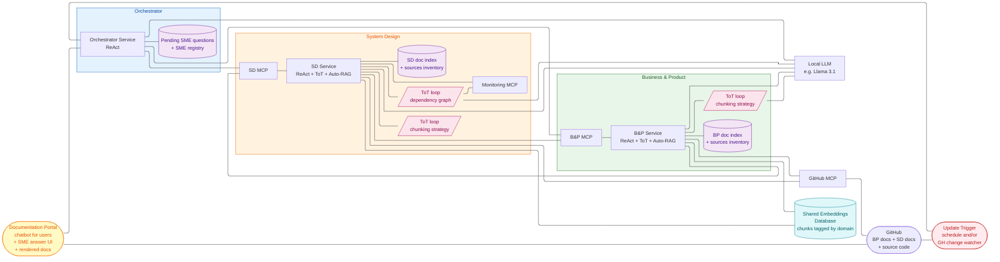
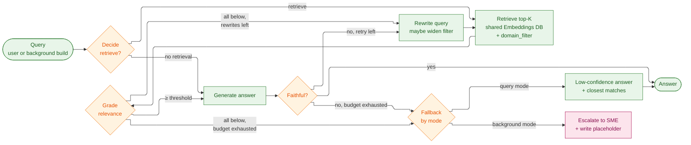
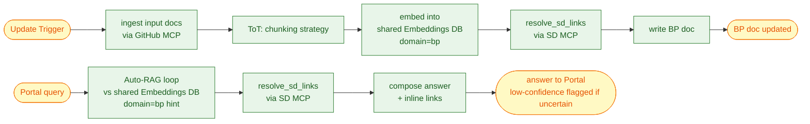
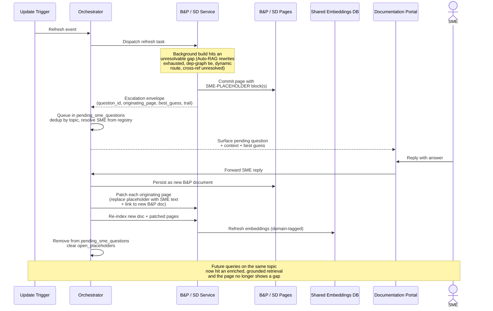

# Capstone Project — Architecture

Enrique R. Corona Dominguez

> Disclaimer: I wrote this with help from Claude Code, I provided a lot of guidance, suggestions, corrections and for the most part defined the high level architecture and
> implementation details based on the course lectures.

This document continues from [PROJECT.md](PROJECT.md) (Sections 1–7) and covers the
high-level ([Section 8](#8-high-level-architecture-module-5))
and low-level ([Section 9](#9-low-level-design)) design of the Research Agent. References to earlier sections link back
to the
main document.

## 8. High-Level Architecture (Module 5)

> As stated in [Section 1.3](PROJECT.md#13-proposed-solution), we're implementing a **Research Agent** that
helps our leadership, developers, and product managers have a complete view of the architecture,
dependencies, progress, and known gaps of our systems. Modernization efforts in a 20+ year old org stall
on a single recurring problem: nobody has an accurate, current map of the system. Decisions get made on
stale or incomplete documentation, dependencies get discovered late, and gap analysis becomes weeks of
manual archaeology. A Research Agent that **continuously updates and enriches** the org's documentation
collapses that lead time and gives every team — engineering, product, leadership — a single source of
truth they can trust.

### 8.1 Roles and responsibilities

The system is a **multi-agent** architecture organized around a supervisor pattern: the **Orchestrator** is
the supervisor that routes work and tracks state, while **B&P** and **SD** are specialist agents that each
own a documentation domain and run their own LangGraph reasoning loop. Collaboration happens through
**MCP-shaped contracts** — never direct function calls — so each agent can evolve or be replaced
independently.

**Why three agents.** The work splits naturally into two domains — *business/product* and
*system/code* — and each one calls for a different kind of reasoning over a different kind of source
material. Asking one agent to do both blurs that focus. The Orchestrator is the third because someone
has to route work, track what's been documented, and hold the queue of open SME questions; that's not
a fit for either specialist. A fourth agent (e.g., Security) can be added later when a new domain
shows up, but stretching past three before then adds coordination cost without new capability.

**Per-agent role:**

- **Orchestrator agent** *(supervisor)*
    - **Owns** — the **pending SME questions queue** and the SME / specialist registry. No content state.
    - **Does** — routes Portal queries to the right specialist, forwards refresh events from the
      Update Trigger to the affected specialist(s), ingests SME replies (received through the Portal)
      and routes them to the owning specialist for persistence and re-integration, deduplicates pending
      SME questions per topic.
    - **Does not** — analyze content, track which pages exist, or compute what changed. No embedding
      pipeline, no code analysis, no ToT, no doc index, no sources inventory; all deep work and all
      per-domain state are owned by a specialist.
- **B&P agent** *(Business & Product specialist)*
    - **Owns** — the **BP pages in GitHub**, the **BP slice of the shared Embeddings Database** (chunks
      tagged `domain=bp`), the **BP doc index** (per-page metadata: `last_updated`, `source_documents`,
      `content_hash`, `open_placeholders`, embedding revision), and the **BP sources inventory** (input
      docs and their last-known hashes).
    - **Does** — runs the indexing pipeline ([Section 6](PROJECT.md#6-retrieval-design--rag-module-3)), generates
      product and feature pages with
      cross-references to SD pages, answers query-time questions through the Autonomous RAG loop
      ([Section 9.2](#92-autonomous-rag-architecture-query-time)), resolves SD links via the SD MCP,
      computes its own affected pages on a refresh event by diffing against its sources inventory.
    - **Does not** — write into the SD pages, write chunks tagged `domain=sd` into the shared
      Embeddings Database, or read source code directly; the SD MCP is the only path to SD pages and
      SD-side relational queries.
- **SD agent** *(System Design specialist)*
    - **Owns** — the **SD pages in GitHub**, the **SD slice of the shared Embeddings Database** (chunks
      tagged `domain=sd`), the **SD doc index** (same shape as B&P's), and the **SD sources inventory**
      (last-known commit shas per service it documents).
    - **Does** — analyzes source code via the GitHub MCP, cross-checks telemetry via the Monitoring MCP,
      runs the ToT dep-graph loop ([Section 7.1](PROJECT.md#71-where-tot-helps-in-this-project), use case 3), generates
      service/endpoint/dependency pages
      with cross-references to B&P pages, resolves B&P links via the B&P MCP, indexes its own pages into
      the **shared Embeddings Database** through the shared chunking sub-graph
      ([Section 9.4.2](#942-tot-chunking-strategy)), answers query-time questions through the same
      Auto-RAG sub-graph B&P uses ([Section 9.2](#92-autonomous-rag-architecture-query-time)),
      computes its own affected pages on a refresh event by diffing against its sources inventory.
    - **Does not** — write into the B&P pages or write chunks tagged `domain=bp` into the shared
      Embeddings Database; the B&P MCP is the only path to BP pages and BP-side relational queries.

**Shared sub-graphs and shared store.** Both specialists run the same **ToT chunking strategy** sub-graph
([Section 9.4.2](#942-tot-chunking-strategy)) over their own input — input docs for B&P, generated SD
pages for SD — and the same **Auto-RAG** sub-graph
([Section 9.2](#92-autonomous-rag-architecture-query-time)) at query time. There is **one
Embeddings Database** shared by both specialists; chunks carry a `domain` tag (`bp`|`sd`) plus the
source URI, content hash, and chunking-strategy metadata, so writes stay scoped to the owning
specialist's slice and reads can apply an optional domain filter when the query is single-domain.
Cross-domain queries simply read the whole store — no peer-MCP retrieval call, no merge step.

**Interaction patterns:**

- **Supervisor → specialist** (Orchestrator → B&P/SD) — task envelopes for refresh or query work; the
  specialist runs its loop and returns a structured response or an escalation.
- **Specialist ↔ specialist** (B&P ↔ SD) — read-only peer calls for **relational cross-references**.
  B&P calls SD MCP for "what services serve this product"; SD calls B&P MCP for "what products depend
  on this service". Similarity retrieval is not a peer call any more — both specialists query the
  shared Embeddings Database directly. Neither agent writes into the other's slice of that store, and
  neither writes into the other's pages.
- **Specialist → supervisor** (escalation) — when a specialist can't resolve a question on its own
  (Auto-RAG exhausts its rewrites, the SD ToT can't pick a winner), it returns an SME-escalation
  envelope; the orchestrator queues it and surfaces it through the Portal ([Section 9.6](#96-sme-interaction)).
- **Trigger → supervisor → specialists** (refresh fan-out) — the orchestrator forwards the change event
  to the specialist(s) it concerns (B&P for input-doc paths, SD for source-code paths; both for
  ambiguous events). Each specialist diffs the event against its own sources inventory and doc index,
  computes its affected pages, and works on them in parallel. No global doc index is consulted — each
  specialist's view of "what changed for me" is authoritative for its own domain.

Adding a new specialist later (e.g., a Security agent) is mostly an orchestrator change: register a new
MCP and add the routing rule. Existing specialists don't need to know about the new one until they need
to cross-reference it.

### 8.2 High-Level Architecture diagram

The following diagram shows the high-level architecture considering tooling, augmented retrieval components and
ToT.

> **Storage decision** — all generated documentation (B&P and SD) is persisted to **GitHub** as Markdown.
> Cross-references between B&P and SD pages are plain relative Markdown links, so they live in the same review/PR
> workflow as code.
>
> **Two operating modes** — both **B&P** and **SD** run in two distinct flows:
> - **Refresh path** — `Update Trigger → Orchestrator → BP/SD Service → updated docs + embeddings`. Driven by
    > schedule or by GitHub change events; this is the "continuous" half of the system.
> - **Query path** — `Portal → Orchestrator → BP/SD Service → answer back to Portal`. Driven by user chatbot
    > questions or SME interactions through the Portal.
>
> The two paths share the same agent services and MCPs; they differ only in entry point and depth of work.
> [Section 9](#9-low-level-design) walks through the LangGraph designs that support both modes.
>
> **POC scope** — both inputs and outputs live in Git. Slack, Confluence, email and Quip ingestion are deferred
> to later phases — they would be added as new MCPs next to the GitHub MCP without changing the rest of the
> topology.



> **Diagram simplification** — the **BP↔SD cross-reference** is implemented as relative Markdown links inside
> the GitHub repo, so it lives in the `GH` node rather than as a runtime edge.

- The **"Service"** component of each agent contains the reasoning loop logic defined
  in [Section 3](PROJECT.md#3-proposed-reasoning-loop-module-2) (Module 2).
- The **Documentation Portal** is the only user-facing component. It (a) renders the BP and SD pages directly
  from GitHub, (b) hosts a **chatbot** for users to query the agent and propose improvements, routed to the
  **Orchestrator Service**, and (c) provides the **SME answer UI** described in [Section 9.6](#96-sme-interaction).
- The **Orchestrator** runs a plain **ReAct** loop and is reached only through the Portal and the
  Update Trigger. It owns only the **pending SME questions** queue (used by the Portal's SME UI) and
  the SME / specialist registry; it deliberately keeps no doc index or sources inventory of its own.
  Per-domain state — which pages exist, when they were last updated, what sources they came from —
  lives inside each specialist and is queried via its MCP when needed.
- The **B&P Service** runs a **ReAct + ToT + Auto-RAG** loop. The ToT sub-routine selects the best chunking
  strategy per document during indexing ([Section 7.1](PROJECT.md#71-where-tot-helps-in-this-project), use case 1); the
  Auto-RAG loop ([Section 9.2](#92-autonomous-rag-architecture-query-time)) handles
  query-time retrieval. It owns the **BP pages** in GitHub, the **BP slice of the shared Embeddings
  Database** (chunks tagged `domain=bp`), and the **BP doc index + sources inventory** (per-page
  metadata and last-known input-doc hashes); it embeds cross-references to SD pages for every service
  mentioned in a feature description.
- The **SD Service** runs a **ReAct + ToT + Auto-RAG** loop. One ToT sub-routine infers dependency graphs at
  indexing time using the **Monitoring MCP** as part of the
  evaluator ([Section 7.1](PROJECT.md#71-where-tot-helps-in-this-project), use case 3); a second ToT
  sub-routine — the same **chunking strategy** sub-graph B&P uses
  ([Section 9.4.2](#942-tot-chunking-strategy)) — runs over each generated SD page so it lands in the
  **shared Embeddings Database** with `domain=sd`. It owns the **SD pages** in
  GitHub, the **SD slice of the shared Embeddings Database**, and the **SD doc index + sources
  inventory** (per-page metadata and last-known commit shas per documented service); it embeds
  cross-references to B&P pages for every product served by a given service or endpoint, and answers
  query-time questions through the shared Auto-RAG loop
  ([Section 9.2](#92-autonomous-rag-architecture-query-time)).
- **Shared Embeddings Database** — there is one vector store for all documentation chunks. Each chunk
  carries a `domain` tag (`bp`|`sd`) plus the source URI, content hash, and chunking-strategy
  metadata. Writes are scoped to the owning specialist's slice (B&P only writes `domain=bp`, SD only
  writes `domain=sd`); reads can apply an optional domain filter when the query is single-domain, or
  read the whole store when it spans both. This collapses what would otherwise be two stores plus a
  cross-store retrieval contract into a single store with a tag-based ownership boundary, and lets the
  Auto-RAG loop in [Section 9.2](#92-autonomous-rag-architecture-query-time) stay free of merge
  logic. The trade-off is a single embedding model and a shared schema across both domains; the
  domain tag is the contract that keeps refresh and invalidation per-specialist.
- **Single storage for pages** — all generated documentation (BP and SD) lives in the same GitHub repo as the
  source code. They are different folders (`/bp/` and `/sd/` for the POC, see [Section 8.3](#83-considerations-for-the-poc));
  cross-references are
  plain relative Markdown links. The Portal reads these folders directly to render the docs; agents read and
  write through the **GitHub MCP**.
- **Continuously updated, not read-only** — on every refresh cycle the owning agent: (a) creates pages for newly
  discovered projects/services, (b) refreshes existing pages whose source code or input docs have drifted,
  (c) re-validates cross-references and downgrades broken links to "follow-up", (d) ingests new SME responses
  delivered via the Portal. Refreshes are kicked off by the **Update Trigger**; on each refresh the B&P agent
  re-runs its indexing pipeline ([Section 6](PROJECT.md#6-retrieval-design--rag-module-3)) so its slice of the
  **shared Embeddings Database** stays in sync with the B&P pages.
  The "read-only" principle from [Section 1.4](PROJECT.md#14-principles-for-our-agent) applies only to the *external
  systems* the agent inspects — the
  agent's own documentation output is in constant flux, version-controlled by Git.
- **Update Trigger** — drives the continuous half of the system. It watches GitHub for changes and/or fires
  on a schedule, then emits refresh requests to the Orchestrator. The orchestrator forwards each event
  to the specialist(s) it concerns; each specialist diffs against its own sources inventory and doc
  index to compute its affected pages, then re-runs its pipeline in parallel with the other.
  Implementation TBD — daily cron, GitHub webhook, or a hybrid. The contract: fire `(doc_id or
  commit_sha, change_kind)` events to the Orchestrator.
- **Cross-referencing flow** — when B&P generates a page about a product, it calls the **SD MCP** to resolve
  which services back that product and writes the resulting links into the page. Symmetrically, when SD
  generates a page about a service, it calls the **B&P MCP** to resolve which products consume that service.
  Both directions are re-validated on each refresh, so a stale link becomes a follow-up task instead of silent
  rot.
- For **B&P** the main deliverable is the set of BP pages in GitHub; for **SD**, the set of SD pages in
  GitHub. Both are Markdown.

### 8.3 Considerations for the POC

- For the POC the **Monitoring MCP** is left out as input for the SD agent. Without it, the SD ToT loop will fall
  back to code references and existing documentation as the only evaluator signals.
- For the POC the ToT loops will run with **B=2–3** and **D=2–3** ([Section 7.4](PROJECT.md#74-search-strategy)) to
  bound the number of LLM calls per loop. The same bounds apply to SD's chunking ToT.
- For the POC the **shared Embeddings Database** indexes B&P input docs and the generated SD pages —
  not source code itself. Indexing source code is a later phase that would slot in as another input to
  the same shared chunking sub-graph (with its own `domain` or `domain=sd, kind=source` tag) without
  changing the rest of the topology.
- For the POC the B&P and SD documentation can share **a single GitHub repo** with two top-level folders
  (`/bp/` and `/sd/`) — easier link resolution and a single PR review surface. Splitting into two repos is a later
  optimization if access control becomes an issue.
- For the POC the **Update Trigger** will run as a **daily scheduled job** plus a manual "refresh" action in the
  Documentation Portal. GitHub webhooks for per-commit triggers can be added later without changes to the rest
  of the topology — the Orchestrator's contract with the Trigger is the same regardless of source.
- For the POC the **LLM** is a small local model (e.g., **Llama 3.1 8B**) running on the same host as the
  agent services. This keeps the POC self-contained and removes external API dependencies; quality-sensitive
  nodes (the critic, the faithfulness re-grade) can switch to a larger model later if needed. Prompts are
  kept small and focused so they fit comfortably within the model's context window.

### 8.4 Trade-offs and scalability

**Reliability vs. latency.** Every reliability mechanism in this design is also a latency cost: the
Auto-RAG rewrite loop, the ToT loops, and SME escalation each add wait time on top of a direct answer.
Each one carries an explicit cap so worst-case latency stays predictable. The trade is deliberate:
stale or hallucinated documentation is the failure mode we cannot afford, so we pay extra time on
uncertain answers rather than ship a fast wrong one.

**Coordination overhead vs. independence.** Routing every cross-agent call through MCPs and the
Orchestrator costs an extra hop, but it keeps each agent independently replaceable and puts shared
state in a single place. Direct calls would be faster but would entangle the agents and force
coordinated deployments — a worse trade for a system meant to evolve.

**Complexity vs. consistency.** B&P and SD each run in two modes (background and query) on the same
graph, so both modes reuse the same domain logic. That keeps the separation of concerns clean and
keeps fresh answers consistent with the last refresh.

**Scalability.** Four properties let the design grow without rework:

- **Parallel refresh fan-out** — the Orchestrator hands out one job per affected page and the
  specialists work in parallel, so refresh time tracks the slowest page rather than the total number
  of pages.
- **New specialists plug in** — adding a new agent (e.g., Security) is a registration plus one
  routing rule. Existing agents only learn about it when they need to link to its domain.
- **New input sources plug in** — Confluence, Slack, Quip, and email enter through the same ingest
  contract used by the GitHub source today; no changes to the rest of the pipeline.
- **Resumable state** — the Orchestrator saves its progress as it goes. If a refresh crashes
  partway, it picks up where it left off instead of restarting from scratch.

---

## 9. Low-Level Design

This section covers the per-service designs (B&P and SD) plus the patterns shared between them — Autonomous RAG
and SME interaction.

### 9.1 Two operating modes

Both the **B&P** and **SD** services run in two modes against the same LangGraph harness:

- **Background mode** — the agent picks up refresh requests from the **Update Trigger** and rebuilds or
  extends its documentation store. This is the continuous half of the system; source code or input docs
  change, the trigger fires, the orchestrator dispatches per-affected-page work, and the service re-runs its
  pipeline.
- **Query mode** — the agent answers an on-demand question coming through the **Documentation Portal** (a
  user via the chatbot, or an SME through the SME UI). For B&P this is the **Autonomous RAG** loop in
  [Section 9.2](#92-autonomous-rag-architecture-query-time); for SD it is a shorter graph that reads the
  pre-built doc and falls back to live code analysis when needed.

Both modes share the same MCPs, the same LLM, and the same shared Embeddings Database. The difference
is the entry point and the depth of work performed.

### 9.2 Autonomous RAG architecture (query time)

[Sections 6.1–6.4](PROJECT.md#6-retrieval-design--rag-module-3) describe the **indexing-time** pipeline. At
**query time** we wrap retrieval in an **Autonomous RAG** loop so a specialist can self-correct when retrieval
is weak instead of returning a low-confidence answer silently. The loop has four nodes — **decide → retrieve
→ grade → rewrite** — wired as a LangGraph `StateGraph`, same harness style as the ToT loops
([Section 7.5](PROJECT.md#75-mapping-tot-roles-to-tools)). The same sub-graph is invoked by both **B&P**
and **SD**, and both run against the **shared Embeddings
Database** ([Section 8.2](#82-high-level-architecture-diagram)). There is no per-store retrieval and
no peer-MCP `retrieve(q, k)` call — the chunks for both domains live in one index, separated by a
`domain` tag rather than by a store boundary.

The loop is reused from **background mode** when a specialist needs to retrieve evidence while
building or refreshing a page. Both callers behave identically up to the fallback: an exhausted
rewrite budget triggers SME escalation in background mode ([Section 9.6](#96-sme-interaction)) and a
plain low-confidence answer in query mode. SMEs are never paged from a user query.

The nodes:

1. **Decision (router)** — classifies the query into `{no_retrieval, retrieve}` and, when retrieving,
   picks a `domain_filter` ∈ `{bp, sd, both}`. Some questions are answered from static context and
   skip retrieval. The Orchestrator's dispatch envelope
   ([Section 9.5](#95-orchestrator-service-design)) seeds the filter: a single-specialist dispatch
   becomes a hint toward that domain; a both-specialist dispatch becomes `both`. The router can drop
   the filter on its own if a single-domain hint produces nothing usable two rewrites in a row.
2. **Retrieval** — similarity search against the chosen embedding
   view ([Section 6.3](PROJECT.md#63-for-indexing-each-document)) on the shared Embeddings Database,
   constrained by the router's `domain_filter`. K is small (2–5) since we pull the **whole document**
   into context once it has been selected. There is no merge step — the filter (or its absence) is
   pushed into the vector query and the grader sees a single ranked list.
3. **Grader** — an LLM scores each retrieved document 0–3. If all are below threshold, the loop goes to the
   rewriter; otherwise the survivors go to answer generation, and we run a second grading pass for **faithfulness**
   to catch hallucinations.
4. **Query rewriter** — invoked when the grader produces nothing usable. Rewrites the query (acronyms, synonyms,
   scope, sub-queries) and loops back to retrieval. Bounded to **R=2** rewrites per question. May also
   widen `domain_filter` (e.g., from `bp` to `both`) when the failure pattern suggests cross-domain
   evidence is needed.

Loop control and failure modes:

- **Query-mode fallback** — after R rewrites, return a low-confidence answer with the closest matches,
  the rewrite trail, and grader scores so the user understands what the agent was uncertain about. No
  SME escalation: the gap will be filled the next time a background page build hits the same question.
- **Background-mode fallback** — after R rewrites, escalate to an SME via
  [Section 9.6](#96-sme-interaction) and write a placeholder block into the page being built
  ([Section 9.6.1](#961-placeholders-and-re-integration)).
- If the post-generation faithfulness check fails, trigger one rewrite cycle on the unsupported claims, then
  fall back as above (low-confidence answer in query mode, SME escalation in background mode).
- If the same document repeatedly survives retrieval but fails the grader, the orchestrator flags it for re-indexing
  with a different chunking strategy (the ToT use case 1
  from [Section 7.1](PROJECT.md#71-where-tot-helps-in-this-project)) — closing the loop between query-time
  and indexing-time decisions. The flag is routed to the specialist that owns the chunk's `domain` tag,
  so re-indexing stays per-specialist even though the index is shared.
- Cache `(query → graded retrieval)` for the lifetime of a single agent run.

The loop is a shared sub-graph imported by both the **B&P Service** and the **SD Service**
([Section 8](#8-high-level-architecture-module-5)); both run it against the same shared Embeddings
Database and write back their own index-quality signals (scoped by `domain` tag). The router and
rewriter can become ToT decision points later if their single-pass calls underperform; for the POC we
keep them single-pass.



### 9.3 SD Service design

The SD agent is one **LangGraph** state graph whose entry router dispatches to the right path based on the
operating mode ([Section 9.1](#91-two-operating-modes)).

**Background mode** — for each refresh task the graph walks the affected service end-to-end. It pulls source
code via the **GitHub MCP**, runs plain code analysis (AST + regex) augmented by an LLM pass for the prose
around each endpoint, optionally verifies inferred call patterns against telemetry through the **Monitoring
MCP** when wired in, runs the **ToT loop** ([Section 7.1](PROJECT.md#71-where-tot-helps-in-this-project), use case 3) to
pick the best dependency graph
among several candidates, calls the **B&P MCP** to resolve cross-references, writes the resulting page
as Markdown into the **SD pages** in GitHub, then runs the shared **ToT chunking strategy** sub-graph
([Section 9.4.2](#942-tot-chunking-strategy)) over the new page and persists chunks into the **shared
Embeddings Database** with `domain=sd`. SD's own `doc_index` records the new revision so the next
refresh knows what changed.

**Query mode** — a question routed to SD runs the shared **Auto-RAG** sub-graph
([Section 9.2](#92-autonomous-rag-architecture-query-time)) against the **shared Embeddings
Database**. The orchestrator's dispatch envelope seeds an SD-domain hint that the router uses as the
default filter; cross-domain queries simply drop the filter and read the whole store. If the grader is
satisfied, the answer is composed from retrieved chunks with citations. If the loop exhausts its
rewrite budget — typically because the existing SD page genuinely doesn't cover the question — a
focused `analyze_code` pass runs on a targeted subset of files (the file backing the closest-matching
endpoint) and feeds the composer. The user always gets an answer back: if Auto-RAG and focused
analysis both leave the response low-confidence, it is returned as such with closest-match citations
and the analyzer's notes. Query mode never escalates to an SME — that flow is reserved for background
builds (see [Section 9.6](#96-sme-interaction)).

Reusing the same code-analysis node across both modes keeps the live answers consistent with what we
documented during the last refresh — they come from the same logic. Reusing the same Auto-RAG sub-graph
across B&P and SD keeps query-time behavior consistent across domains.

**ReAct implementation.** The outer loop is a `reason → act → observe` cycle: `reason` picks the next
step from `{pull_source, analyze_code, verify_telemetry, run_tot_dep_graph, resolve_bp_links,
write_doc, run_tot_chunking, embed, run_auto_rag, focused_analyze, compose_answer, escalate, done}`
based on the operating mode and the partial result so far. `act` calls the chosen sub-step (e.g.,
`analyze_code` is itself a five-step internal pipeline — see [Section 9.3.1](#931-analyze_code)).
`observe` writes the result back into graph state and a conditional edge loops back to `reason` until
the action returns `done`. Background mode is mostly deterministic so the local LLM rarely deviates
from the planned order; query mode is more active — the reasoner decides whether Auto-RAG was
sufficient or focused code analysis is needed. `escalate` is reachable only from background mode.

```mermaid
%%{init: {'flowchart': {'defaultRenderer': 'elk', 'curve': 'step'}}}%%
flowchart LR
    Trig([Update Trigger]) --> Pull[pull source<br/>via GitHub MCP]
    Port([Portal query]) --> Auto[Auto-RAG loop<br/>vs shared Embeddings DB<br/>domain=sd hint]
    Pull --> AC[analyze_code]
    AC --> Tele[verify telemetry<br/>via Monitoring MCP]
    Tele --> ToT[ToT: dep graph]
    ToT --> XR[resolve_bp_links<br/>via BP MCP]
    XR --> Write[write SD doc]
    Write --> ToTChunk[ToT: chunking strategy]
    ToTChunk --> Embed[embed into<br/>shared Embeddings DB<br/>domain=sd]
    Embed --> Done([SD doc + index updated])
    Auto --> Cover{Auto-RAG<br/>satisfied?}
    Cover -->|yes| Compose[compose answer<br/>+ citations]
    Cover -->|no| ACFocus[analyze_code<br/>focused]
    ACFocus --> Compose
    Compose --> Out([answer to Portal<br/>low-confidence flagged if uncertain])
    classDef node fill: #E8F5E9, stroke: #2E7D32, color: #1B5E20
    classDef decision fill: #FFF3E0, stroke: #EF6C00, color: #E65100
    classDef portal fill: #FFF9C4, stroke: #F57F17, color: #E65100
    class Pull,AC,Tele,ToT,XR,Write,ToTChunk,Embed,Auto,ACFocus,Compose node
    class Cover decision
    class Trig,Port,Done,Out portal
```



#### 9.3.1 analyze_code

This node is the workhorse of SD's design. It pulls source files via the **GitHub MCP** and produces a
structured representation of the service: **endpoints** (Flask `@app.route` decorators extracted with
Python's `ast` module), **data structures** (`@dataclass` definitions and type-hinted function
signatures), and **downstream calls** (`requests` HTTP calls and raw `sqlite3` queries). Each endpoint
also gets a one-paragraph plain-English description from an LLM pass over the function body and
surrounding comments, so the doc reads like prose rather than an auto-generated stub.

In query mode the same node runs on a focused subset of files identified by the router — typically the
file containing the endpoint the question is about — keeping the prompt small for the local LLM.

**Implementation pipeline.** The node decomposes into five internal sub-steps:

1. **`pull_source`** — pulls the target service's tree via the GitHub MCP. A full refresh pulls
   everything; an incremental refresh pulls only files changed since the doc index's last revision
   (commit-sha diff). Files are content-hashed and cached so re-runs over the same revision are free.
2. **`parse_ast`** — parses each `.py` file with the stdlib `ast` module, producing a uniform internal
   node representation `{kind, name, decorators, args, body_range, source_path}` that downstream
   sub-steps consume.
3. **`extract_endpoints`** — walks the AST for Flask `@app.route(path, methods=[...])` decorators and
   `Blueprint`-mounted routes. Each match produces an `Endpoint` record `{method, path, handler_fn,
   params, return_type, source_path, line_range}`. Data structures are extracted alongside from
   `@dataclass` definitions and type-hinted parameter/return annotations.
4. **`extract_calls`** — pattern-matches outbound calls: HTTP via
   `requests.{get,post,put,delete,...}(url, ...)` and DB via `sqlite3` — calls of the form
   `<conn>.execute(sql, ...)` where `<conn>` traces back to a `sqlite3.connect(...)` (directly or
   through the `shared.db.connect()` helper). Table names parsed from the SQL string and
   statically-resolvable URLs become the dependency target; the rest are tagged `dynamic` for SME
   review.
5. **`llm_augment`** — for each endpoint, sends a structured prompt to the LLM containing the function
   body, immediately surrounding comments, and the `Call` records that originate from that handler.
   The prompt asks for a one-paragraph prose description of what the endpoint does and any non-obvious
   behavior. Bounded to ~1k input tokens per call so prompts stay focused and fit comfortably in the
   local LLM's context window.

**Output shape.** The node writes a `ServiceAnalysis` blob to graph state, consumed by every downstream
node in the SD graph (`verify_telemetry`, `ToT dep graph`, `resolve_bp_links`, `write SD doc`):

```text
{
  "service": "billing-service",
  "source_revision": "<commit-sha>",
  "endpoints":         [{ method, path, handler, params, return_type, source_path, line_range }],
  "data_structures":   [{ name, fields, kind }],
  "downstream_calls":  [{ from, kind: http|db, target, dynamic? }],
  "prose":             { "<endpoint_key>": "<one-paragraph description>" }
}
```

**Edge cases — tagged, not guessed:**

- **Dynamic routes** — paths or URLs computed at runtime are tagged `dynamic` with the source
  expression captured; the doc page surfaces them for SME confirmation.
- **Blueprint registration** — multi-blueprint apps where the URL prefix comes from
  `register_blueprint(..., url_prefix=...)` are captured best-effort. The ToT dep-graph step uses
  telemetry to break ties when more than one wiring is plausible.
- **Partial parse failures** — file-level parse errors are recorded in the analysis metadata; the rest
  of the run proceeds and the SD page lists the failed files as follow-ups for the next refresh.

#### 9.3.2 verify_telemetry

When the **Monitoring MCP** is wired in (out of POC scope per [Section 8.3](#83-considerations-for-the-poc)), this node
cross-checks
`analyze_code`'s output against observed traffic. For each inferred endpoint, it queries the MCP for
spans and metrics matching the route — endpoints with no telemetry get flagged as candidates for
deprecation. For each inferred downstream call, it verifies that traces actually show calls to the named
target; calls that appear in code but not in telemetry are suspicious, and the reverse case (telemetry
shows something the code analysis missed) is also surfaced.

Each endpoint and dependency gets a confidence score based on telemetry agreement, which feeds into the
ToT evaluator below. The node is a no-op when the Monitoring MCP is unavailable — confidence collapses to
"code-only".

#### 9.3.3 ToT dep graph

Inferring the dependency graph is non-trivial — call patterns are often ambiguous when calls flow through
brokers, queues, or service meshes. The steps:

1. **Generate** — emit K=3 candidate dependency graphs per service: one taken straight from code
   analysis, one reweighted by telemetry agreement (so high-volume but lightly-coded paths get promoted),
   and one that prefers stable historical traffic over single-trace anomalies.
2. **Score** — for each candidate, compute the telemetry agreement: the fraction of edges that match
   observed traffic from the Monitoring MCP, weighted by call volume. Without telemetry, the score
   collapses to a rubric over code coverage and reference count.
3. **Prune** — drop candidates with agreement below 0.8.
4. **Iterate** — beam-search keeps the top B=2–3 surviving candidates and expands variants (swap inferred
   edges, merge near-duplicates) for the next level. Stops at depth D=2–3.
5. **Persist** — the winning graph becomes the dependency section in the generated SD page; runner-up
   edges that differ are recorded as follow-up tasks for the next refresh.

If no candidate clears the threshold, the highest-scoring graph is kept and flagged for SME review.

### 9.4 B&P Service design

The B&P agent is also one LangGraph state graph, with an extra responsibility on top of the indexing
pipeline from [Section 6](PROJECT.md#6-retrieval-design--rag-module-3): every page it produces or consumes needs to *
*resolve into the SD documentation**
so that a B&P page about a product links to the services that implement it.

**Background mode** — the agent ingests input documents (org docs from the Git repo for the POC), runs the
**ToT chunking-strategy loop** ([Section 7.1](PROJECT.md#71-where-tot-helps-in-this-project), use case 1) per document — the same shared sub-graph SD uses for its own pages —
writes embeddings into the **shared Embeddings Database** with `domain=bp`, and produces the
corresponding B&P page. Right before writing, a `resolve_sd_links`
node calls the **SD MCP** to enumerate the services that back the product or feature described on the page;
the resulting links are inlined as relative Markdown links to the SD pages. Stale links surface as
follow-up tasks rather than silent rot — the next refresh re-validates them.

**Query mode** — incoming questions are answered by the **Autonomous RAG**
loop ([Section 9.2](#92-autonomous-rag-architecture-query-time)) — the same shared sub-graph SD
invokes — running against the **shared Embeddings Database**. The orchestrator's dispatch envelope
seeds a BP-domain hint that the router uses as the default filter; cross-domain queries drop the
filter and read the whole store, so the grader sees BP and SD chunks together without any merge step.
When the loop references a service in its answer, the same `resolve_sd_links` node runs to resolve the
reference at answer time, so the user sees an up-to-date link even if the persisted page is briefly
stale. If the loop exhausts its rewrite budget, the user gets a low-confidence answer with closest-
match citations — query mode does not escalate to an SME (see [Section 9.6](#96-sme-interaction)).

The cross-referencing direction is symmetric with SD: B&P calls **SD MCP** to resolve "what services serve
this product"; SD calls **B&P MCP** to resolve "what products depend on this service". The two services do
not write into each other's stores — they just link.

**ReAct implementation.** The outer loop is a `reason → act → observe` cycle: `reason` picks the next
step from `{ingest_input_docs, run_tot_chunking, embed, resolve_sd_links, write_bp_doc, run_auto_rag,
compose_answer, escalate, done}` based on the operating mode and partial result. `act` calls the chosen
sub-step; `observe` writes the result back into graph state and a conditional edge loops back to
`reason`. Background mode is mostly deterministic sequencing through the indexing pipeline; query mode
hands off to the **Auto-RAG** sub-graph ([Section 9.2](#92-autonomous-rag-architecture-query-time)),
which is its own ReAct-style loop with a `decide → retrieve → grade → rewrite` cycle. `escalate` is
reachable only from background mode.



#### 9.4.1 ingest input docs

This node pulls input documents from the Git repo via the **GitHub MCP**, normalizes them (strips
formatting metadata, collapses whitespace, resolves embedded references), and computes a content hash
that B&P's own `sources_inventory` uses to skip unchanged files on the next refresh. The node hands the
normalized document and its metadata (source path, format, hash) to the chunking step ([Section 9.4.2](#942-tot-chunking-strategy)). For the
POC the input set is just hand-checked org docs in the same Git repo; later phases plug in additional
MCPs (Confluence, Slack, etc.) without changing this node's contract.

#### 9.4.2 ToT: chunking strategy

For each new or changed document — input docs in B&P, generated SD pages in SD — the agent picks a chunking strategy from the candidates
in [Section 6.2](PROJECT.md#62-chunking-strategies)
(per-paragraph, per-section, per-N-chars, summary-only, hybrid) using the ToT loop. The steps:

1. **Generate** — emit K=4 candidate strategies for the document (e.g. per-paragraph at 800 chars,
   per-section, per-N at 1200 chars, summary-only).
2. **Embed** — for each candidate, run the chunker, compute embeddings for every chunk, and stage them in
   a temporary index.
3. **Probe** — ask an LLM to read the document and produce N student-style Q&A pairs.
4. **Score** — for each candidate, run the questions against its temporary index and compute the
   similarity-over-M score: the fraction of questions whose top-K hit lands in the right chunk.
5. **Prune** — drop candidates with score below 0.7.
6. **Iterate** — beam-search keeps the top B=2–3 surviving candidates and expands variants (different
   chunk sizes, hybrid combinations) for the next level. Stops at depth D=2–3 or when one candidate
   clearly beats the others.
7. **Persist** — the winning candidate's chunks and embeddings are written to the **shared Embeddings
   Database** with the calling specialist's `domain` tag (`bp` or `sd`); the strategy itself is
   persisted as metadata so query-time retrieval can reuse it.

If no candidate clears the threshold at depth D, the document is tagged low-confidence and indexed with
the highest-scoring strategy anyway.

This sub-graph is shared: both B&P and SD invoke it during their indexing steps and each persists the
winning chunks into the shared Embeddings Database, scoped by its own `domain` tag. The probe step's
question generator is content-driven, so domain prose differences (B&P narrative vs SD structured
prose) flow through naturally — the winning strategy can differ per page without any agent-specific
tuning.

### 9.5 Orchestrator Service design

The Orchestrator is one **LangGraph** state graph that runs a plain **ReAct** loop. It does no content
analysis itself — its job is to receive work from the Portal or the Update Trigger, route it to the
right specialist, and persist the resulting state. Same harness style as B&P and SD, with fewer nodes
since there is no domain-specific reasoning.

**Inputs.** Three event types feed the orchestrator:

- **Portal query** — a user (or SME) question or improvement proposal. The orchestrator picks B&P, SD,
  or both based on the query. Specialists never escalate query-mode work to an SME — a low-confidence
  answer comes straight back to the Portal.
- **Trigger refresh** — `(doc_id or commit_sha, change_kind)` events from the Update Trigger. The
  orchestrator routes each event to the specialist(s) it concerns based on its path/kind (a small
  static rule, not a stored index). Each specialist computes its own affected pages by diffing the
  event against its sources inventory and re-runs its pipeline. Background-mode dispatches are the
  only source of SME escalations.
- **SME reply** — answers received via the Portal that need to land as a new B&P document and patched
  back into every page that carried the matching placeholder.

**State.** A single persisted blob survives between runs:

- **`pending_sme_questions`** — escalated questions waiting for an SME, keyed by `question_id`, with
  `{topic, question, originating_pages, placeholder_id, best_guess, retrieval_trail, assigned_sme,
  posted_at}`. `originating_pages` is the set of B&P/SD page URIs that carry the matching
  placeholder, so re-integration patches every page that asked the same question — not just the newest
  one. This is the only piece of state the orchestrator owns; it is genuinely cross-cutting because
  dedup happens across both domains and the SME registry is global.

The **doc index** and **sources inventory** are *not* held by the orchestrator. Each specialist owns
its own copy keyed to its domain (see §8.1). The orchestrator can ask a specialist for that
information via its MCP when it needs it (e.g., the placeholder-patch step queries the owning
specialist for the page's current content), but it never caches a global view.

**ReAct implementation.** The outer loop is a 3-node ReAct cycle: `reason` (the local LLM picks the next
action from `{dispatch_to_bp, dispatch_to_sd, dispatch_to_both, ingest_sme_reply, ack_completion, done}`
based on the inbound event and current state) → `act` (calls the chosen MCP or internal node) →
`observe` (writes the response back into graph state). A conditional edge loops back to `reason` until
the action returns `done`. The system prompt is kept tight (~300 tokens) and the action space small so
the loop runs reliably on the local LLM.

**Pipeline nodes wrapped by the ReAct loop:**

1. **`route`** — classifies the inbound event into `{portal_query, trigger_refresh, sme_reply}`. Used
   by the `reason` step as the first decision point.
2. **`dispatch`** — for refresh tasks, forwards the change event to the right specialist's MCP; the
   specialist returns the list of affected pages it plans to refresh (or `[]` if the event is
   irrelevant to it). For Portal queries, picks a single specialist (or both, if the query spans both
   domains) and forwards.
3. **`ingest_sme_reply`** — the re-integration step ([Section 9.6.1](#961-placeholders-and-re-integration)).
   Persists the SME's answer as a new B&P document via the BP_MCP, then walks
   `pending_sme_questions[question_id].originating_pages` and asks the owning specialist to **patch
   each page** by replacing the placeholder block with the SME's text plus a link to the new doc. Tells
   B&P to re-index. The patching specialist updates its own `open_placeholders` in its doc index;
   the orchestrator just removes the entry from `pending_sme_questions`.
4. **`ack_completion`** — when a specialist finishes a refresh task or a query response, this node
   marks the in-flight task complete in the orchestrator's working state. If the response is a
   background-mode escalation envelope (specialist hit a gap and wrote a placeholder block into the
   page it was building), the node opens or updates the corresponding entry in
   `pending_sme_questions`. Query-mode responses never carry an escalation envelope. The specialist
   itself records the new page in its own doc index — the orchestrator no longer maintains a parallel
   copy.

**Resumability.** Every node persists its state before transitioning; if the orchestrator crashes
mid-refresh it picks up where it left off on next start. Refresh fan-outs run specialists in parallel
but preserve ordering per page so cross-references stay consistent within a single cycle.

### 9.6 SME interaction

When a specialist hits an unresolvable gap during a **background page build** — Auto-RAG exhausts its
rewrite budget on a sub-question necessary for the page, code analysis tags a route as `dynamic`, the
ToT dep-graph evaluator can't pick a winner, or a cross-reference can't be resolved — it escalates the
question to a **subject matter expert** through the **Documentation Portal**
([Section 8](#8-high-level-architecture-module-5)). Query-mode answers never escalate; the user gets a
low-confidence answer with closest-match citations and the gap is filled the next time a background
build surfaces the same question. The goal is to enrich the knowledge base over time, not to block
either the user or the page commit.

The flow is async:

1. The specialist commits the page with a **placeholder block** standing in for the missing prose or
   link ([Section 9.6.1](#961-placeholders-and-re-integration)) and returns an **escalation envelope**
   to the orchestrator carrying `question_id`, `placeholder_id`, the originating page URI, the
   retrieval/analysis trail, and the agent's best low-confidence guess so the SME can confirm or
   correct rather than draft from scratch.
2. The orchestrator queues the question (`pending_sme_questions` in its inventory, keyed by
   `question_id`) with the originating page list, dedupes by topic so two pages hitting the same gap
   don't both page the SME, and surfaces it to the right SME through the Portal.
3. When the SME replies, the orchestrator runs `ingest_sme_reply`
   ([Section 9.5](#95-orchestrator-service-design)): it persists the reply as a new B&P document,
   asks the owning specialist to patch every originating page (placeholder block → SME's text + link
   to the new doc), triggers re-indexing, and clears the queue entry.



The Portal looks up the right SME from a registry keyed by project/domain (the "initial list of SMEs"
from [Section 3.1](PROJECT.md#31-business--product-bp-pov)), with fallback to the next candidate after
a timeout (e.g., 24h). The same flow is used by **SD** when its ToT gap-reconciliation evaluator can't
pick a winner ([Section 7.7](PROJECT.md#77-risk-and-mitigation)'s mitigation).

If the SME's reply disagrees with the retrieved documents, those documents are flagged for refresh —
the SME-driven counterpart of the index-quality feedback in
[Section 9.2](#92-autonomous-rag-architecture-query-time). If no SME is available for a domain, the
orchestrator records the gap in its inventory; it is a knowledge-base coverage problem, not a runtime
error.

#### 9.6.1 Placeholders and re-integration

A page is rarely held back because of a single open question — the specialist commits what it knows and
**marks the gap inline** so readers see where the documentation is incomplete and the system has a hook to patch
the page once an SME answers. Two mechanisms cover this: a **placeholder block** written into the page at gap
time, and a **re-integration step** in the orchestrator that replaces the block when the SME's reply lands.

**When a placeholder is written.** A placeholder block is emitted whenever a specialist hits a gap it cannot
resolve on its own during a background page build and the resulting question is escalated to an SME via
[Section 9.6](#96-sme-interaction). The common cases:

- **Background-mode Auto-RAG** — the shared Auto-RAG loop ([Section 9.2](#92-autonomous-rag-architecture-query-time))
  runs while building or refreshing a page (B&P over its input docs, SD over the SD slice of the
  shared store, optionally widening the domain filter when the question needs cross-domain evidence)
  and exhausts its rewrite budget on a sub-question that's necessary for the page (e.g., the canonical
  owner of a feature flag, or the product context for an SD endpoint). Query-mode Auto-RAG never
  reaches this bullet — it returns a low-confidence answer to the user instead.
- **SD code-analysis gaps** — `analyze_code` tags a route or call as `dynamic` ([Section 9.3.1](#931-analyze_code))
  or the ToT dep-graph evaluator can't pick a winner ([Section 9.3.3](#933-tot-dep-graph)).
- **Cross-reference resolution** — `resolve_sd_links` / `resolve_bp_links` can't map a referent and the link
  would otherwise rot silently.

In all three cases the specialist still writes the page; the placeholder block stands in for the missing prose
or link.

**Placeholder block format.** A self-contained, machine-locatable Markdown block with HTML-comment fences so
the patch step can find and replace it deterministically without regex over arbitrary prose:

```markdown
<!-- SME-PLACEHOLDER:Q-2026-06-17-001 START -->
> ⏳ **Waiting for SME** — *Topic:* dynamic queue URL resolution
>
> *Question:* How is `QUEUE_BASE` resolved per tenant at runtime?
> *Best guess (low-confidence):* Derived from `config.QUEUE_BASE` plus tenant-id; needs confirmation.
> *Asked:* @alice on 2026-06-17 · *Status:* pending · *Question ID:* `Q-2026-06-17-001`
<!-- SME-PLACEHOLDER:Q-2026-06-17-001 END -->
```

The fenced HTML comments are the contract. Everything between them is human-readable; the `question_id` in the
fence is what the orchestrator uses to find the block. The page's `open_placeholders` list in the owning
specialist's `doc_index` mirrors the set of `question_id`s currently fenced inside the file; the orchestrator
finds every page that asked the same question via its own `pending_sme_questions[question_id].originating_pages`,
without scanning the repo and without keeping a parallel index of its own.

**Re-integration when the SME replies.** The orchestrator's `ingest_sme_reply` node
([Section 9.5](#95-orchestrator-service-design)) does two writes in order:

1. **New B&P document** — the SME's answer is persisted as a standalone B&P page so the Auto-RAG loop can
   retrieve it on future queries on the same topic. This is the embedding-side update; without it, the next
   identical question would re-escalate.
2. **Patch every originating page** — for each URI in `pending_sme_questions[question_id].originating_pages`,
   the orchestrator asks the owning specialist (B&P or SD) to replace the fenced placeholder block with the
   SME's text plus a relative Markdown link to the new B&P document. This is the page-side update; without it,
   the placeholder rots in the page even though the answer exists.

Both writes are committed in the same Git change so the index update and the page patch land together. After
the patch, the `question_id` is removed from each page's `open_placeholders` and the entry is cleared from
`pending_sme_questions`. If a downstream refresh later re-discovers the same gap (e.g., the SME's answer
became outdated), a new `question_id` is opened and a fresh placeholder block written — the system never
reuses a closed `question_id`, so the audit trail in Git stays linear.

**Cross-references re-validation.** The same patch step also runs after a refresh that resolves a previously
missing cross-reference: the placeholder block becomes the resolved relative Markdown link. From the page's
perspective there's only one mechanism — fenced block in, resolved content out — regardless of whether the
fix came from an SME or from a successful re-run.
