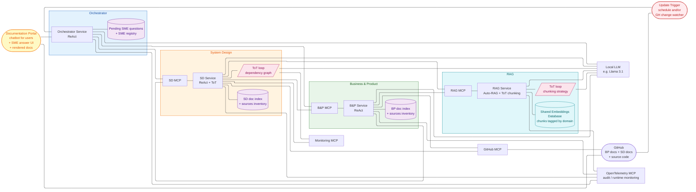

# Capstone Project — Architecture

Enrique R. Corona Dominguez

> Disclaimer: I wrote this with help from Claude Code, I provided a lot of guidance, suggestions, corrections and for
> the most part defined the high level architecture and
> implementation details based on the course lectures.

> As stated in [Section 1.3](PROJECT.md#13-proposed-solution), we're implementing a **Research Agent** that
> helps our leadership, developers, and product managers have a complete view of the architecture,
> dependencies, progress, and known gaps of our systems. Modernization efforts in a 20+ year old org stall
> on a single recurring problem: nobody has an accurate, current map of the system. Decisions get made on
> stale or incomplete documentation, dependencies get discovered late, and gap analysis becomes weeks of
> manual archaeology. A Research Agent that **continuously updates and enriches** the org's documentation
> collapses that lead time and gives every team — engineering, product, leadership — a single source of
> truth they can trust.

## 8. High-Level Architecture (Module 5)

### 8.1 Roles and responsibilities

The system is a **multi-agent** architecture organized around a supervisor pattern: the **Orchestrator** is
the supervisor that routes work and tracks state, **B&P** and **SD** are specialist agents that each
own a documentation domain, and the **RAG Service** is a fourth component that owns the shared
embedding store and the retrieval / chunking sub-graphs both specialists rely on. Collaboration happens
through **MCP-shaped contracts** — never direct function calls — so each agent can evolve or be replaced
independently.

**Why four agents.** The work splits naturally into two domains — *business/product* and *system/code*
— and each one calls for a different kind of reasoning over a different kind of source material.
Asking one agent to do both blurs that focus. The Orchestrator is the third because someone has to
route work, track what's been documented, and hold the queue of open SME questions; that's not a fit
for either specialist. The RAG Service is the fourth because retrieval and indexing are concerns that
neither specialist owns by itself: the embedding model, the vector store, the Auto-RAG loop, and the
ToT chunking-strategy sub-graph are all infrastructure the two specialists share. Co-locating them in
a single component means the embedding model lives in one place, both specialists see consistent
retrieval behavior, and a future specialist (e.g., Security) gets retrieval and indexing for free by
calling the same RAG Service. A fifth agent would only be added when a new domain shows up; stretching
past four for general engineering reasons would just add coordination cost without new capability.

**Per-agent role:**

- **Orchestrator agent** *(supervisor)*
    - **Owns** — the **pending SME questions queue** and the SME / specialist registry. No content state.
    - **Does** — routes Portal queries to the right specialist, forwards refresh events from the
      Update Trigger to the affected specialist(s), ingests SME replies (received through the Portal)
      and routes them to the owning specialist for persistence and re-integration, deduplicates pending
      SME questions per topic.
    - **Does not** — analyze content, track which pages exist, or compute what changed. No embedding
      pipeline, no code analysis, no ToT, no doc index, no sources inventory; all deep work and all
      per-domain state are owned by a specialist.
- **B&P agent** *(Business & Product specialist)*
    - **Owns** — the **BP pages in GitHub**, the **BP doc index** (per-page metadata: `last_updated`,
      `source_documents`, `content_hash`, `open_placeholders`, embedding revision), and the **BP
      sources inventory** (input docs and their last-known hashes). No embedding store and no
      chunking pipeline of its own — those live in the RAG Service.
    - **Does** — runs the indexing pipeline ([Section 6](PROJECT.md#6-retrieval-design--rag-module-3))
      by ingesting input docs and handing the normalized document to the RAG Service via
      `RAG_MCP.index(domain=bp, ...)`, generates product and feature pages with cross-references to SD
      pages, answers query-time questions by delegating to the RAG Service via
      `RAG_MCP.retrieve(query, domain_filter=bp, mode=query)`, resolves SD links via the SD MCP,
      computes its own affected pages on a refresh event by diffing against its sources inventory.
    - **Does not** — embed or chunk anything itself, write into SD pages, or read source code
      directly; the RAG MCP owns retrieval and indexing, the SD MCP is the only path to SD pages and
      SD-side relational queries.
- **SD agent** *(System Design specialist)*
    - **Owns** — the **SD pages in GitHub**, the **SD doc index** (same shape as B&P's), and the **SD
      sources inventory** (last-known commit shas per service it documents). No embedding store of
      its own; no chunking pipeline of its own.
    - **Does** — analyzes source code via the GitHub MCP, cross-checks telemetry via the Monitoring
      MCP, runs the ToT dep-graph loop
      ([Section 7.1](PROJECT.md#71-where-tot-helps-in-this-project), use case 3), generates
      service/endpoint/dependency pages with cross-references to B&P pages, resolves B&P links via
      the B&P MCP, hands each generated SD page to the RAG Service via
      `RAG_MCP.index(domain=sd, ...)` for chunking + embedding + persistence, answers query-time
      questions by delegating to the RAG Service via
      `RAG_MCP.retrieve(query, domain_filter=sd, mode=query)`, computes its own affected pages on a
      refresh event by diffing against its sources inventory.
    - **Does not** — embed or chunk anything itself, write into B&P pages, or call into the
      embedding store directly; the RAG MCP is the only path to retrieval and indexing.
- **RAG agent** *(retrieval / indexing service)*
    - **Owns** — the **shared Embeddings Database**, the **embedding model**, the **Autonomous RAG
      loop** ([Section 9.1.3.1](PROJECT_LOW_LEVEL_DESIGN.md#9131-autonomous-rag-loop)), and the **ToT chunking-strategy sub-graph**
      ([Section 9.1.3.2](PROJECT_LOW_LEVEL_DESIGN.md#9132-tot-chunking-strategy)). Stateless across requests apart from the
      vector store itself; no per-page metadata, no SME state.
    - **Does** — accepts documents via `RAG_MCP.index(domain, source_uri, document)`, picks a
      chunking strategy via the ToT sub-graph, computes embeddings, persists chunks tagged with the
      caller's `domain` (`bp`|`sd`); accepts queries via
      `RAG_MCP.retrieve(query, domain_filter, mode)` and runs the Autonomous RAG loop, returning a
      response with status `ok | low_confidence | exhausted`, the answer, sources, retrieval trail,
      and grader scores; surfaces index-quality flags (chunks that survive retrieval but repeatedly
      fail the grader) so the calling specialist can trigger a re-index. The `mode` parameter is
      advisory — the loop is identical, only the calling specialist's reaction to `exhausted` differs
      (low-confidence answer in query mode, SME escalation in background mode).
    - **Does not** — read source code, write to GitHub, talk to SMEs, or own any per-page state. Both
      writes (`index`) and reads (`retrieve`) are scoped by the `domain` tag the specialist
      provides; the RAG Service trusts the specialist's claim of domain ownership and never
      cross-writes.

**Shared store, shared sub-graphs.** There is **one Embeddings Database**, owned by the RAG Service.
Chunks carry a `domain` tag (`bp`|`sd`) plus the source URI, content hash, and chunking-strategy
metadata. The two shared sub-graphs — Autonomous RAG ([Section 9.1.3.1](PROJECT_LOW_LEVEL_DESIGN.md#9131-autonomous-rag-loop)) and
ToT chunking strategy ([Section 9.1.3.2](PROJECT_LOW_LEVEL_DESIGN.md#9132-tot-chunking-strategy)) — live inside the RAG Service and
are not invoked by the specialists directly any more; they reach them via `RAG_MCP.retrieve` and
`RAG_MCP.index`. Cross-domain queries drop the domain filter and read the whole store — no peer-MCP
retrieval call, no merge step.

**Interaction patterns:**

- **Supervisor → specialist** (Orchestrator → B&P/SD) — task envelopes for refresh or query work; the
  specialist runs its loop and returns a structured response or an escalation.
- **Specialist → RAG Service** (B&P/SD → RAG_MCP) — both specialists call the same MCP for indexing
  (`index`) and retrieval (`retrieve`). Specialists pass their `domain` tag and the orchestrator's
  domain hint; the RAG Service does not authenticate domain ownership beyond what the specialist
  asserts (the boundary is enforced by which MCP each specialist is wired to).
- **Specialist ↔ specialist** (B&P ↔ SD) — read-only peer calls for **relational cross-references**
  only. B&P calls SD MCP for "what services serve this product"; SD calls B&P MCP for "what products
  depend on this service". Similarity retrieval is never a peer call — both specialists go through
  the RAG MCP. Neither agent writes into the other's pages.
- **Specialist → supervisor** (escalation) — when a specialist can't resolve a question during a
  background page build (RAG_MCP returns `exhausted`, SD code analysis or ToT can't resolve,
  cross-reference unresolvable), it returns an SME-escalation envelope; the orchestrator queues it
  and surfaces it through the Portal ([Section 9.5](PROJECT_LOW_LEVEL_DESIGN.md#95-sme-interaction-module-6)).
- **Trigger → supervisor → specialists** (refresh fan-out) — the orchestrator forwards the change event
  to the specialist(s) it concerns (B&P for input-doc paths, SD for source-code paths; both for
  ambiguous events). Each specialist diffs the event against its own sources inventory and doc index,
  computes its affected pages, and works on them in parallel — calling `RAG_MCP.index` for each
  page that needs (re-)indexing.

Adding a new specialist later (e.g., a Security agent) is mostly an orchestrator change: register a new
MCP, add the routing rule, and have the new specialist call `RAG_MCP` with `domain=security`.
Existing specialists don't need to know about the new one until they need to cross-reference it, and
no embedding pipeline has to be set up for them.

### 8.2 High-Level Architecture diagram

The following diagram shows the high-level architecture considering tooling, augmented retrieval components and
ToT.

> **Diagram simplification** — the **BP↔SD cross-reference** is implemented as relative Markdown links inside
> the GitHub repo, so it lives in the `GH` node rather than as a runtime edge.

- The **"Service"** component of each agent contains the reasoning loop logic defined
  in [Section 3](PROJECT.md#3-proposed-reasoning-loop-module-2) (Module 2).
- The **Documentation Portal** is the only user-facing component. It renders BP/SD pages from
  GitHub, hosts the chatbot (routed to the Orchestrator), and provides the SME answer UI
  ([Section 9.5](PROJECT_LOW_LEVEL_DESIGN.md#95-sme-interaction-module-6)).
- The **Monitoring MCP** is external, alongside the GitHub MCP. SD calls it during code analysis to
  verify inferred call patterns and score ToT dep-graph candidates; future agents can consume it
  without going through SD.
- **Page storage** — all generated docs live in the same GitHub repo as source code, in
  domain-scoped folders. Cross-references are relative Markdown links; agents read and write
  through the GitHub MCP. POC folder layout is in [Section 8.5](#85-considerations-for-the-poc).
- **Embedding storage** — one shared Embeddings Database, owned by the RAG Service and reached only
  via `RAG_MCP`. Chunks carry a `domain` tag plus source URI, content hash, and chunking-strategy
  metadata, so refresh and invalidation stay per-specialist even though the index is shared.
- **Continuous refresh** — the **Update Trigger** watches GitHub and/or fires on a schedule and
  emits `(doc_id or commit_sha, change_kind)` events to the Orchestrator. Each affected specialist
  diffs against its sources inventory and re-runs its pipeline. The "read-only" principle from
  [Section 1.4](PROJECT.md#14-principles-for-our-agent) applies only to *external* systems — the
  agent's own docs are in constant flux, version-controlled by Git.
- **Cross-references** — B&P calls `SD_MCP` to resolve "what services serve this product"; SD calls
  `BP_MCP` for the reverse. Both directions are re-validated on each refresh, so stale links become
  follow-up tasks instead of silent rot.
- **Runtime audit** — every service (Orchestrator, B&P, SD, RAG) emits OpenTelemetry spans for
  inbound and outbound MCP calls via `OTEL_MCP`. Spans carry the request envelope, response
  status, and latency. Per-node metrics (escalation rate, grader-fail rate, RAG `exhausted` rate,
  latency) are derived from the trace stream; see [Section 8.5](#85-considerations-for-the-poc) for
  the POC implementation.

### 8.3 Trade-offs and scalability

**Reliability vs. latency.** Every reliability mechanism in this design is also a latency cost: the
Auto-RAG rewrite loop, the ToT loops, and SME escalation each add wait time on top of a direct answer.
Each one carries an explicit cap so worst-case latency stays predictable. The trade is deliberate:
stale or hallucinated documentation is the failure mode we cannot afford, so we pay extra time on
uncertain answers rather than ship a fast wrong one.

**Coordination overhead vs. independence.** Routing every cross-agent call through MCPs and the
Orchestrator costs an extra hop, but it keeps each agent independently replaceable and puts shared
state in a single place. Direct calls would be faster but would entangle the agents and force
coordinated deployments — a worse trade for a system meant to evolve.

**Complexity vs. consistency.** B&P and SD each run in two modes (background and query) on the same
graph, so both modes reuse the same domain logic. That keeps the separation of concerns clean and
keeps fresh answers consistent with the last refresh.

**Autonomy vs. oversight (Module 6).** The agent runs autonomously most of the time — refreshes
fan out, queries answer back, and Auto-RAG self-corrects within bounds — but every loop in the
design ends in either a confident answer, a low-confidence answer with closest matches, or a
human-in-the-loop hand-off (SME escalation in background mode). We deliberately gate human
attention to the cases where it adds the most value: gaps in source material that the agent
genuinely cannot resolve from what it has, never user-facing latency. The tradeoff is that
low-confidence answers sometimes reach users without an SME having signed off; we accept that
because the alternative — making every uncertain query block on a human — would collapse the
system's throughput and defeat the "continuously updated" goal from
[§1.3](PROJECT.md#13-proposed-solution).

**Scalability.** Four properties let the design grow without rework:

- **Parallel refresh fan-out** — the Orchestrator hands out one job per affected page and the
  specialists work in parallel, so refresh time tracks the slowest page rather than the total number
  of pages.
- **New specialists plug in** — adding a new agent (e.g., Security) is a registration plus one
  routing rule. Existing agents only learn about it when they need to link to its domain.
- **New input sources plug in** — Confluence, Slack, Quip, and email enter through the same ingest
  contract used by the GitHub source today; no changes to the rest of the pipeline.
- **Resumable state** — the Orchestrator saves its progress as it goes. If a refresh crashes
  partway, it picks up where it left off instead of restarting from scratch.

### 8.4 Guardrails (Module 6)

The architecture has several guardrails baked into the structural choices above. This section
catalogues them explicitly so the safety posture is reviewable, and flags the known gaps that are
deferred to later phases.

**Built into the design:**

- **Tool access** — MCPs are the only inter-agent interface ([§8.1](#81-roles-and-responsibilities)).
  Each agent is wired to a fixed set: BP/SD reach the RAG Service, the GitHub MCP, the peer's MCP
  (relational queries only), and — for SD — the Monitoring MCP. The RAG Service has no GitHub
  access; the Orchestrator has no embedding-store or source-code access. Adding a tool means
  changing the wiring, not the prompts.
- **Cross-domain isolation** — every chunk in the shared Embeddings Database carries a `domain`
  tag, and the RAG Service trusts the caller's domain claim only on the wired MCP boundary. BP
  cannot write `domain=sd`; SD cannot write `domain=bp`. Page writes are similarly per-domain
  through the GitHub MCP.
- **Loop bounds** — Auto-RAG capped at **R=2** rewrites ([§9.1.3.1](PROJECT_LOW_LEVEL_DESIGN.md#9131-autonomous-rag-loop)); ToT
  loops capped at **B=2–3, D=2–3** ([§7.4](PROJECT.md#74-search-strategy)). After the cap, the
  loop returns `low_confidence` / `exhausted` rather than recursing further.
- **Output validation** — every Auto-RAG answer goes through a grader and a faithfulness re-grade
  ([§9.1.3.1](PROJECT_LOW_LEVEL_DESIGN.md#9131-autonomous-rag-loop)) before reaching the user; failed grades trigger a rewrite or
  fall back to low-confidence with closest matches.
- **Source verification** — answers carry retrieval trails and grader scores; cross-references are
  re-validated each refresh and degrade to follow-up tasks rather than silent rot
  ([§8.2](#82-high-level-architecture-diagram) cross-references bullet); SME re-integration grounds
  answers in human-verified content ([§9.5.1](PROJECT_LOW_LEVEL_DESIGN.md#951-placeholders-and-re-integration)).
- **Escalation rules** — SME escalation is **background-only**: a user query can never page an SME
  ([§9.5](PROJECT_LOW_LEVEL_DESIGN.md#95-sme-interaction-module-6)). Escalations are deduped by topic before reaching the SME registry.
- **Read-only on external systems** — the [§1.4](PROJECT.md#14-principles-for-our-agent)
  principle: the agent only writes to the BP/SD pages
  it owns and to its own embedding store. Source code, telemetry, and any future external sources
  (Slack, Confluence, Quip) are read-only.
- **Audit trail** — two complementary mechanisms: every page write goes through the GitHub MCP,
  so Git history is the durable per-page audit log; every inbound and outbound MCP call is an
  OpenTelemetry span via `OTEL_MCP` ([§8.2](#82-high-level-architecture-diagram)), so the runtime
  call graph is independently observable. Placeholder blocks include the `question_id` so
  SME-driven changes are traceable across both.
- **Runtime monitoring** — `OTEL_MCP` collects spans for every service-to-service call; per-node
  metrics (escalation rate, grader-fail rate, latency per node, RAG `exhausted` rate) and the
  index-quality flags from RAG retrieval are derived from the trace stream. POC implementation is
  in [Section 8.5](#85-considerations-for-the-poc).

**Known gaps (deferred or flagged for later phases):**

- **Prompt injection** — input docs from Git could embed adversarial instructions. No sanitization
  pass on ingest yet; for the POC the input set is hand-checked org docs, so the risk is low.
- **PII / sensitive content** — [§1.4](PROJECT.md#14-principles-for-our-agent) forbids PII but
  enforcement today is policy, not technical. A redaction pass on ingest is a candidate for the
  next phase.
- **Global LLM / cost budget** — per-loop bounds exist, but no per-request or per-refresh ceiling
  on total LLM calls. A runaway loop is bounded by the `done` action and resumability, not by an
  explicit budget.
- **Output schema validation** — structured outputs (escalation envelope, RAG response, ToT branch
  scores) follow documented shapes but aren't JSON-schema-validated at the boundary.
- **SME identity** — the Portal looks up SMEs from a registry; how an SME authenticates when
  replying is left to the Portal implementation.

**Safety strategy — how the pieces compose.** Guardrails (§8.4), evaluation
([§9.7](PROJECT_LOW_LEVEL_DESIGN.md#97-evaluation-strategy-module-6)), and human intervention ([§9.5](PROJECT_LOW_LEVEL_DESIGN.md#95-sme-interaction-module-6))
are three layers of one strategy, not three independent features. Guardrails are **preventive** —
they keep individual loops bounded and isolated, so a single bad call can't cascade across the
system. Evaluation is **detective** — the OTel trace stream and the offline golden set turn
runtime behavior into measurable signals (escalation rate, faithfulness pass rate, calibration),
so regressions surface early instead of silently degrading the docs. Human intervention is
**corrective** — when the agent genuinely can't resolve something during a background build, it
hands off to an SME and re-integrates the answer back into the index, closing the loop instead of
leaving a gap. The three reinforce each other: guardrails make detection meaningful (a faithful
answer that's also low-confidence is genuinely uncertain, not just sloppy), detection routes the
right gaps to SMEs, and SME answers feed back into the index so the next round of preventive
guardrails has better material to work with.

### 8.5 Considerations for the POC

- **Monitoring MCP** is left out — SD's ToT falls back to code references and existing docs as
  evaluator signals.
- **ToT loops** run with **B=2–3, D=2–3**
  ([Section 7.4](PROJECT.md#74-search-strategy)) — applies to both SD's dep-graph ToT and the RAG
  Service's chunking ToT.
- **RAG Service** runs in-process with a local ChromaDB instance. Splitting it behind
  `RAG_MCP`-over-HTTP is a later optimization; the contract with B&P/SD doesn't change.
- **OpenTelemetry MCP** is built for the POC as a thin OTel collector fronted by an MCP. Each
  service emits spans for inbound and outbound calls (request envelope, response status, latency);
  the collector persists them locally (file-based or SQLite). Production deployments would swap
  the collector for a real OTel backend (Tempo, Honeycomb, etc.) without changing the service-side
  wiring.
- **Indexed content** is BP input docs and generated SD pages only, not source code. Source-code
  indexing slots in later as another input to `RAG_MCP.index` without changing the topology.
- **Page storage** — BP and SD share a single GitHub repo with
  [/bp/](https://github.com/kikecorona/pear-store/tree/main/documentation/bp) and
  [/sd/](https://github.com/kikecorona/pear-store/tree/main/documentation/sd) folders. Splitting
  into two repos is a later option if access control requires it.
- **Update Trigger** runs as a daily scheduled job plus a manual "refresh" in the Portal. GitHub
  webhooks for per-commit triggers can be added later without changing the contract.
- **Input sources** — both inputs and outputs live in Git. Slack, Confluence, email and Quip
  ingestion are deferred to later phases; they would be added as new MCPs next to the GitHub MCP
  without changing the rest of the topology.
- **Evaluation (Module 6)**
  - **In scope for the POC** — Live signals are read off the trace stream and the doc indexes from
    day one with no extra code beyond a dashboard. Deeper evaluation runs against a small,
    manually-curated golden set on a weekly cadence; the LLM-as-judge uses the same `llama3.1:8b` as
    the agent itself, with the option to swap to a stronger judge (`llama3.1:70b` or `mixtral:8x7b`)
    for the periodic human-recalibration cycles. Calibration and hallucination checks start as manual
    spot-checks and become automated as the harness matures.
  - **Out of scope for the POC** — External adversarial inputs (prompt injection, crafted documents) and PII
    leakage rates are not measured — they are policy-deferred per the
    [§8.4 known gaps](#84-guardrails-module-6). Adding them later is a harness change, not a
    metric-strategy change.
- **LLM cost / latency** — the LLM runs locally on Ollama so token cost is not a concern for the
  POC; latency is the proxy we monitor instead, via the per-MCP-method p50/p95 metrics from
  [§9.6](PROJECT_LOW_LEVEL_DESIGN.md#96-audit-and-observability-module-6).
- **Deploy safety (Module 6)** — The guardrails in [§8.4](#84-guardrails-module-6) (loop bounds,
  output validation, escalation rules, cross-domain isolation, OTel-based runtime monitoring) give
  us enough confidence to deploy and observe in real time rather than flying blind. And because
  every page write goes through Git via the GitHub MCP, every deploy comes with a free rollback
  story: a regression in BP/SD content reverts cleanly with `git revert` on the affected files,
  and re-indexing falls out of the next refresh against the rolled-back source. The combination —
  preventive guardrails + observable runtime + Git-backed rollback — is what makes the design
  deploy-ready beyond just functionally correct.

### 8.6 LLM strategy

For the POC, every LLM call across [§9](PROJECT_LOW_LEVEL_DESIGN.md#9-low-level-design) — Auto-RAG router/grader/rewriter, orchestrator's `reason`
step, ToT probe-question generator, ToT critics, SD's `analyze_code` LLM augment, faithfulness
re-grade — runs against the same `llama3.1:8b` instance. One model, one set of prompts, one memory
profile.

If quality on a specific node lags during evaluation, the candidates for upgrade are:

- **SD `analyze_code` LLM augment** ([Section 9.2.3.1](PROJECT_LOW_LEVEL_DESIGN.md#9231-analyze_code)) — prose descriptions of
  endpoints. Code-specialized models do better on tricky code paths (transaction boundaries,
  non-obvious side effects). Candidates on Ollama: `codellama:7b-instruct`, `qwen2.5-coder:7b`,
  `deepseek-coder-v2`. The newer Qwen/DeepSeek tiers usually beat CodeLlama on current benchmarks.
- **Auto-RAG grader and faithfulness re-grade** ([Section 9.1.3.1](PROJECT_LOW_LEVEL_DESIGN.md#9131-autonomous-rag-loop)) and the
  **gap-reconciliation critic** ([Section 7.7](PROJECT.md#77-risk-and-mitigation)) — these are the
  accuracy-critical scoring nodes. A stronger general model (`llama3.1:70b`, `mixtral:8x7b`)
  improves discrimination on edge cases at the cost of memory and latency.
- **Cheap structured calls** — router, query rewriter, orchestrator `reason`, ToT probe
  Q&A — stay on `llama3.1:8b`. They're fast, structured, and bounded; a bigger model is overkill.

Trade-off: per-node specialization improves quality on the most accuracy-sensitive steps but adds
operational complexity (multiple models loaded or swapped, separate prompt tuning per family).
Ollama can hold multiple models on disk and swap on demand, so the cost on a workstation is mostly
memory. We don't commit to specialization in the POC — the design just leaves the seams obvious.

---

Continue to [PROJECT_LOW_LEVEL_DESIGN.md](PROJECT_LOW_LEVEL_DESIGN.md) for Section 9 (Low-Level Design).
