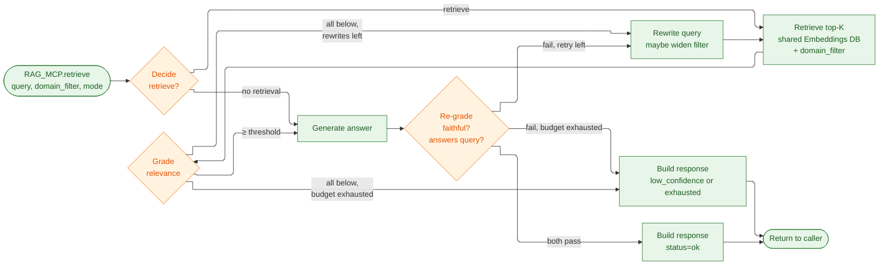
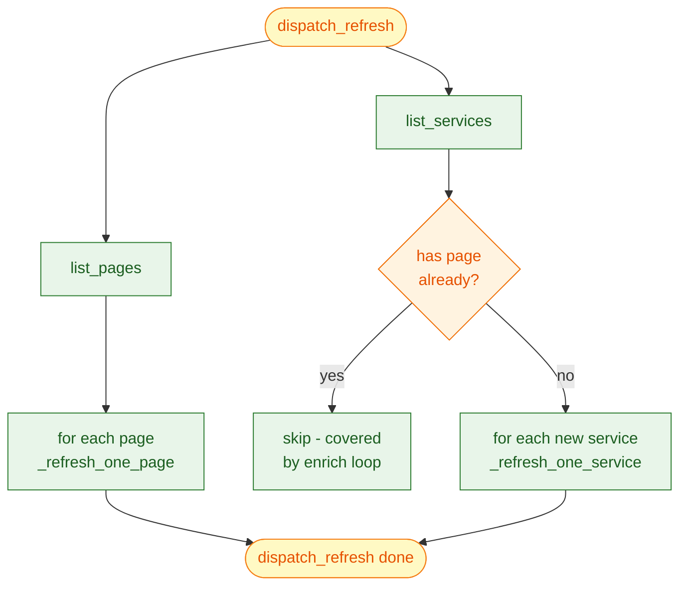
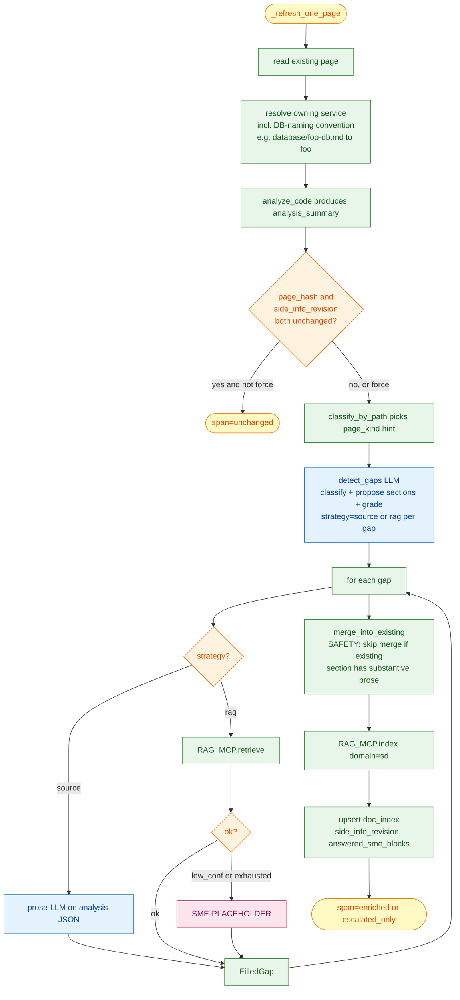
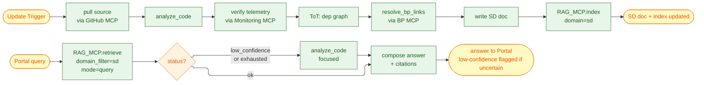
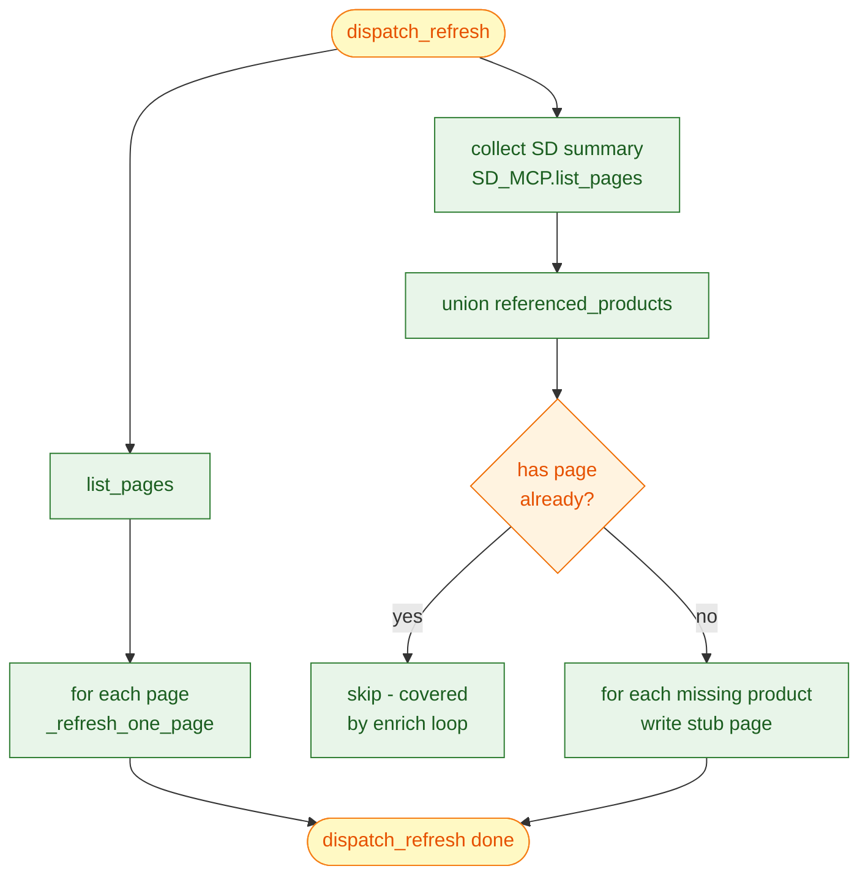
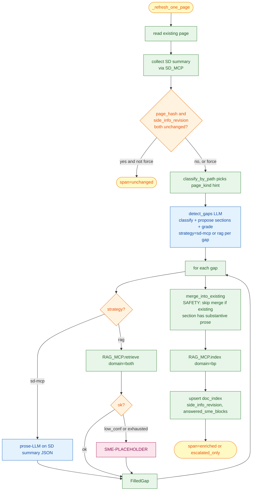
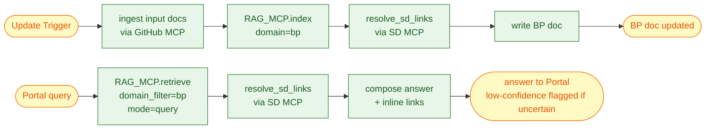
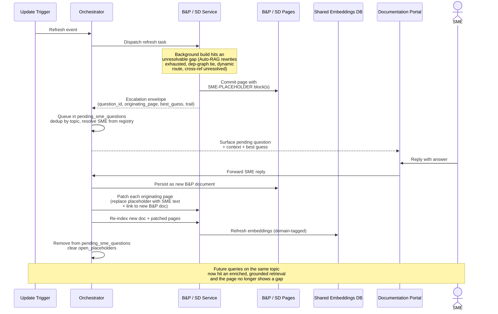

# Capstone Project — Research Agent for Org Knowledge (Low-Level Design)

Enrique R. Corona Dominguez

---

> *Disclaimer: I wrote this with help from Claude Code, I provided a lot of guidance, suggestions, corrections and for
> the most part defined the high level architecture and
> implementation details based on the course lectures.*

> As stated in [Section 1.3](PROJECT.md#13-proposed-solution), we're implementing a **Research Agent** that
> helps our leadership, developers, and product managers have a complete view of the architecture,
> dependencies, progress, and known gaps of our systems. Modernization efforts in a 20+ year old org stall
> on a single recurring problem: nobody has an accurate, current map of the system. Decisions get made on
> stale or incomplete documentation, dependencies get discovered late, and gap analysis becomes weeks of
> manual archaeology. A Research Agent that **continuously updates and enriches** the org's documentation
> collapses that lead time and gives every team — engineering, product, leadership — a single source of
> truth they can trust.
> 
## 9. Low-Level Design

This section covers the per-service designs (B&P, SD, RAG) plus the patterns shared between them — the
Autonomous RAG loop, the ToT chunking strategy, and SME interaction.

### 9.1 RAG Service design

#### 9.1.1 Responsibilities

Owner of the **shared Embeddings Database**, the **embedding model**, the **Autonomous RAG loop**
([§9.1.3.1](#9131-autonomous-rag-loop)), and the **ToT chunking sub-graph**
([§9.1.3.2](#9132-tot-chunking-strategy)). Specialists never touch the embedding store directly
— every read and every write goes through `RAG_MCP`. The service does not read source code, write
to GitHub, or talk to SMEs.

#### 9.1.2 APIs (MCP)

Methods exposed by `RAG_MCP`:

- `retrieve(query, domain_filter, mode) -> { status, answer, sources, retrieval_trail, grader_scores }`
  — runs the Autonomous RAG loop. `domain_filter ∈ {bp, sd, both}` is pushed into the vector query;
  `mode ∈ {query, background}` is advisory metadata. `status ∈ {ok, low_confidence, exhausted}`
  summarises the outcome — `ok` means both grader axes (faithfulness and answerability) cleared,
  `low_confidence` means the rewrite budget was exhausted but a best-effort answer + closest
  matches are returned, `exhausted` means no usable evidence at all.
- `index(domain, source_uri, document, content_hash) -> { chunks_indexed, chunking_strategy, embedding_revision }`
  — runs the ToT chunking-strategy loop, computes embeddings, and persists chunks tagged with the
  caller's `domain`. Existing chunks for the same `(domain, source_uri)` are replaced atomically.
- `delete(domain, source_uri)` — invalidate all chunks for a removed source.

`embed` and `score_strategy` are internal nodes of the ToT sub-graph; they are not exposed
externally because specialists don't run that loop themselves.

#### 9.1.3 Implementation details

One LangGraph state graph fronted by `RAG_MCP`; the entry node routes by method into the matching
sub-graph. Apart from the vector store itself, the service is stateless across requests. The
**index-quality flag** — chunks that survive retrieval but repeatedly fail the grader — rides
along on every `retrieve` response so the calling specialist can re-index that source on the next
refresh. Domain isolation is enforced by which MCP each specialist is wired to: B&P only writes
`domain=bp`, SD only writes `domain=sd`. Reads can request any domain or `both`. Adding a future
specialist (e.g., Security) means a new wired MCP and a reserved `domain` tag — no schema change.

##### 9.1.3.1 Autonomous RAG loop

[Sections 6.1–6.4](PROJECT.md#6-retrieval-design--rag-module-3) cover indexing-time rationale. At
**retrieval time** the RAG Service wraps the vector lookup in an Autonomous RAG loop so the caller
can self-correct when retrieval is weak. Four nodes — **decide → retrieve → grade → rewrite** —
wired as a LangGraph `StateGraph`. Caller (B&P or SD) sees only the response shape from
[§9.1.2](#912-apis-mcp).

The nodes:

1. **Decision** — classifies the query into `{no_retrieval, retrieve}` and honours the
   caller-supplied `domain_filter`. Static-context questions skip retrieval entirely.
2. **Retrieval** — similarity search against the chosen embedding view
   ([§6.3](PROJECT.md#63-for-indexing-each-document)) with `domain_filter` pushed into the vector
   query. K is small (2–5) — we pull the **whole document** into context once selected. No merge
   step; the grader sees a single ranked list.
3. **Grader** — LLM scores each retrieved document 0–3. Survivors go to answer generation, then a
   second-pass **answer re-grade** scores along two axes: **faithfulness** (every claim supported
   by a source — catches hallucinations) and **answerability** (the answer substantively addresses
   the query — catches faithful refusals like *"the sources don't mention X"*). Both axes gate
   `status=ok`.
4. **Query rewriter** — invoked when the grader produces nothing usable. Rewrites the query and
   loops back to retrieval. Bounded to **R=2** rewrites; may widen `domain_filter` (e.g. `bp` →
   `both`) when failure suggests cross-domain evidence is needed.

**Loop control.** After R rewrites the loop returns `low_confidence` with the closest matches +
trail, or `exhausted` when even the closest matches are below a "no signal" floor. Query-mode
callers turn either into a low-confidence answer to the user; background-mode callers turn either
into an SME escalation ([§9.5](#95-sme-interaction-module-6)). Failed answer re-grade triggers one
rewrite cycle; if it still fails, downgrade to `low_confidence`. Repeated grader-fails on the same
chunk emit an **index-quality flag** in the trail so the specialist can re-index that source on
the next refresh — closing the loop between retrieval and indexing. Router and rewriter are
single-pass for the POC; promoting either to a ToT decision point is a later option.



##### 9.1.3.2 ToT: chunking strategy

For each new or changed document arriving via `RAG_MCP.index`, the RAG Service picks a chunking
strategy from the candidates in [§6.2](PROJECT.md#62-chunking-strategies) (per-paragraph,
per-section, per-N-chars, summary-only, hybrid) using the ToT loop:

1. **Generate** — emit K=4 candidate strategies for the document.
2. **Embed** — chunk + embed each candidate into a temporary index.
3. **Probe** — LLM produces N student-style Q&A pairs from the document.
4. **Score** — for each candidate, fraction of probe questions whose top-K hit lands in the right
   chunk (similarity-over-M).
5. **Prune & iterate** — drop candidates below 0.7; beam-search keeps top B=2–3 and expands
   variants. Stops at depth D=2–3 or when one candidate clearly wins.
6. **Persist** — winning chunks + embeddings written to the shared store with the caller's
   `domain` tag; existing chunks for the same `(domain, source_uri)` replaced atomically. The
   strategy itself is persisted as metadata.

If no candidate clears the threshold at depth D, the document is tagged low-confidence and indexed
with the highest-scoring strategy anyway. This sub-graph is owned end-to-end by the RAG Service —
specialists only see `chunking_strategy` + `embedding_revision` in the response and record them in
their `doc_index`. Probe questions are content-driven, so domain prose differences (BP narrative
vs SD structured prose) flow through naturally.

### 9.2 SD Service design

#### 9.2.1 Responsibilities

Owner of the **SD pages** in GitHub, the **SD doc index** (per-page metadata: content hash,
source-derived `side_info_revision`, and `answered_sme_blocks` preserved across refreshes), and
the **SD sources inventory** (last-known commit shas of the source-code subdirectories it
documents). Iterates over existing SD pages, fills detected gaps using freshly-pulled source-code
analysis plus RAG retrieval, escalates unresolvable gaps as `SME-PLACEHOLDER` blocks, and
discovers new pages from services in source code that don't yet have one. Retrieval and indexing
go through `RAG_MCP`; SD never embeds, chunks, writes into BP, or hits the embedding store
directly.

#### 9.2.2 APIs (MCP)

Methods exposed by `SD_MCP`:

- `dispatch_query(query, domain_hint, context) -> { status, answer, sources, retrieval_trail }` —
  query-mode entry point. Delegates to `RAG_MCP.retrieve`; falls back to focused `analyze_code` on
  `low_confidence` / `exhausted`.
- `dispatch_refresh(event) -> { affected_pages, escalations }` — background-mode entry point.
  Iterates the union of existing SD pages and services in source code; new services without a
  page fall through to the original "analyze → ToT dep graph → compose" path so they pick up a
  starter page on the next refresh. `force=true` bypasses skip-unchanged.
- `find_services_for_product(product_id) -> [{ service, endpoint, role }]` — relational
  cross-reference, called by B&P during `resolve_sd_links`. `doc_index` only — no LLM.
- `list_pages() -> [{ page_uri, service, referenced_products, downstream_services, ... }]` —
  pure relational dump used by B&P enrichment as side-info and for new-page discovery.
- `get_page(page_uri) -> { content, doc_index_entry }` — read current page + metadata.
- `patch_page(page_uri, question_id, replacement) -> { commit_sha }` — replace the
  `SME-PLACEHOLDER:question_id` block with the SME's text wrapped in a matching
  `SME-ANSWERED:question_id` fence; updates `open_placeholders` / `answered_sme_blocks` and
  triggers `RAG_MCP.index`.

#### 9.2.3 Implementation details

One LangGraph state graph fronted by `SD_MCP`. Background and query modes share the same
`analyze_code` node so live answers stay consistent with the last refresh.

**Background — `dispatch_refresh`** iterates the union of *existing SD pages* and *services
discovered in source code*. Existing pages take the enrich path; services without a page fall
back to compose-from-scratch.



**Per-page enrich flow:**



**Page-kind rubrics** (seed for the LLM judge + fallback when the call fails):

| `page_kind`             | Expected sections |
|-------------------------|-------------------|
| `service`               | Overview · Endpoints · Downstream services · Data model · Observability · Open Questions |
| `architecture-overview` | Overview · Service map · Ownership boundaries · Why this shape · What is not in this system |
| `data-flow`             | Overview · Sequence · Triggers · Failure modes · Open Questions |
| `data-store`            | Overview · Schema · Access patterns · Consistency · retention · Open Questions |
| `other`                 | Overview · Details · Open Questions |

**Gap criteria** — a section is a gap iff: heading missing, body empty, body is a boilerplate
marker (`TBD` / `TODO` / `FIXME` / `WIP` / `N/A` / "to be filled" / "add details" / "placeholder"),
or body contains a `SME-PLACEHOLDER` fence. **Subjective judgments ("could be more detailed") are
NOT gap criteria.** As defence-in-depth, `merge_into_existing` runs a fillable-body check before
overwriting any matched heading; substantive prose is never replaced even when the detector
mis-flags it.

**Fill strategies** (one per gap, picked by the detector):

* **`source`** — answer is in the source-code analysis (endpoints, downstream calls, data stores).
  Composed by a prose-LLM from the analysis JSON; no RAG retrieve. Falls through to RAG on
  prose-LLM error so a single hiccup doesn't stall the refresh.
* **`rag`** — needs prose context not in the code. Auto-RAG retrieve (§9.1.3.1) with the analysis
  appended as a context hint. `low_confidence` / `exhausted` → SME-PLACEHOLDER (§9.5).

**Skip & ordering.** Per-page skip iff `(page_hash, side_info_revision)` both match the prior
refresh — `side_info_revision` hashes the source analysis, so a code change re-enriches even when
page bytes didn't move. `force=true` bypasses both checks. The orchestrator runs SD's
`dispatch_refresh` to completion before BP's, so BP sees the freshly-written SD doc-index.

**SME continuity.** `SME-ANSWERED:question_id` fences inside a page body are detected
pre-enrichment and reused verbatim instead of re-asking. `answered_sme_blocks` in the doc-index
carries them across refreshes as a second line of defence.

**Telemetry.** Every page emits an `sd_service.enrich_page` OTel span with `page_kind`,
`gap_count`, `filled_count`, `escalated_count`, `source_intended_count`, `rag_intended_count`,
`is_substantive`. Status: `enriched` / `escalated_only` / `unchanged` / `page_deleted` / `error`
— rolled up in the Dashboard (§9.8.2).

**Query mode.** Delegates to `RAG_MCP.retrieve(query, domain_filter=sd, mode=query)`. On
`low_confidence` / `exhausted` a focused `analyze_code` runs against the file backing the
closest-matching endpoint; the user always gets an answer back, flagged low-confidence when
uncertain. Query mode never escalates to an SME.

**ReAct loop.** Outer reasoner cycles through `{pull_source, analyze_code, verify_telemetry,
run_tot_dep_graph, resolve_bp_links, write_doc, rag_index, rag_retrieve, focused_analyze,
compose_answer, escalate, done}`. Background mode is mostly deterministic; query mode is more
reactive. `escalate` is reachable only from background mode.



The internal sub-nodes are documented next.

##### 9.2.3.1 analyze_code

The workhorse of SD's design. Pulls source files via the **GitHub MCP** and produces a structured
representation of the service:

- **endpoints** (Flask routes / Blueprint mounts, extracted with Python's `ast` module),
- **data structures** (`@dataclass` definitions, type-hinted signatures, Pydantic models),
- **data stores** (module-level dicts/lists/sets, `SQLAlchemy Table(...)`, raw `CREATE TABLE`
  strings),
- **downstream calls** (`requests` HTTP calls and `sqlite3` queries; URLs / table names parsed
  out, dynamic targets tagged for SME review),
- **prose** — a one-paragraph LLM-augmented description per endpoint, bounded to ~1k input tokens
  so prompts stay focused on the local LLM.

A full refresh pulls the whole tree; an incremental refresh pulls only files changed since the
doc-index revision. Files are content-hashed and cached so re-runs over the same revision are
free. In query mode the same node runs on a focused subset — typically the file backing the
endpoint the question is about.

The output `ServiceAnalysis` blob (`{service, source_revision, endpoints, data_structures,
data_stores, downstream_calls, prose}`) is consumed by every downstream node
(`verify_telemetry`, `ToT dep graph`, `resolve_bp_links`, `write_doc`).

**Edge cases — tagged, not guessed:**

- **Dynamic routes / URLs** — captured with the source expression and surfaced for SME
  confirmation rather than guessed.
- **Blueprint registration** — multi-blueprint apps are best-effort; the ToT dep-graph step uses
  telemetry to break ties.
- **Partial parse failures** — recorded in the analysis metadata; the rest of the run proceeds
  and the page lists failed files as follow-ups.

##### 9.2.3.2 verify_telemetry

When the **Monitoring MCP** is wired in (out of POC scope per
[§8.5](PROJECT_ARCHITECTURE.md#85-considerations-for-the-poc)), this node cross-checks
`analyze_code`'s output against observed traffic. Endpoints with no telemetry get flagged for
deprecation; downstream calls that appear in code but not in traces are suspicious, and the
reverse case (telemetry shows what code analysis missed) is also surfaced. Each endpoint and
dependency receives a confidence score that feeds the ToT evaluator below. No-op when the
Monitoring MCP is unavailable — confidence collapses to "code-only".

##### 9.2.3.3 ToT dep graph

Inferring the dependency graph is non-trivial — call patterns are often ambiguous when calls flow
through brokers, queues, or service meshes:

1. **Generate** — K=3 candidate graphs per service: code-only, telemetry-reweighted, stable-history.
2. **Score** — telemetry-agreement (fraction of edges matching observed traffic, volume-weighted).
   Without telemetry, falls back to a code-coverage / reference-count rubric.
3. **Prune & iterate** — drop candidates below 0.8; beam-search keeps top B=2–3, expands variants
   (swap inferred edges, merge near-duplicates). Stops at depth D=2–3.
4. **Persist** — winning graph becomes the dependency section of the SD page; runner-up edges
   that differ are recorded as follow-up tasks.

If no candidate clears the threshold, the highest-scoring graph is kept and flagged for SME review.

### 9.3 B&P Service design

#### 9.3.1 Responsibilities

Owner of the **BP pages** in GitHub, the **BP doc index** (per-page metadata: content hash, an
SD-side `side_info_revision` snapshot, and `answered_sme_blocks`), and the **BP sources
inventory** (in the enrich-existing flow, page hashes themselves rather than separate input
docs). Iterates over existing BP pages, fills detected gaps using SD context (via `SD_MCP`) and
RAG retrieval, escalates unresolvable gaps as `SME-PLACEHOLDER` blocks, and discovers new pages
from SD's `referenced_products`. Every page must **resolve into the SD documentation** so a BP
page about a product links to the services that implement it. Retrieval and indexing go through
`RAG_MCP`; SD pages are reached only via `SD_MCP`.

#### 9.3.2 APIs (MCP)

Methods exposed by `BP_MCP`:

- `dispatch_query(query, domain_hint, context) -> { status, answer, sources, retrieval_trail }` —
  query-mode entry point. Delegates to `RAG_MCP.retrieve`, runs `resolve_sd_links` on referenced
  services, returns the composed answer with inline cross-reference links.
- `dispatch_refresh(event) -> { affected_pages, escalations }` — background-mode entry point.
  Iterates the `documentation/bp/` tree, runs the per-page enrichment pipeline (gap-detect →
  fill → merge → re-index), discovers new pages from SD's `referenced_products`. `force=true`
  bypasses skip-unchanged.
- `find_products_for_service(service_id) -> [{ product, feature, role }]` — relational
  cross-reference, called by SD during `resolve_bp_links`. `doc_index` only.
- `get_page(page_uri) -> { content, doc_index_entry }` — read current page + metadata.
- `patch_page(page_uri, question_id, replacement) -> { commit_sha }` — replace
  `SME-PLACEHOLDER:question_id` with the resolved text wrapped in a matching
  `SME-ANSWERED:question_id` fence; updates `open_placeholders` / `answered_sme_blocks` and
  triggers `RAG_MCP.index`.
- `ingest_sme_doc(question_id, sme_text, originating_pages) -> { new_page_uri, embedding_revision }` —
  turn an SME reply into a new BP page, called only by the Orchestrator's `ingest_sme_reply`.
  Writes to GitHub, calls `RAG_MCP.index(domain=bp, ...)`, returns the new page URI for
  subsequent `patch_page` calls.

#### 9.3.3 Implementation details

One LangGraph state graph fronted by `BP_MCP`. Background and query modes share the same SD
cross-reference summary so live answers stay consistent with the last refresh.

**Background — `dispatch_refresh`** iterates the union of *existing BP pages* and *products
discovered in SD's doc-index* (`referenced_products`). Existing pages take the enrich path;
products without a page get a minimal stub written, picked up by the next refresh.



**Per-page enrich flow:**



**Page-kind rubrics** (seed for the LLM judge + fallback when the call fails):

| `page_kind`     | Expected sections |
|-----------------|-------------------|
| `product`       | Overview · Use Cases · Capabilities · Integrations · Open Questions |
| `business-case` | Overview · Problem · Stakeholders · Success metrics · Risks · Open Questions |
| `flow`          | Overview · Steps · Triggers · Decision points · Open Questions |
| `strategy`      | Overview · Goals · Approach · Risks · Open Questions |
| `other`         | Overview · Details · Open Questions |

**Gap criteria** match SD ([§9.2.3](#923-implementation-details)) — heading missing / body empty /
boilerplate marker / `SME-PLACEHOLDER` fence. Subjective judgments are NOT gap criteria. The same
fillable-body safety check applies in `merge_into_existing`.

**Fill strategies** (one per gap, picked by the detector):

* **`sd-mcp`** — answer is in the SD doc-index summary (`Integrations`, service-list sections).
  Composed by a prose-LLM from the SD summary JSON; no RAG retrieve. The prose LLM is
  system-prompted to refuse fabrication — if the summary doesn't cover the section it appends
  `(further detail TBD — not in SD cross-reference)`. Falls through to RAG on prose-LLM error.
* **`rag`** — needs prose context not in the SD index. Auto-RAG retrieve (§9.1.3.1) with
  `domain_filter=both` + the SD summary appended as a context hint. `low_confidence` /
  `exhausted` → SME-PLACEHOLDER (§9.5).

**Skip & ordering.** Per-page skip iff `(page_hash, side_info_revision)` both match prior refresh
— `side_info_revision` hashes the SD doc-index summary, so an SD change re-enriches even when BP
page bytes didn't move. `force=true` bypasses both. SD's `dispatch_refresh` runs to completion
before BP's. New-page stubs are written before the next refresh's enrich pass — the enrichment
LLM never sees a half-written page from the same run.

**SME continuity, telemetry, query mode** mirror SD ([§9.2.3](#923-implementation-details)) with
the BP equivalents (`bp_service.enrich_page` span, `domain_filter=bp` for query mode).
Cross-domain queries pass `domain_filter=both` so the response sees BP and SD chunks together
without a merge step. When the response references a service, `resolve_sd_links` resolves the
reference at answer time so the user sees an up-to-date link even if the persisted page is
briefly stale.

**Cross-domain isolation.** B&P calls SD MCP for "what services serve this product"; SD calls
B&P MCP for the reverse. The two services do not write into each other's pages.

**ReAct loop.** Outer reasoner cycles through `{ingest_input_docs, rag_index, resolve_sd_links,
write_bp_doc, rag_retrieve, compose_answer, escalate, done}`. Background mode is mostly
deterministic; query mode hands off to `rag_retrieve`. `escalate` is reachable only from
background mode.



### 9.4 Orchestrator Service design

#### 9.4.1 Responsibilities

The supervisor: receives work from the Documentation Portal and the Update Trigger, routes it to
the right specialist, manages the SME-question queue, and persists task state. No content
analysis, no embedding store, no doc index, no sources inventory — all per-domain state is owned
by the specialists. The only state it owns is the **`pending_sme_questions`** queue plus the
SME / specialist registry.

#### 9.4.2 APIs (REST)

Upstream callers (Portal, Update Trigger) are not LLM-driven, so the Orchestrator exposes
**HTTP/REST** rather than an MCP. It still *calls* MCP downstream — the asymmetry is intentional
(MCP for agent-to-agent, REST for system integration).

REST endpoints (versioned under `/v1`):

- `POST /v1/queries` — body: `{ query, user_id, context }`. Picks B&P, SD, or both based on the
  query, dispatches via the corresponding MCP, returns `{ status, answer, sources,
  retrieval_trail }`. Synchronous; bounded by Auto-RAG's R=2.
- `POST /v1/refresh` — body: `{ event_type, doc_id_or_commit_sha, change_kind, source }`. Used by
  the Update Trigger (cron + GitHub webhook + Portal "refresh" button). Returns
  `{ task_id, accepted_at }`. Asynchronous fan-out.
- `POST /v1/sme-replies` — body: `{ question_id, sme_id, sme_text }`. Runs `ingest_sme_reply`
  (persist new B&P doc → patch every originating page → re-index → clear queue entry) and returns
  `{ status, new_doc_uri, patched_pages }`.
- `GET /v1/sme-questions?sme_id=...&status=pending` — list pending questions for an SME.
- `GET /v1/sme-questions/{question_id}` — full detail incl. retrieval trail.
- `GET /v1/tasks/{task_id}` — poll an async task.
- `GET /v1/health` — liveness check.

Two more endpoints colocated under `/v1/` are added by [§9.8](#98-documentation-portal) for the
Multi-Agents X-Ray drawer and the Dashboard:

- `GET /v1/streams/events` — server-sent events; merged tail of `service_logs` and `llm_calls` at
  `$AUDIT_DB_PATH`. Each event carries a `kind: "service" | "llm"` discriminator. The SSE id is
  composite (`s:N` / `l:N`) so the browser's `EventSource` resumes from the right cursor on
  reconnect.
- `GET /v1/metrics?service=...&since=...&until=...` — passthrough to OTel `get_metrics`
  ([§9.6](#96-audit-and-observability-module-6)) plus an `llm` section sourced from the
  `llm_calls` audit table; the Dashboard polls this on a 5s interval.

Auth and rate-limiting are out of POC scope but the endpoints are designed so adding them is a
middleware change, not a contract change.

#### 9.4.3 Implementation details

One LangGraph state graph running a plain **ReAct** loop — same harness style as B&P and SD,
with fewer nodes since there's no domain-specific reasoning.

**Inputs.** Three event types map to the REST endpoints above:

- **Portal query** — picks B&P, SD, or both. Specialists never escalate query-mode work to an SME.
- **Trigger refresh** — routes each event to affected specialist(s) based on path/kind (small
  static rule, not a stored index). Background-mode dispatches are the only source of SME
  escalations.
- **SME reply** — lands as a new B&P document and patches every page that carried the matching
  placeholder.

**State.** Only `pending_sme_questions` survives between runs, keyed by `question_id` with
`{topic, question, originating_pages, placeholder_id, best_guess, retrieval_trail,
assigned_sme, posted_at}`. `originating_pages` is the set of pages carrying the matching
placeholder — re-integration patches every one of them, not just the newest. The doc index and
sources inventory are *not* held here; the orchestrator asks the owning specialist via its MCP
when it needs them.

**ReAct loop.** Three nodes — `reason` (local LLM picks next action from `{dispatch_to_bp,
dispatch_to_sd, dispatch_to_both, ingest_sme_reply, ack_completion, done}`) → `act` → `observe`.
Conditional edge loops back until the action returns `done`. Tight system prompt (~300 tokens)
and a small action space keep it reliable on the local LLM.

**Pipeline nodes wrapped by the loop:**

1. **`route`** — classifies the inbound event into `{portal_query, trigger_refresh, sme_reply}`.
2. **`dispatch`** — forwards refreshes to the right specialist; for queries, picks a single
   specialist or fans out to both.
3. **`merge`** *(query mode only)* — when both specialists answered, picks the strongest status
   (`ok` > `low_confidence` > `exhausted`), dedupes sources by `(source_uri, domain)`, and
   collapses near-identical answers (substring containment or ≥85% token overlap) into a single
   `From BP + SD: <body>` line instead of repeating the same prose twice.
4. **`polish`** *(query mode, status=`ok` only)* — final editor pass: a temperature-0 prose-LLM
   call rewrites the merged answer to strip hedges (`further detail TBD`, `appears to be...`),
   meta-commentary (`according to [S1]`), inline `[S1]` / `[S2]` citation markers (the chat UI
   lists sources separately), and speculative options the draft was unsure about. The
   `From BP + SD: ` lead-in is preserved; facts are never invented. A deterministic regex
   strip after the LLM call removes any citation markers the model leaves behind.
   Best-effort — failure falls back to the un-polished merge.
5. **`ingest_sme_reply`** — re-integration ([§9.5.1](#951-placeholders-and-re-integration)).
   Persists the SME's answer as a new BP doc via `BP_MCP.ingest_sme_doc`, walks
   `originating_pages` asking each owning specialist to patch its page (placeholder block →
   SME's text + link to the new doc), tells BP to re-index, removes the entry from
   `pending_sme_questions`. The patching specialist updates its own `open_placeholders`.
6. **`ack_completion`** — marks the in-flight task complete; if the response is a background-mode
   escalation envelope, opens or updates the corresponding `pending_sme_questions` entry.
   Query-mode responses never carry an escalation envelope.

**Resumability.** Every node persists state before transitioning; a mid-refresh crash picks up on
next start. Refresh fan-outs run specialists in parallel but preserve per-page ordering so
cross-references stay consistent within a cycle.

### 9.5 SME interaction (Module 6)

When a specialist hits an unresolvable gap during a **background page build** — Auto-RAG exhausts
its rewrite budget on a critical sub-question, code analysis tags a route as `dynamic`, the ToT
dep-graph evaluator can't pick a winner, or a cross-reference can't be resolved — it escalates
to a **subject matter expert** through the **Documentation Portal**. Query-mode answers never
escalate; the user gets a low-confidence answer and the gap is filled the next time a background
build surfaces it. The goal is to enrich the knowledge base over time, not to block either the
user or the page commit.

The flow is async:

1. The specialist commits the page with a **placeholder block**
   ([§9.5.1](#951-placeholders-and-re-integration)) and returns an **escalation envelope** to
   the orchestrator carrying `question_id`, `placeholder_id`, the originating page URI, the
   retrieval/analysis trail, and the agent's best low-confidence guess.
2. The orchestrator queues the question in `pending_sme_questions`, dedupes by topic so two
   pages hitting the same gap don't double-page the SME, and surfaces it through the Portal.
3. When the SME replies, `ingest_sme_reply` ([§9.4](#94-orchestrator-service-design)) persists
   the reply as a new BP document, asks the owning specialist to patch every originating page,
   triggers re-indexing, and clears the queue entry.



The Portal looks up the right SME from a registry keyed by project/domain, with fallback to the
next candidate after a timeout (e.g., 24h). If the SME's reply disagrees with the retrieved
documents, those documents are flagged for refresh — the SME-driven counterpart of the
index-quality feedback in [§9.1.3.1](#9131-autonomous-rag-loop). If no SME is available for a
domain, the orchestrator records the gap; it's a knowledge-base coverage problem, not a runtime
error.

#### 9.5.1 Placeholders and re-integration

The specialist commits what it knows and **marks the gap inline** so readers see where the
documentation is incomplete and the system has a hook to patch the page once an SME answers.
Two mechanisms cover this: a **placeholder block** in the page, and a **re-integration step** in
the orchestrator that replaces it.

**When written.** A placeholder is emitted whenever a specialist escalates during a background
build:

- **Background-mode RAG retrieval** returns `low_confidence` / `exhausted` on a sub-question
  critical for the page. Query-mode statuses don't trigger placeholders — they become
  low-confidence answers to the user.
- **SD code-analysis gaps** — `analyze_code` tags a route as `dynamic`
  ([§9.2.3.1](#9231-analyze_code)) or the ToT dep-graph evaluator can't pick a winner
  ([§9.2.3.3](#9233-tot-dep-graph)).
- **Cross-reference resolution** — `resolve_sd_links` / `resolve_bp_links` can't map a referent.

**Placeholder block format.** Self-contained Markdown with HTML-comment fences so the patch step
finds and replaces it deterministically (no regex over arbitrary prose):

```markdown
<!-- SME-PLACEHOLDER:Q-2026-06-17-001 START -->
> ⏳ **Waiting for SME** — *Topic:* dynamic queue URL resolution
>
> *Question:* How is `QUEUE_BASE` resolved per tenant at runtime?
> *Best guess (low-confidence):* Derived from `config.QUEUE_BASE` plus tenant-id; needs confirmation.
> *Asked:* @alice on 2026-06-17 · *Status:* pending · *Question ID:* `Q-2026-06-17-001`
<!-- SME-PLACEHOLDER:Q-2026-06-17-001 END -->
```

The fenced HTML comments are the contract. The `question_id` is what the orchestrator uses to
find the block. Each page's `open_placeholders` mirrors the set of `question_id`s currently
fenced; the orchestrator finds every page that asked the same question via
`pending_sme_questions[question_id].originating_pages` — no repo scan, no parallel index.

**Re-integration.** `ingest_sme_reply` does two writes in order:

1. **New BP document** — the SME's answer is persisted as a standalone BP page so Auto-RAG can
   retrieve it on future queries (the embedding-side update; without it, the next identical
   question would re-escalate).
2. **Patch every originating page** — for each URI in `originating_pages`, the orchestrator asks
   the owning specialist to replace the fenced placeholder with the SME's text plus a relative
   Markdown link to the new BP doc.

Both writes commit in the same Git change. The `question_id` is removed from each page's
`open_placeholders` and the entry is cleared from `pending_sme_questions`. If a future refresh
re-discovers the same gap, a fresh `question_id` is opened — closed IDs are never reused, so the
Git audit trail stays linear.

The same patch step runs when a refresh resolves a previously missing cross-reference: from the
page's perspective there's only one mechanism — fenced block in, resolved content out —
regardless of whether the fix came from an SME or a successful re-run.

### 9.6 Audit and observability (Module 6)

Every service emits **OpenTelemetry spans** for inbound and outbound MCP calls through `OTEL_MCP`
([§8.2](PROJECT_ARCHITECTURE.md#82-high-level-architecture-diagram)). The spans are the runtime
audit log and the source of every per-node metric the system tracks. Span emission is wrapped
around each `act` step automatically — the per-service designs don't need to thread it
explicitly.

**Span boundary** — opens on every inbound MCP method and every outbound MCP call:

- **Orchestrator** — inbound: `route`; outbound: `dispatch_to_bp/sd/both`, `ingest_sme_reply`,
  `ack_completion`.
- **B&P / SD** — inbound: each MCP method on its own surface; outbound: `RAG_MCP.*`, peer MCP,
  `GH_MCP.*`, plus `MON_MCP.*` for SD.
- **RAG Service** — inbound: `retrieve`, `index`, `delete`; outbound: LLM calls (grader,
  faithfulness, rewriter, probe) and embedding-model calls.

**Span attributes.** `mcp.method`, `mcp.domain` (RAG only), `mcp.status`, `mcp.latency_ms`, and
`mcp.trace_id` propagated end-to-end so a Portal query → Orchestrator → B&P → RAG chain shares
one trace. A `mcp.payload_summary` carries counts, IDs, and status — **not** raw queries or
document content. Auto-RAG spans add rewrite count, grader scores, answer-re-grade per axis
(faithfulness, answerability), and index-quality flags; ToT spans add branch count, depth, and
winning score.

**Derived metrics.** The trace stream is the source of truth for: escalation rate, grader-fail
rate, RAG status distribution, latency percentiles per MCP method, ToT branch success rate, and
the index-quality hit rate ([§9.1.3.1](#9131-autonomous-rag-loop)).

**Privacy.** Raw query text and document content are NOT captured by default; the collector
samples them only when explicitly enabled in dev configs.

**Resilience.** Span emission is fire-and-forget — a failure in `OTEL_MCP` never blocks a
service-to-service call. Spans are buffered locally if the collector is unreachable, with a
bounded buffer that drops oldest-first rather than stalling agent work.

### 9.7 Evaluation strategy (Module 6)

[§9.6](#96-audit-and-observability-module-6) tells us what the agent *did*; this section is about
whether it was any good. Two layers: **online metrics** computed live from spans + doc indexes
(cheap, continuous) and **offline metrics** that require labeling or sampling (slower, higher
signal).

**Online metrics** — derivable from the trace stream and per-specialist doc indexes without
external labeling:

- **Answer re-grade pass rate** — fraction of generated answers clearing the post-generation
  re-grade, per axis: **faithfulness** (catches hallucination drift) and **answerability**
  (catches faithful refusals — usually a retrieval or grader gap).
- **Escalation rate, grader-fail rate, RAG status distribution, ToT branch success rate, latency
  percentiles, index-quality hit rate** — all derived from §9.6.
- **Coverage** — `% products with a BP page` / `% services with an SD page` from the doc indexes.
  A drop after a refresh signals the trigger or diff missed something.
- **Freshness** — median page age since last refresh; `% pages whose content_hash diverges from
  current source`. Both come from the doc index, no extra instrumentation.
- **Open-placeholder rate** — `% pages with at least one unresolved SME-PLACEHOLDER`.
- **SME resolution time** — median / p95 from `posted_at` to `ingest_sme_reply` — tells us
  whether the SME loop is keeping pace.
- **Cross-reference health** — `% relative Markdown links that resolve` on a scheduled validator
  pass; breakage above threshold triggers a refresh of the referencing pages.

**Offline metrics** — require labeling, sampling, or human review:

- **Correctness** — a curated **golden Q&A set** (~30–50 across BP and SD domains, human-validated)
  scored by LLM-as-judge with a rubric (relevance, completeness, accuracy, citation quality) and
  periodic human spot-checks to recalibrate the judge.
- **Calibration** — does `status` track reality? Of answers stamped `ok`, what fraction the human
  reviewer also marked correct; of `low_confidence`, what fraction were actually wrong. A
  miscalibrated `ok` is the worst failure mode (overconfident hallucination).
- **Hallucination rate** — stronger than faithfulness: "is every factual claim supported by at
  least one cited source?" Run periodically over a sample by an LLM judge with a stricter rubric.
- **Page-quality review** — periodic sampling of newly-generated pages scored by an SME or
  LLM-as-judge with a structure/completeness/link-quality rubric. Catches systematic regressions
  the online metrics miss.

POC scope (what's wired from day one, judge cadence, what's explicitly out) is in
[§8.5](PROJECT_ARCHITECTURE.md#85-considerations-for-the-poc).

### 9.8 Documentation Portal

The only user-facing surface. Hosts the chatbot that routes queries to the Orchestrator, the SME
answer UI, and rendered views of the BP/SD pages the agent maintains. For the POC the
rendered-views surface dominates — it's how leadership / developers / product see what the agent
has produced — so the portal ships first as a thin viewer of the docs repo with three
operator-facing surfaces (SME Answers, Dashboard, and the Multi-Agents X-Ray drawer) layered on
top.

#### 9.8.1 Stack and shape

A single-page Vue-based web app talking to two backends:

- **GitHub** — the Documentation tab fetches directory listings and file contents directly from
  the public docs repo (no PAT in the browser, no backend proxy). A future private deployment
  swaps direct fetch for an authenticated proxy on the orchestrator.
- **Orchestrator** ([§9.4](#94-orchestrator-service-design)) — every dynamic operator-facing
  surface (queue list + reply, X-Ray streaming, Dashboard polling) is wired to the REST API.
  CORS is enabled in dev; production terminates both behind one origin.

#### 9.8.2 Tabs and surfaces

Two operator-workflow tabs on the left, one observability tab pinned to the right edge of the
tab bar, and a collapsible right-side drawer:

- **Documentation** — directory tree of the docs repo's `documentation/` root plus a Markdown
  viewer. The BP and SD trees live as siblings under that root, so a single tab covers both and
  cross-references render as live links inside the same view.
- **SME Answers** — paired list + reply form. The list shows pending escalations; selecting one
  surfaces its topic, originating page URI(s), agent's best guess, and retrieval trail snippet.
  Reply fires `ingest_sme_reply` ([§9.5](#95-sme-interaction-module-6)); a toast names the
  page(s) that got their placeholder replaced.
- **Dashboard** — pinned to the right of the tab bar. Split into **Service Metrics**
  (infrastructure-level KPIs from the OTel span store) and **Agent Metrics** (output-quality
  KPIs from §9.7). The Agent Metrics section also surfaces **LLM latency** from the `llm_calls`
  audit table (overall call count, error rate, p50, p95) plus a per-module latency panel so the
  operator can see which step is the slow one. Polled on a short interval — charts re-render in
  place.
- **Multi-Agents X-Ray** *(right-side collapsible drawer)* — subscribes to
  `GET /v1/streams/events`, the merged SSE feed of service-log entries and LLM call records.
  One combined console pane, descending order; each row carries a `kind` discriminator. Click
  any row → dialog with the full text. The drawer mounts the SSE subscription only while open.

A **floating chat bubble** is mounted in the layout, visible from every tab. Routes through the
orchestrator's query endpoint with a default `domain_hint=both`, overridable from a small
dropdown. Answers render as Markdown with cited sources beneath.

#### 9.8.3 Branch selector

A header-level selector exposes canonical branches (`main`, `starting-point`) plus a free-text
"custom branch" that accepts any ref name. The Documentation tab watches the selected branch and
re-fetches on change; X-Ray, Dashboard, and SME Answers ignore it (they read live runtime state,
not git state).

The selector is the operator's escape hatch: when a run goes wrong, reset the repo to
`starting-point` and flip the portal to that branch to confirm the rollback landed before the
next refresh.

#### 9.8.4 SSE event streaming

The X-Ray drawer subscribes to `GET /v1/streams/events` ([§9.4.2](#942-apis-rest)), backed by a
poll-and-emit cursor against both audit-DB tables. Per cycle the orchestrator queries
`service_logs` and `llm_calls` for rows newer than each table's cursor, merges by timestamp, and
emits each row with a `kind` discriminator. No long-polling / LISTEN-NOTIFY — SQLite doesn't
support either, and a low-frequency poll is plenty for human-readable streaming.

On disconnect the browser backs off and resumes from the last composite SSE id (`s:N` /
`l:N`), so a temporary hiccup doesn't drop entries. The drawer mounts the EventSource only
while open.

#### 9.8.5 Out of scope for the POC

- **Auth** — portal binds to localhost and trusts everything. Production binds behind the org's
  SSO; middleware change.
- **Multi-repo** — only the single docs repo is wired today.
- **Production build** — only the dev-server boot is supported; static-asset bundling works but
  isn't part of the standard boot script.
