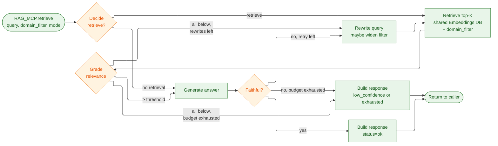
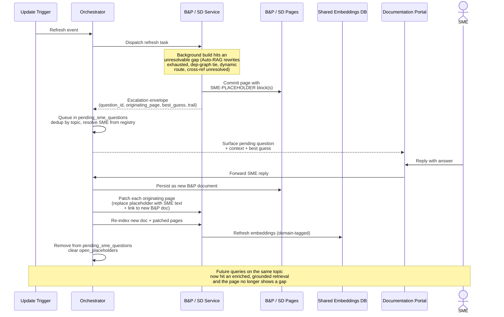

# Capstone Project — Low-Level Design

Enrique R. Corona Dominguez

> Disclaimer: I wrote this with help from Claude Code, I provided a lot of guidance, suggestions, corrections and for
> the most part defined the high level architecture and
> implementation details based on the course lectures.

> As stated in [Section 1.3](PROJECT.md#13-proposed-solution), we're implementing a **Research Agent** that
> helps our leadership, developers, and product managers have a complete view of the architecture,
> dependencies, progress, and known gaps of our systems. Modernization efforts in a 20+ year old org stall
> on a single recurring problem: nobody has an accurate, current map of the system. Decisions get made on
> stale or incomplete documentation, dependencies get discovered late, and gap analysis becomes weeks of
> manual archaeology. A Research Agent that **continuously updates and enriches** the org's documentation
> collapses that lead time and gives every team — engineering, product, leadership — a single source of
> truth they can trust.
> 
## 9. Low-Level Design

This section covers the per-service designs (B&P, SD, RAG) plus the patterns shared between them — the
Autonomous RAG loop, the ToT chunking strategy, and SME interaction.

### 9.1 RAG Service design

#### 9.1.1 Responsibilities

The RAG Service is the fourth component (alongside the Orchestrator, B&P, and SD). It owns:

- The **shared Embeddings Database**.
- The **embedding model**.
- The **Autonomous RAG** loop ([Section 9.1.3.1](#9131-autonomous-rag-loop)) used at retrieval time.
- The **ToT chunking strategy** sub-graph ([Section 9.1.3.2](#9132-tot-chunking-strategy)) used at
  indexing time.

It does *not* read source code, write to GitHub, talk to SMEs, or own any per-page state.
Specialists never touch the embedding store directly — every read and every write goes through
`RAG_MCP`.

#### 9.1.2 APIs (MCP)

Methods exposed by `RAG_MCP`:

- `retrieve(query, domain_filter, mode) -> { status, answer, sources, retrieval_trail, grader_scores }` —
  runs the Autonomous RAG loop. `domain_filter ∈ {bp, sd, both}` is pushed into the vector query;
  `mode ∈ {query, background}` is advisory metadata that lets the loop tune limits and lets the
  caller branch on the response. `status ∈ {ok, low_confidence, exhausted}` summarises the outcome:
  `ok` means the answer cleared the grader and the faithfulness check; `low_confidence` means the
  rewrite budget was exhausted but a best-effort answer is included with the closest matches;
  `exhausted` means no usable evidence was found and no answer is returned. The caller decides what
  to do — query mode returns the answer (or a low-confidence fallback) to the user; background mode
  may write an SME placeholder when `status` is `low_confidence` or `exhausted` on a sub-question
  necessary for the page being built.
- `index(domain, source_uri, document, content_hash) -> { chunks_indexed, chunking_strategy, embedding_revision }` —
  runs the ToT chunking-strategy loop on the document, computes embeddings with the RAG Service's
  embedding model, and persists chunks tagged with the caller's `domain`. The response gives the
  specialist enough metadata to update its own `doc_index`. Existing chunks for the same
  `(domain, source_uri)` are replaced atomically.
- `delete(domain, source_uri)` — invalidate all chunks for a removed source, used when a B&P input
  doc disappears or an SD page is retired.

`embed(chunks)` and `score_strategy(candidate_chunks, probe_questions)` are internal nodes of the
ToT chunking sub-graph; they are not exposed externally because the specialists don't run that loop
themselves.

#### 9.1.3 Implementation details

*State and routing.* The RAG Service is one LangGraph state graph fronted by `RAG_MCP`; the entry
node routes by method (`retrieve`, `index`, `delete`) into the matching sub-graph. Apart from the
vector store itself, the service is stateless across requests — it does not track which page is
"in flight" for either specialist. Index-quality flags (chunks that survive retrieval but repeatedly
fail the grader) are emitted as part of the `retrieve` response so the calling specialist can
decide to re-index that source with a different chunking strategy on the next refresh. The flag is
naturally scoped by the `domain` tag the chunk carries, so re-indexing stays per-specialist.

*LLM use.* The RAG Service calls the same local LLM that B&P and SD use, for the grader, the
faithfulness re-grade, the query rewriter (in `retrieve`), and the probe-question generator + Q&A
scoring (in `index`). All these calls are bounded and cacheable; for the POC the service runs
in-process so there is no extra network hop.

*Boundary.* The RAG Service trusts the caller's claim of `domain` ownership — there is no
authentication beyond which MCP each specialist is wired to. B&P only writes `domain=bp`; SD only
writes `domain=sd`. Reads can request any domain or `both`. Adding a future specialist (e.g.,
Security) means giving it access to `RAG_MCP` and reserving a new `domain` tag — no schema change
to the store, no code change in B&P or SD.

The two internal sub-graphs are documented next.

##### 9.1.3.1 Autonomous RAG loop

[Sections 6.1–6.4](PROJECT.md#6-retrieval-design--rag-module-3) describe the **indexing-time** rationale.
At **retrieval time** the RAG Service wraps the vector lookup in an **Autonomous RAG** loop so the
caller can self-correct when retrieval is weak instead of returning a low-confidence answer silently.
The loop has four nodes — **decide → retrieve → grade → rewrite** — wired as a LangGraph
`StateGraph`, same harness style as the ToT loops
([Section 7.5](PROJECT.md#75-mapping-tot-roles-to-tools)). It runs entirely inside the RAG Service;
the caller (B&P or SD) sees only the response shape described in [Section 9.1](#91-rag-service-design).

The nodes:

1. **Decision (router)** — classifies the query into `{no_retrieval, retrieve}` and, when retrieving,
   honors the caller-supplied `domain_filter` ∈ `{bp, sd, both}`. Some questions are answered from
   static context and skip retrieval entirely. The Orchestrator's dispatch envelope
   ([Section 9.4](#94-orchestrator-service-design)) is what seeds the filter at the specialist; the
   specialist passes it through to `RAG_MCP.retrieve`. The router can drop the filter on its own if
   a single-domain hint produces nothing usable two rewrites in a row.
2. **Retrieval** — similarity search against the chosen embedding
   view ([Section 6.3](PROJECT.md#63-for-indexing-each-document)) on the shared Embeddings Database,
   constrained by the router's `domain_filter`. K is small (2–5) since we pull the **whole document**
   into context once it has been selected. There is no merge step — the filter (or its absence) is
   pushed into the vector query and the grader sees a single ranked list.
3. **Grader** — an LLM scores each retrieved document 0–3. If all are below threshold, the loop goes
   to the rewriter; otherwise the survivors go to answer generation, and we run a second grading
   pass for **faithfulness** to catch hallucinations.
4. **Query rewriter** — invoked when the grader produces nothing usable. Rewrites the query
   (acronyms, synonyms, scope, sub-queries) and loops back to retrieval. Bounded to **R=2** rewrites
   per question. May also widen `domain_filter` (e.g., from `bp` to `both`) when the failure pattern
   suggests cross-domain evidence is needed.

Loop control and failure modes:

- After R rewrites, the loop returns `status=low_confidence` with the closest matches, the rewrite
  trail, and grader scores. If even the closest matches are below a "no signal at all" floor the
  loop returns `status=exhausted` with no answer. The decision of what to do with each status is
  the caller's: B&P/SD in **query mode** turn `low_confidence`/`exhausted` into a low-confidence
  answer to the user; in **background mode** they turn it into an SME escalation
  ([Section 9.5](#95-sme-interaction-module-6)) and write a placeholder block
  ([Section 9.5.1](#951-placeholders-and-re-integration)).
- If the post-generation faithfulness check fails, trigger one rewrite cycle on the unsupported
  claims; if it still fails after the cycle, downgrade `status` to `low_confidence` and return.
- If the same document repeatedly survives retrieval but fails the grader, the loop emits an
  index-quality flag in the `retrieval_trail` so the calling specialist can re-index that source
  with a different chunking strategy on the next refresh — closing the loop between retrieval and
  indexing.
- Cache `(query → graded retrieval)` for the lifetime of a single request.

The router and rewriter can become ToT decision points later if their single-pass calls
underperform; for the POC we keep them single-pass.



##### 9.1.3.2 ToT: chunking strategy

For each new or changed document arriving via `RAG_MCP.index` — input docs from B&P, generated SD
pages from SD — the RAG Service picks a chunking strategy from the candidates in
[Section 6.2](PROJECT.md#62-chunking-strategies) (per-paragraph, per-section, per-N-chars,
summary-only, hybrid) using the ToT loop. The steps:

1. **Generate** — emit K=4 candidate strategies for the document (e.g. per-paragraph at 800 chars,
   per-section, per-N at 1200 chars, summary-only).
2. **Embed** — for each candidate, run the chunker, compute embeddings for every chunk, and stage
   them in a temporary index.
3. **Probe** — ask an LLM to read the document and produce N student-style Q&A pairs.
4. **Score** — for each candidate, run the questions against its temporary index and compute the
   similarity-over-M score: the fraction of questions whose top-K hit lands in the right chunk.
5. **Prune** — drop candidates with score below 0.7.
6. **Iterate** — beam-search keeps the top B=2–3 surviving candidates and expands variants
   (different chunk sizes, hybrid combinations) for the next level. Stops at depth D=2–3 or when
   one candidate clearly beats the others.
7. **Persist** — the winning candidate's chunks and embeddings are written to the **shared
   Embeddings Database** with the caller-supplied `domain` tag (`bp` or `sd`); the strategy itself
   is persisted as metadata so retrieval-time grading can reuse it. Existing chunks for the same
   `(domain, source_uri)` are replaced atomically.

If no candidate clears the threshold at depth D, the document is tagged low-confidence and indexed
with the highest-scoring strategy anyway; the response signals the low-confidence index so the
calling specialist can decide whether to surface a follow-up or accept the imperfect index.

This sub-graph is owned end-to-end by the RAG Service: B&P and SD do not run it themselves and do
not need to know which strategy won — they only see the response metadata
(`chunking_strategy`, `embedding_revision`) returned by `RAG_MCP.index`, which they record in their
own `doc_index`. The probe step's question generator is content-driven, so domain prose differences
(B&P narrative vs SD structured prose) flow through naturally — the winning strategy can differ per
page without any specialist-specific tuning.

### 9.2 SD Service design

#### 9.2.1 Responsibilities

The SD agent owns the **SD pages** in GitHub, the **SD doc index** (per-page metadata, last-known
commit shas), and the **SD sources inventory**. It analyzes source code via the GitHub MCP,
cross-checks telemetry via the Monitoring MCP, runs its own ToT dep-graph loop
([Section 7.1](PROJECT.md#71-where-tot-helps-in-this-project), use case 3), generates
service/endpoint/dependency pages with cross-references to B&P, and answers query-time questions
about services. It does *not* embed or chunk anything itself, write into B&P pages, or talk to the
embedding store directly — retrieval and indexing go through `RAG_MCP`.

#### 9.2.2 APIs (MCP)

Methods exposed by `SD_MCP`:

- `dispatch_query(query, domain_hint, context) -> { status, answer, sources, retrieval_trail }` —
  query-mode entry point. The Orchestrator calls this with the user's question and the dispatch
  envelope. SD runs its query-mode graph (delegates to `RAG_MCP.retrieve` with
  `domain_filter=sd`/`both`, falls back to focused `analyze_code` if the response is
  `low_confidence`/`exhausted`) and returns a composed answer with citations.
- `dispatch_refresh(event) -> { affected_pages, escalations }` — background-mode entry point. The
  Orchestrator calls this with `(commit_sha or doc_id, change_kind)`. SD diffs the event against
  its `sources_inventory`, runs its background-mode pipeline for each affected service
  (`analyze_code` → `verify_telemetry` → ToT dep-graph → `resolve_bp_links` → `write_doc` →
  `RAG_MCP.index(domain=sd, ...)`), and returns the list of pages it (re-)wrote plus any
  escalation envelopes.
- `find_services_for_product(product_id) -> [{ service, endpoint, role }]` — relational
  cross-reference, called by B&P during `resolve_sd_links`. Reads from SD's `doc_index` only — no
  LLM, no `RAG_MCP.retrieve` call.
- `get_page(page_uri) -> { content, doc_index_entry }` — read an SD page's current content and
  metadata, called by the Orchestrator before `patch_page` and by the cross-reference validator.
- `patch_page(page_uri, question_id, replacement) -> { commit_sha }` — replace the fenced
  `SME-PLACEHOLDER:question_id` block in the page with the SME's resolved text plus a relative
  Markdown link. Called by the Orchestrator's `ingest_sme_reply`. Updates `open_placeholders` in
  the SD `doc_index` and triggers `RAG_MCP.index` for the patched page.

#### 9.2.3 Implementation details

The SD agent is one **LangGraph** state graph whose entry router dispatches to the right path
based on the operating mode (background vs query).

*Background mode* — for each refresh task the graph walks the affected service end-to-end. It
pulls source code via the **GitHub MCP**, runs plain code analysis (AST + regex) augmented by an
LLM pass for the prose around each endpoint, optionally verifies inferred call patterns against
telemetry through the **Monitoring MCP** when wired in, runs the **ToT loop**
([Section 7.1](PROJECT.md#71-where-tot-helps-in-this-project), use case 3) to pick the best
dependency graph among several candidates, calls the **B&P MCP** to resolve cross-references,
writes the resulting page as Markdown into the **SD pages** in GitHub, then hands the new page to
the RAG Service via `RAG_MCP.index(domain=sd, source_uri, document)` for chunking + embedding +
persistence. SD's own `doc_index` records the new revision (and the `chunking_strategy` /
`embedding_revision` returned by the RAG Service) so the next refresh knows what changed.

*Query mode* — a question routed to SD delegates retrieval to the RAG Service via
`RAG_MCP.retrieve(query, domain_filter=sd, mode=query)` ([Section 9.1.3.1](#9131-autonomous-rag-loop)).
The Orchestrator's dispatch envelope seeds the SD-domain hint that SD passes through; cross-domain
queries pass `domain_filter=both`. If the response comes back with `status=ok` the answer is
composed from the returned chunks with citations. If the response is `low_confidence` or
`exhausted` — typically because the existing SD page genuinely doesn't cover the question — a
focused `analyze_code` pass runs on a targeted subset of files (the file backing the
closest-matching endpoint, taken from the response's `sources`) and feeds the composer. The user
always gets an answer back: if the RAG response and focused analysis both leave the response
low-confidence, it is returned as such with closest-match citations and the analyzer's notes.
Query mode never escalates to an SME — that flow is reserved for background builds (see
[Section 9.5](#95-sme-interaction-module-6)).

Reusing the same code-analysis node across both modes keeps the live answers consistent with what
we documented during the last refresh — they come from the same logic. Delegating retrieval to the
same RAG Service across B&P and SD keeps query-time behavior consistent across domains.

*ReAct loop.* The outer loop is a `reason → act → observe` cycle: `reason` picks the next step
from `{pull_source, analyze_code, verify_telemetry, run_tot_dep_graph, resolve_bp_links,
write_doc, rag_index, rag_retrieve, focused_analyze, compose_answer, escalate, done}` based on the
operating mode and the partial result so far. `act` calls the chosen sub-step (e.g.,
`analyze_code` is itself a five-step internal pipeline — see
[Section 9.2.3.1](#9231-analyze_code); `rag_index` and `rag_retrieve` are MCP calls into the RAG
Service). `observe` writes the result back into graph state and a conditional edge loops back to
`reason` until the action returns `done`. Background mode is mostly deterministic so the local LLM
rarely deviates from the planned order; query mode is more active — the reasoner decides whether
the RAG response was sufficient or focused code analysis is needed. `escalate` is reachable only
from background mode.


The internal sub-nodes are documented next.

##### 9.2.3.1 analyze_code

This node is the workhorse of SD's design. It pulls source files via the **GitHub MCP** and produces a
structured representation of the service: **endpoints** (Flask `@app.route` decorators extracted with
Python's `ast` module), **data structures** (`@dataclass` definitions and type-hinted function
signatures), and **downstream calls** (`requests` HTTP calls and raw `sqlite3` queries). Each endpoint
also gets a one-paragraph plain-English description from an LLM pass over the function body and
surrounding comments, so the doc reads like prose rather than an auto-generated stub.

In query mode the same node runs on a focused subset of files identified by the router — typically the
file containing the endpoint the question is about — keeping the prompt small for the local LLM.

**Implementation pipeline.** The node decomposes into five internal sub-steps:

1. **`pull_source`** — pulls the target service's tree via the GitHub MCP. A full refresh pulls
   everything; an incremental refresh pulls only files changed since the doc index's last revision
   (commit-sha diff). Files are content-hashed and cached so re-runs over the same revision are free.
2. **`parse_ast`** — parses each `.py` file with the stdlib `ast` module, producing a uniform internal
   node representation `{kind, name, decorators, args, body_range, source_path}` that downstream
   sub-steps consume.
3. **`extract_endpoints`** — walks the AST for Flask `@app.route(path, methods=[...])` decorators and
   `Blueprint`-mounted routes. Each match produces an `Endpoint` record `{method, path, handler_fn,
   params, return_type, source_path, line_range}`. Data structures are extracted alongside from
   `@dataclass` definitions and type-hinted parameter/return annotations.
4. **`extract_calls`** — pattern-matches outbound calls: HTTP via
   `requests.{get,post,put,delete,...}(url, ...)` and DB via `sqlite3` — calls of the form
   `<conn>.execute(sql, ...)` where `<conn>` traces back to a `sqlite3.connect(...)` (directly or
   through the `shared.db.connect()` helper). Table names parsed from the SQL string and
   statically-resolvable URLs become the dependency target; the rest are tagged `dynamic` for SME
   review.
5. **`llm_augment`** — for each endpoint, sends a structured prompt to the LLM containing the function
   body, immediately surrounding comments, and the `Call` records that originate from that handler.
   The prompt asks for a one-paragraph prose description of what the endpoint does and any non-obvious
   behavior. Bounded to ~1k input tokens per call so prompts stay focused and fit comfortably in the
   local LLM's context window.

**Output shape.** The node writes a `ServiceAnalysis` blob to graph state, consumed by every downstream
node in the SD graph (`verify_telemetry`, `ToT dep graph`, `resolve_bp_links`, `write SD doc`):

```text
{
  "service": "billing-service",
  "source_revision": "<commit-sha>",
  "endpoints":         [{ method, path, handler, params, return_type, source_path, line_range }],
  "data_structures":   [{ name, fields, kind }],
  "downstream_calls":  [{ from, kind: http|db, target, dynamic? }],
  "prose":             { "<endpoint_key>": "<one-paragraph description>" }
}
```

**Edge cases — tagged, not guessed:**

- **Dynamic routes** — paths or URLs computed at runtime are tagged `dynamic` with the source
  expression captured; the doc page surfaces them for SME confirmation.
- **Blueprint registration** — multi-blueprint apps where the URL prefix comes from
  `register_blueprint(..., url_prefix=...)` are captured best-effort. The ToT dep-graph step uses
  telemetry to break ties when more than one wiring is plausible.
- **Partial parse failures** — file-level parse errors are recorded in the analysis metadata; the rest
  of the run proceeds and the SD page lists the failed files as follow-ups for the next refresh.

##### 9.2.3.2 verify_telemetry

When the **Monitoring MCP** is wired in (out of POC scope per [Section 8.5](PROJECT_ARCHITECTURE.md#85-considerations-for-the-poc)), this node
cross-checks
`analyze_code`'s output against observed traffic. For each inferred endpoint, it queries the MCP for
spans and metrics matching the route — endpoints with no telemetry get flagged as candidates for
deprecation. For each inferred downstream call, it verifies that traces actually show calls to the named
target; calls that appear in code but not in telemetry are suspicious, and the reverse case (telemetry
shows something the code analysis missed) is also surfaced.

Each endpoint and dependency gets a confidence score based on telemetry agreement, which feeds into the
ToT evaluator below. The node is a no-op when the Monitoring MCP is unavailable — confidence collapses to
"code-only".

##### 9.2.3.3 ToT dep graph

Inferring the dependency graph is non-trivial — call patterns are often ambiguous when calls flow through
brokers, queues, or service meshes. The steps:

1. **Generate** — emit K=3 candidate dependency graphs per service: one taken straight from code
   analysis, one reweighted by telemetry agreement (so high-volume but lightly-coded paths get promoted),
   and one that prefers stable historical traffic over single-trace anomalies.
2. **Score** — for each candidate, compute the telemetry agreement: the fraction of edges that match
   observed traffic from the Monitoring MCP, weighted by call volume. Without telemetry, the score
   collapses to a rubric over code coverage and reference count.
3. **Prune** — drop candidates with agreement below 0.8.
4. **Iterate** — beam-search keeps the top B=2–3 surviving candidates and expands variants (swap inferred
   edges, merge near-duplicates) for the next level. Stops at depth D=2–3.
5. **Persist** — the winning graph becomes the dependency section in the generated SD page; runner-up
   edges that differ are recorded as follow-up tasks for the next refresh.

If no candidate clears the threshold, the highest-scoring graph is kept and flagged for SME review.

### 9.3 B&P Service design

#### 9.3.1 Responsibilities

The B&P agent owns the **BP pages** in GitHub, the **BP doc index** (per-page metadata,
last-known input-doc hashes), and the **BP sources inventory**. It ingests org input docs, hands
them to the RAG Service for indexing, generates product/feature pages with cross-references to SD,
and answers query-time questions about products. Every page it produces or consumes needs to
**resolve into the SD documentation** so a B&P page about a product links to the services that
implement it. It does *not* embed or chunk anything itself, write into SD pages, or read source
code directly — retrieval and indexing go through `RAG_MCP`, and SD pages are reached via
`SD_MCP`.

#### 9.3.2 APIs (MCP)

Methods exposed by `BP_MCP`:

- `dispatch_query(query, domain_hint, context) -> { status, answer, sources, retrieval_trail }` —
  query-mode entry point. The Orchestrator calls this with the user's question; B&P delegates to
  `RAG_MCP.retrieve` with `domain_filter=bp`/`both`, runs `resolve_sd_links` on referenced
  services in the response, and returns the composed answer with inline cross-reference links.
- `dispatch_refresh(event) -> { affected_pages, escalations }` — background-mode entry point. The
  Orchestrator calls this with `(doc_id, change_kind)`. B&P diffs against its `sources_inventory`,
  runs its background-mode pipeline (ingest → `RAG_MCP.index(domain=bp, ...)` → `resolve_sd_links`
  → `write_doc`), and returns the list of pages plus any escalation envelopes.
- `find_products_for_service(service_id) -> [{ product, feature, role }]` — relational
  cross-reference, called by SD during `resolve_bp_links`. Reads from B&P's `doc_index` only.
- `get_page(page_uri) -> { content, doc_index_entry }` — read a B&P page's current content and
  metadata.
- `patch_page(page_uri, question_id, replacement) -> { commit_sha }` — replace the fenced
  `SME-PLACEHOLDER:question_id` block with the resolved text plus link. Same semantics as SD's
  `patch_page`. Updates `open_placeholders` in the B&P `doc_index` and triggers `RAG_MCP.index`.
- `ingest_sme_doc(question_id, sme_text, originating_pages) -> { new_page_uri, embedding_revision }` —
  turn an SME reply into a new B&P page. Called only by the Orchestrator's `ingest_sme_reply`.
  Writes the new page to GitHub, calls `RAG_MCP.index(domain=bp, ...)`, and returns the new page's
  URI for use in subsequent `patch_page` calls across both B&P and SD originating pages.

#### 9.3.3 Implementation details

The B&P agent is one LangGraph state graph.

*Background mode* — the agent ingests input documents (org docs from the Git repo for the POC),
normalizes them (strips formatting metadata, collapses whitespace, resolves embedded references),
and computes a content hash that B&P's own `sources_inventory` uses to skip unchanged files on the
next refresh. It then hands the normalized document to the RAG Service via
`RAG_MCP.index(domain=bp, source_uri, document, content_hash)` — the RAG Service runs ToT chunking
([Section 9.1.3.2](#9132-tot-chunking-strategy)), computes embeddings, and persists the chunks. B&P
records the returned `chunking_strategy` and `embedding_revision` in its `doc_index` and produces
the corresponding B&P page. Right before writing the page, a `resolve_sd_links` node calls the
**SD MCP** to enumerate the services that back the product or feature described on the page; the
resulting links are inlined as relative Markdown links to the SD pages. Stale links surface as
follow-up tasks rather than silent rot — the next refresh re-validates them. For the POC the input
set is just hand-checked org docs in the same Git repo; later phases plug in additional MCPs
(Confluence, Slack, etc.) without changing this contract.

*Query mode* — incoming questions are answered by delegating to the RAG Service via
`RAG_MCP.retrieve(query, domain_filter=bp, mode=query)` ([Section 9.1.3.1](#9131-autonomous-rag-loop)).
The Orchestrator's dispatch envelope seeds the BP-domain hint that B&P passes through;
cross-domain queries pass `domain_filter=both`, so the response sees BP and SD chunks together
without any merge step on B&P's side. When the response references a service in its answer, the
same `resolve_sd_links` node runs to resolve the reference at answer time, so the user sees an
up-to-date link even if the persisted page is briefly stale. If the response comes back as
`low_confidence` or `exhausted`, the user gets a low-confidence answer with closest-match
citations — query mode does not escalate to an SME (see
[Section 9.5](#95-sme-interaction-module-6)).

The cross-referencing direction is symmetric with SD: B&P calls **SD MCP** to resolve "what
services serve this product"; SD calls **B&P MCP** to resolve "what products depend on this
service". The two services do not write into each other's pages — they just link.

*ReAct loop.* The outer loop is a `reason → act → observe` cycle: `reason` picks the next step
from `{ingest_input_docs, rag_index, resolve_sd_links, write_bp_doc, rag_retrieve,
compose_answer, escalate, done}` based on the operating mode and partial result. `act` calls the
chosen sub-step (e.g., `rag_index` and `rag_retrieve` are MCP calls into the RAG Service);
`observe` writes the result back into graph state and a conditional edge loops back to `reason`.
Background mode is mostly deterministic sequencing through ingest → index → resolve_links →
write_doc; query mode hands off to `rag_retrieve` and composes the answer around the RAG
response. `escalate` is reachable only from background mode.


### 9.4 Orchestrator Service design

#### 9.4.1 Responsibilities

The Orchestrator is the supervisor: it receives work from the Documentation Portal and the Update
Trigger, routes it to the right specialist, manages the SME-question queue, and persists task
state. It does *no* content analysis itself, has no embedding store, no doc index, and no sources
inventory — all per-domain state is owned by the specialists. The only state it owns is the
**`pending_sme_questions`** queue plus the SME / specialist registry.

#### 9.4.2 APIs (REST)

The Orchestrator's upstream callers (the Documentation Portal and the Update Trigger) are not
LLM-driven agents, so the Orchestrator exposes a plain **HTTP/REST API** rather than an MCP. The
Orchestrator continues to *call* MCP downstream (`BP_MCP`, `SD_MCP`); the asymmetry is fine — MCP
for agent-to-agent, REST for system integration.

REST endpoints (versioned under `/v1`):

- `POST /v1/queries` — body: `{ query, user_id, context }`. Used by the Portal chatbot. The
  Orchestrator picks B&P, SD, or both based on the query, dispatches via the corresponding MCP,
  and returns `{ status, answer, sources, retrieval_trail }`. Synchronous; bounded by the
  underlying RAG loop's R=2 rewrites.
- `POST /v1/refresh` — body: `{ event_type, doc_id_or_commit_sha, change_kind, source }`. Used by
  the Update Trigger (cron + GitHub webhook + Portal "refresh" button). Returns
  `{ task_id, accepted_at }`. Asynchronous — the Orchestrator queues the work and fans out to the
  affected specialists.
- `POST /v1/sme-replies` — body: `{ question_id, sme_id, sme_text }`. Used by the Portal's SME
  answer UI. The Orchestrator runs `ingest_sme_reply` (persist new B&P doc → patch every
  originating page → trigger re-indexing → clear queue entry) and returns
  `{ status, new_doc_uri, patched_pages }`.
- `GET /v1/sme-questions?sme_id=...&status=pending` — Used by the Portal's SME UI to list pending
  questions for a given SME. Returns `[{ question_id, topic, question, best_guess,
  originating_pages, posted_at }]`.
- `GET /v1/sme-questions/{question_id}` — full detail for one queued question, including the
  retrieval trail.
- `GET /v1/tasks/{task_id}` — poll status of an async task (e.g., a refresh fan-out). Returns
  `{ status, started_at, completed_at, result }`.
- `GET /v1/health` — liveness check for the Update Trigger and any external monitoring.

Auth and rate-limiting are out of POC scope but the endpoints are designed so adding them is a
middleware change, not a contract change. The Portal authenticates with a simple API key for the
POC; production deployments would swap to whatever the org's standard service auth is.

#### 9.4.3 Implementation details

The Orchestrator is one **LangGraph** state graph that runs a plain **ReAct** loop. Same harness
style as B&P and SD, with fewer nodes since there is no domain-specific reasoning.

*Inputs.* Three event types feed the orchestrator (mapped from the REST endpoints above):

- **Portal query** (`POST /v1/queries`) — a user (or SME) question or improvement proposal. The
  orchestrator picks B&P, SD, or both based on the query, and the dispatch envelope carries a
  `domain_hint` that the specialist forwards to `RAG_MCP.retrieve` as `domain_filter`. Specialists
  never escalate query-mode work to an SME — a low-confidence answer comes straight back to the
  Portal.
- **Trigger refresh** (`POST /v1/refresh`) — `(doc_id or commit_sha, change_kind)` events from the
  Update Trigger. The orchestrator routes each event to the specialist(s) it concerns based on
  its path/kind (a small static rule, not a stored index). Each specialist computes its own
  affected pages by diffing the event against its sources inventory and re-runs its pipeline
  (calling `RAG_MCP.index` for each affected document). Background-mode dispatches are the only
  source of SME escalations.
- **SME reply** (`POST /v1/sme-replies`) — answers received via the Portal that need to land as a
  new B&P document and patched back into every page that carried the matching placeholder.

*State.* A single persisted blob survives between runs:

- **`pending_sme_questions`** — escalated questions waiting for an SME, keyed by `question_id`,
  with `{topic, question, originating_pages, placeholder_id, best_guess, retrieval_trail,
  assigned_sme, posted_at}`. `originating_pages` is the set of B&P/SD page URIs that carry the
  matching placeholder, so re-integration patches every page that asked the same question — not
  just the newest one. This is the only piece of state the orchestrator owns; it is genuinely
  cross-cutting because dedup happens across both domains and the SME registry is global.

The **doc index** and **sources inventory** are *not* held by the orchestrator. Each specialist
owns its own copy keyed to its domain (see
[§8.1](PROJECT_ARCHITECTURE.md#81-roles-and-responsibilities)). The orchestrator can ask a
specialist for that information via its MCP when it needs it (e.g., the placeholder-patch step
queries the owning specialist for the page's current content), but it never caches a global view.

*ReAct loop.* The outer loop is a 3-node ReAct cycle: `reason` (the local LLM picks the next
action from `{dispatch_to_bp, dispatch_to_sd, dispatch_to_both, ingest_sme_reply, ack_completion,
done}` based on the inbound event and current state) → `act` (calls the chosen MCP or internal
node) → `observe` (writes the response back into graph state). A conditional edge loops back to
`reason` until the action returns `done`. The system prompt is kept tight (~300 tokens) and the
action space small so the loop runs reliably on the local LLM.

*Pipeline nodes wrapped by the ReAct loop:*

1. **`route`** — classifies the inbound event into `{portal_query, trigger_refresh, sme_reply}`
   based on which REST endpoint received the request. Used by `reason` as the first decision
   point.
2. **`dispatch`** — for refresh tasks, forwards the change event to the right specialist's MCP;
   the specialist returns the list of affected pages it plans to refresh (or `[]` if the event is
   irrelevant to it). For Portal queries, picks a single specialist (or both, if the query spans
   both domains) and forwards.
3. **`ingest_sme_reply`** — the re-integration step
   ([Section 9.5.1](#951-placeholders-and-re-integration)). Persists the SME's answer as a new
   B&P document via `BP_MCP.ingest_sme_doc`, then walks
   `pending_sme_questions[question_id].originating_pages` and asks the owning specialist to
   **patch each page** by replacing the placeholder block with the SME's text plus a link to the
   new doc. Tells B&P to re-index. The patching specialist updates its own `open_placeholders` in
   its doc index; the orchestrator just removes the entry from `pending_sme_questions`.
4. **`ack_completion`** — when a specialist finishes a refresh task or a query response, this
   node marks the in-flight task complete in the orchestrator's working state. If the response is
   a background-mode escalation envelope (specialist hit a gap and wrote a placeholder block into
   the page it was building), the node opens or updates the corresponding entry in
   `pending_sme_questions`. Query-mode responses never carry an escalation envelope. The
   specialist itself records the new page in its own doc index — the orchestrator no longer
   maintains a parallel copy.

*Resumability.* Every node persists its state before transitioning; if the orchestrator crashes
mid-refresh it picks up where it left off on next start. Refresh fan-outs run specialists in
parallel but preserve ordering per page so cross-references stay consistent within a single cycle.

### 9.5 SME interaction (Module 6)

When a specialist hits an unresolvable gap during a **background page build** — Auto-RAG exhausts its
rewrite budget on a sub-question necessary for the page, code analysis tags a route as `dynamic`, the
ToT dep-graph evaluator can't pick a winner, or a cross-reference can't be resolved — it escalates the
question to a **subject matter expert** through the **Documentation Portal**
([Section 8](PROJECT_ARCHITECTURE.md#8-high-level-architecture-module-5)). Query-mode answers never escalate; the user gets a
low-confidence answer with closest-match citations and the gap is filled the next time a background
build surfaces the same question. The goal is to enrich the knowledge base over time, not to block
either the user or the page commit.

The flow is async:

1. The specialist commits the page with a **placeholder block** standing in for the missing prose or
   link ([Section 9.5.1](#951-placeholders-and-re-integration)) and returns an **escalation envelope**
   to the orchestrator carrying `question_id`, `placeholder_id`, the originating page URI, the
   retrieval/analysis trail, and the agent's best low-confidence guess so the SME can confirm or
   correct rather than draft from scratch.
2. The orchestrator queues the question (`pending_sme_questions` in its inventory, keyed by
   `question_id`) with the originating page list, dedupes by topic so two pages hitting the same gap
   don't both page the SME, and surfaces it to the right SME through the Portal.
3. When the SME replies, the orchestrator runs `ingest_sme_reply`
   ([Section 9.4](#94-orchestrator-service-design)): it persists the reply as a new B&P document,
   asks the owning specialist to patch every originating page (placeholder block → SME's text + link
   to the new doc), triggers re-indexing, and clears the queue entry.



The Portal looks up the right SME from a registry keyed by project/domain (the "initial list of SMEs"
from [Section 3.1](PROJECT.md#31-business--product-bp-pov)), with fallback to the next candidate after
a timeout (e.g., 24h). The same flow is used by **SD** when its ToT gap-reconciliation evaluator can't
pick a winner ([Section 7.7](PROJECT.md#77-risk-and-mitigation)'s mitigation).

If the SME's reply disagrees with the retrieved documents, those documents are flagged for refresh —
the SME-driven counterpart of the index-quality feedback in
[Section 9.1.3.1](#9131-autonomous-rag-loop). If no SME is available for a domain, the
orchestrator records the gap in its inventory; it is a knowledge-base coverage problem, not a runtime
error.

#### 9.5.1 Placeholders and re-integration

A page is rarely held back because of a single open question — the specialist commits what it knows and
**marks the gap inline** so readers see where the documentation is incomplete and the system has a hook to patch
the page once an SME answers. Two mechanisms cover this: a **placeholder block** written into the page at gap
time, and a **re-integration step** in the orchestrator that replaces the block when the SME's reply lands.

**When a placeholder is written.** A placeholder block is emitted whenever a specialist hits a gap it cannot
resolve on its own during a background page build and the resulting question is escalated to an SME via
[Section 9.5](#95-sme-interaction-module-6). The common cases:

- **Background-mode RAG retrieval** — while building or refreshing a page, the specialist calls
  `RAG_MCP.retrieve(query, domain_filter, mode=background)` ([Section 9.1.3.1](#9131-autonomous-rag-loop))
  for a sub-question necessary for the page (B&P over its input docs, SD over the SD slice — both
  may widen the filter to cross-domain when the question warrants). The RAG Service exhausts its
  rewrite budget and returns `status=exhausted` (or `low_confidence` on a question critical for the
  page, e.g., the canonical owner of a feature flag or the product context for an SD endpoint).
  Query-mode `RAG_MCP.retrieve` returns the same statuses but the specialist treats them as a
  low-confidence answer to the user instead — no placeholder is written.
- **SD code-analysis gaps** — `analyze_code` tags a route or call as `dynamic` ([Section 9.2.3.1](#9231-analyze_code))
  or the ToT dep-graph evaluator can't pick a winner ([Section 9.2.3.3](#9233-tot-dep-graph)).
- **Cross-reference resolution** — `resolve_sd_links` / `resolve_bp_links` can't map a referent and the link
  would otherwise rot silently.

In all three cases the specialist still writes the page; the placeholder block stands in for the missing prose
or link.

**Placeholder block format.** A self-contained, machine-locatable Markdown block with HTML-comment fences so
the patch step can find and replace it deterministically without regex over arbitrary prose:

```markdown
<!-- SME-PLACEHOLDER:Q-2026-06-17-001 START -->
> ⏳ **Waiting for SME** — *Topic:* dynamic queue URL resolution
>
> *Question:* How is `QUEUE_BASE` resolved per tenant at runtime?
> *Best guess (low-confidence):* Derived from `config.QUEUE_BASE` plus tenant-id; needs confirmation.
> *Asked:* @alice on 2026-06-17 · *Status:* pending · *Question ID:* `Q-2026-06-17-001`
<!-- SME-PLACEHOLDER:Q-2026-06-17-001 END -->
```

The fenced HTML comments are the contract. Everything between them is human-readable; the `question_id` in the
fence is what the orchestrator uses to find the block. The page's `open_placeholders` list in the owning
specialist's `doc_index` mirrors the set of `question_id`s currently fenced inside the file; the orchestrator
finds every page that asked the same question via its own `pending_sme_questions[question_id].originating_pages`,
without scanning the repo and without keeping a parallel index of its own.

**Re-integration when the SME replies.** The orchestrator's `ingest_sme_reply` node
([Section 9.4](#94-orchestrator-service-design)) does two writes in order:

1. **New B&P document** — the SME's answer is persisted as a standalone B&P page so the Auto-RAG loop can
   retrieve it on future queries on the same topic. This is the embedding-side update; without it, the next
   identical question would re-escalate.
2. **Patch every originating page** — for each URI in `pending_sme_questions[question_id].originating_pages`,
   the orchestrator asks the owning specialist (B&P or SD) to replace the fenced placeholder block with the
   SME's text plus a relative Markdown link to the new B&P document. This is the page-side update; without it,
   the placeholder rots in the page even though the answer exists.

Both writes are committed in the same Git change so the index update and the page patch land together. After
the patch, the `question_id` is removed from each page's `open_placeholders` and the entry is cleared from
`pending_sme_questions`. If a downstream refresh later re-discovers the same gap (e.g., the SME's answer
became outdated), a new `question_id` is opened and a fresh placeholder block written — the system never
reuses a closed `question_id`, so the audit trail in Git stays linear.

**Cross-references re-validation.** The same patch step also runs after a refresh that resolves a previously
missing cross-reference: the placeholder block becomes the resolved relative Markdown link. From the page's
perspective there's only one mechanism — fenced block in, resolved content out — regardless of whether the
fix came from an SME or from a successful re-run.

### 9.6 Audit and observability (Module 6)

Every service in the architecture emits **OpenTelemetry spans** for inbound and outbound MCP calls
through `OTEL_MCP` ([Section 8.2](PROJECT_ARCHITECTURE.md#82-high-level-architecture-diagram)). The spans form the runtime
audit log and the source of every per-node metric the system tracks. Span emission is a
cross-cutting concern: each `act` step in a service's ReAct loop is wrapped automatically, so the
per-service designs in [§9.1](#91-rag-service-design)–[§9.4](#94-orchestrator-service-design) don't need to thread it explicitly.

**Span boundary.** A span opens on every inbound MCP method and on every outbound MCP call. By
service:

- **Orchestrator** ([§9.4](#94-orchestrator-service-design)) — inbound: `route`; outbound:
  `dispatch_to_bp/sd/both`, `ingest_sme_reply`, `ack_completion`.
- **B&P Service** ([§9.3](#93-bp-service-design)) — inbound: each `BP_MCP` method; outbound:
  `RAG_MCP.retrieve/index`, `SD_MCP.*`, `GH_MCP.*`.
- **SD Service** ([§9.2](#92-sd-service-design)) — inbound: each `SD_MCP` method; outbound:
  `RAG_MCP.*`, `BP_MCP.*`, `GH_MCP.*`, `MON_MCP.*`.
- **RAG Service** ([§9.1](#91-rag-service-design)) — inbound: `retrieve`, `index`, `delete`;
  outbound: LLM calls (grader, faithfulness, rewriter, probe), embedding-model calls.

**Span attributes.** Each span carries `mcp.method`, `mcp.domain` (for RAG calls),
`mcp.status` (e.g., `ok`/`low_confidence`/`exhausted` for RAG retrieve), `mcp.latency_ms`, and
`mcp.trace_id` propagated through MCP envelopes so a Portal query → Orchestrator → B&P → RAG chain
shares one end-to-end trace. A `mcp.payload_summary` carries counts, IDs, and status — **not** raw
queries or document content. Auto-RAG spans add rewrite count, grader scores, faithfulness
pass/fail, and index-quality flags; ToT spans add branch count, depth reached, and winning score.

**Derived metrics.** The trace stream is the source of truth for:

- **Escalation rate** — fraction of background dispatches that emit an escalation envelope.
- **Grader-fail rate** — fraction of Auto-RAG retrievals that go to rewrite or fall back.
- **RAG status distribution** — counts of `ok` / `low_confidence` / `exhausted` per domain.
- **Latency percentiles** — p50 / p95 per MCP method.
- **ToT branch success rate** — fraction of ToT loops that exit before the depth cap.
- **Index-quality hit rate** — chunks repeatedly surviving retrieval but failing the grader
  (re-indexing signal closing the loop with [§9.1.3.1](#9131-autonomous-rag-loop)).

**Privacy.** Raw query text and full document content are NOT captured by default; the collector
samples them only when explicitly enabled in dev configurations, so the
[§1.4](PROJECT.md#14-principles-for-our-agent) PII guarantee stays policy-clean even when the
trace backend is shared infrastructure.

**Resilience.** Span emission is fire-and-forget — a failure in `OTEL_MCP` never blocks a
service-to-service call. Spans are buffered locally if the collector is unreachable; the buffer
is bounded so a sustained outage drops oldest-first rather than stalling agent work.

### 9.7 Evaluation strategy (Module 6)

The [§9.6](#96-audit-and-observability-module-6) trace stream tells us what the agent *did*; this
section is about whether what it did was *any good*. Two layers: **online metrics** computed live from spans + doc
indexes (cheap, runs
continuously) and **offline metrics** that require labeling or sampling (slower, higher signal).

**Online metrics** — derivable from the OTel trace stream ([§9.6](#96-audit-and-observability-module-6))
and the per-specialist doc indexes ([§9.5](#94-orchestrator-service-design)) without any external
labeling:

- **Faithfulness pass rate** — fraction of generated answers that pass the post-generation
  faithfulness re-grade ([§9.1.3.1](#9131-autonomous-rag-loop)). Drops are an early signal of
  hallucination drift in retrieval or in the answerer.
- **Escalation rate** — fraction of background dispatches that emit an SME-escalation envelope
  (already in [§9.6](#96-audit-and-observability-module-6)).
- **Grader-fail rate** — fraction of Auto-RAG retrievals that fall through to rewrite or fallback
  (already in [§9.6](#96-audit-and-observability-module-6)).
- **RAG status distribution** — counts of `ok` / `low_confidence` / `exhausted` per domain (already
  in [§9.6](#96-audit-and-observability-module-6)). A rising `exhausted` rate on `domain=bp` queries with `domain=sd` candidates suggests a
  cross-reference gap rather than a chunking gap.
- **Coverage** — `% products with a BP page` / `% services with an SD page`, computed from each
  specialist's `doc_index`. A coverage drop after a refresh means the trigger or the diff missed
  something.
- **Freshness** — median age since last refresh per page; `% pages whose content_hash diverges
  from the current source`. Both come from the doc index without any extra instrumentation.
- **Open-placeholder rate** — `% pages with at least one unresolved SME-PLACEHOLDER`, derived from
  each specialist's `open_placeholders` set ([§9.6.1](#951-placeholders-and-re-integration)).
- **SME resolution time** — median / p95 time from `pending_sme_questions[id].posted_at` to
  `ingest_sme_reply` ([§9.5](#94-orchestrator-service-design)). Tells us whether the SME loop is
  keeping pace.
- **Cross-reference health** — `% relative Markdown links to peer pages that resolve` on a
  scheduled validator pass over the BP and SD folders. Broken links above a threshold trigger a
  refresh of the referencing pages.
- **Latency** — p50 / p95 per MCP method, end-to-end query latency, refresh latency per page (all
  in [§9.6](#96-audit-and-observability-module-6)).
- **ToT branch success rate** — fraction of ToT loops (chunking, dep-graph, gap-reconciliation)
  that exit before the depth cap (already in [§9.6](#96-audit-and-observability-module-6)).
- **Index-quality hit rate** — chunks repeatedly surviving retrieval but failing the grader; the
  re-indexing signal that closes the loop with [§9.1.3.1](#9131-autonomous-rag-loop).

**Offline metrics** — require labeling, sampling, or human review. Higher signal than the online
ones but slower to update:

- **Correctness** — a small **golden Q&A set** (~30–50 questions across BP and SD domains, with
  human-validated answers) scored against the agent's responses. Scoring uses LLM-as-judge with a
  rubric (relevance, completeness, accuracy, citation quality) plus a periodic human spot-check to
  recalibrate the judge. The golden set is curated by the team and grows over time.
- **Calibration** — does the agent's `status` track reality? Computed from the golden set: of
  answers stamped `ok`, what fraction the human reviewer also marked correct; of `low_confidence`,
  what fraction were actually wrong. A miscalibrated `ok` is the worst failure mode (overconfident
  hallucination).
- **Hallucination rate** — separate from faithfulness: the faithfulness re-grade asks "is the
  answer supported by retrieved chunks?", but a stronger check asks "is every factual claim in the
  answer supported by at least one cited source?" Run periodically over a sample of recent answers
  by an LLM judge with a stricter rubric.
- **Page-quality review** — periodic sampling of newly-generated BP/SD pages, scored by an SME or
  by an LLM-as-judge with a rubric (structure, completeness, accuracy, link quality). Catches
  systematic regressions the online metrics miss.

For POC scope (which metrics are wired up from day one, the LLM-as-judge cadence, and what is
explicitly out of scope), see [Section 8.5](PROJECT_ARCHITECTURE.md#85-considerations-for-the-poc).
